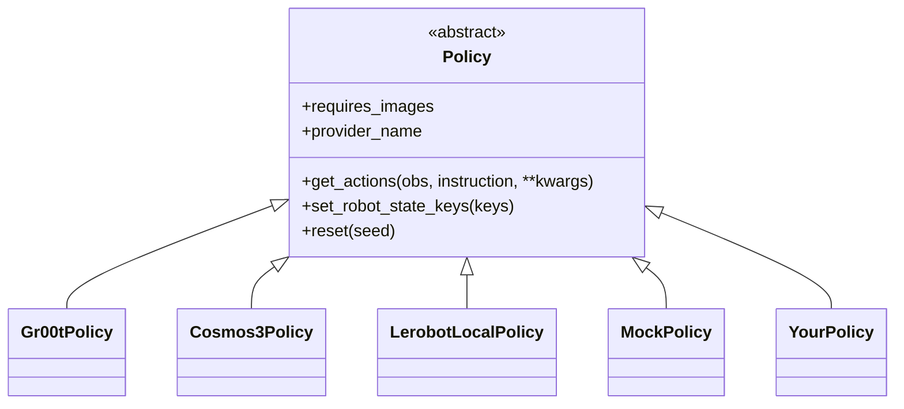

<div align="center">
  <div>
    <a href="https://strandsagents.com">
      
    </a>
  </div>

  <h1>
    Strands Robots
  </h1>

  <h2>
    Control, simulate, and train robots with natural language
  </h2>

  <div align="center">
    <a href="https://pypi.org/project/strands-robots/"></a>
    <a href="https://github.com/strands-labs/robots"></a>
    <a href="https://github.com/strands-labs/robots/blob/main/LICENSE"></a>
    <a href="https://github.com/google-deepmind/mujoco"></a>
    <a href="https://github.com/NVIDIA/Isaac-GR00T"></a>
    <a href="https://github.com/huggingface/lerobot"></a>
  </div>

  <p>
    <a href="https://strandsagents.com/">Strands Docs</a>
    ◆ <a href="https://github.com/google-deepmind/mujoco">MuJoCo</a>
    ◆ <a href="https://github.com/NVIDIA/Isaac-GR00T">NVIDIA GR00T</a>
    ◆ <a href="https://github.com/huggingface/lerobot">LeRobot</a>
    ◆ <a href="https://github.com/strands-labs/robots-sim">Robots Sim</a>
    ◆ <a href="https://github.com/orgs/strands-labs/projects/2">Project Board</a>
  </p>
</div>

<p align="center">
  
</p>

`strands-robots` gives a [Strands Agent](https://github.com/strands-agents/harness-sdk)
hands. One `Robot()` call returns a **MuJoCo simulation** (default - no GPU, no
hardware) or a **real robot** - same code, same natural-language control, and
the same opt-in peer-to-peer **mesh** (`mesh=True`).

```python
from strands import Agent
from strands_robots import Robot

robot = Robot("so100")              # MuJoCo sim by default; mode="real" for hardware
Agent(tools=[robot])("pick up the red cube")
```

### One agent, the whole robotics loop

Teleoperate a real arm to collect demos, fine-tune a policy on them, run it in
sim **and** on hardware, hand work to a fleet peer, and expose it all on ROS 2 -
one library, one mental model. Every line below is a distinct capability:

```python
from strands import Agent
from strands_robots import Robot
from strands_robots.tools import train_policy

# 1. TELEOPERATE a real SO-101 with its leader arm and RECORD demos as a
#    LeRobotDataset (one prompt drives cameras + teleop + recording).
follower = Robot("so101", mode="real", port="/dev/ttyACM0",
                 cameras={"front": {"type": "opencv", "index_or_path": "/dev/video0"}},
                 mesh=True)   # step 4 needs the mesh; joining is opt-in
follower.attach_teleop("so101_leader", port="/dev/ttyACM1", id="leader")
Agent(tools=[follower])(
    "start_recording(repo_id='me/pick', root='/tmp/pick', fps=30, "
    "task='pick up the cube'); teleoperate for 60s; stop_recording"
)

# 2. POST-TUNE a policy on those demos (LoRA fine-tune; GPU box).
train_policy(action="train", provider="lerobot_local",
             dataset_root="/tmp/pick", base_model="lerobot/smolvla_base",
             output_dir="/tmp/pick_ckpt", method="lora", steps=20000)

# 3. RUN the tuned checkpoint - same policy on a MuJoCo twin AND the real arm.
twin = Robot("so101")                                              # sim twin, no hardware
twin.run_policy(robot_name="so101", policy_provider="lerobot_local",
                policy_config={"pretrained_name_or_path": "/tmp/pick_ckpt"}, duration=10.0)
follower.start_task("pick up the cube", policy_provider="lerobot_local",
                    policy_port=None, duration=10.0)               # real arm, in-process

# 4. COORDINATE a fleet - tell a mesh peer to assist, in natural language.
follower.mesh.tell(follower.mesh.peers[0]["peer_id"], "hold the tray steady")

# 5. EXPOSE the running sim on ROS 2 - rviz / nav2 / any ros2 node can subscribe.
from strands_robots.simulation import Simulation
sim = Simulation(ros2_bridge=True); sim.create_world(); sim.add_robot("so101")
sim.step(100)   # publishes /so101/joint_states + camera image_raw on the ROS 2 graph
```

| Step | Capability | Surface |
|------|------------|---------|
| 1 | Teleop + dataset recording | `Robot(mode="real")`, `attach_teleop`, `start_recording` |
| 2 | Policy post-tuning | `train_policy` (LeRobot / GR00T trainers) |
| 3 | Sim + hardware policy rollout | `run_policy` (sim), `start_task` (hardware) |
| 4 | Fleet coordination | `robot.mesh.tell` / `robot_mesh` tool |
| 5 | ROS 2 interop | `Simulation(ros2_bridge=True)`, `use_ros` |

> Steps 1 and 3-real need hardware; step 2 needs a GPU. Everything runs in sim
> with no hardware (`Robot("so101")`), so you can exercise the whole loop today.

## Why strands-robots

- **Sim-first, safe by default.** `Robot("so100")` spins up a MuJoCo world. You
  never accidentally drive real servos - `mode="real"` is an explicit opt-in.
- **70+ robots, 8 categories.** Arms, humanoids, quadrupeds, hands, drones,
  bimanual rigs - resolved from a single registry with auto-download of assets.
- **Any policy.** VLA models (NVIDIA GR00T, LeRobot ACT/Pi0/SmolVLA/Diffusion),
  plus classical motion planners, MPC, and scripted controllers behind one ABC.
- **Mesh networking built in.** Every robot is a Zenoh peer. `tell()` another
  robot what to do; broadcast an E-STOP; bridge to AWS IoT Core for fleets.
- **67-action simulation tool.** World building, physics, rendering, domain
  randomization, procedural terrain (`create_world(terrain="rough"|"stairs"|"pyramid"|"slope")`
  for locomotion), and LeRobotDataset recording - all agent-callable.
- **ROS 2 interop.** Observe + command any ROS 2 graph (`use_ros`), act as a
  robot with no rclpy (`use_rtps`), or expose a running sim as a ROS node.
- **One mental model.** Sim and hardware share the same policy interface,
  the same mesh, and the same natural-language control surface.

## How it works

<p align="center">
  
</p>


## Installation

Examples use [`uv`](https://docs.astral.sh/uv/) (`curl -LsSf https://astral.sh/uv/install.sh | sh`); plain `pip` works too.

```bash
uv pip install strands-robots
```

The base install is light (numpy, opencv-headless, Pillow). Pull in only the
extras you need:

| Extra | Installs | Use for |
|-------|----------|---------|
| `sim-mujoco` | MuJoCo, robot_descriptions, imageio, mink + qpsolvers[daqp] | Simulation (recommended starting point). mink/qpsolvers are the differential-IK solver behind the `move_to` Cartesian transport primitive; `qpsolvers` ships no solver of its own, so the `[daqp]` backend extra is declared with it. |
| `sim-newton` | Newton, Warp, MuJoCo-Warp, trimesh | GPU-native simulation (NVIDIA GPU; batched envs, headless ray-traced render) |
| `sim-isaac` | usd-core, imageio (Isaac Sim installed separately) | NVIDIA Isaac Sim backend - photorealistic RTX rendering, synthetic data, GPU-batched sensors, USD-native scenes. Install Isaac Sim itself separately: via its pip wheels on Python 3.12 (`isaacsim[all,extscache]` from pypi.nvidia.com - see the caveats in [`docs/simulation/isaac.md`](docs/simulation/isaac.md)), the Omniverse Launcher, Isaac Lab, or the NGC docker image. This extra pulls only the pip-installable Python helpers. (NVIDIA RTX GPU; GPU-only, not in `[all]`.) |
| `sim-gs` | gsplat, plyfile, torch | 3D Gaussian Splatting hybrid rendering (`strands_robots.rendering`): composite any sim backend's robot over a captured photoreal 3DGS scene. `gsplat` ships as a source dist that JIT-compiles CUDA kernels via `nvcc` on first use - probe with `strands_robots.rendering.gsplat_rasterizer_available()`; the zero-GPU `PanoramaBackground` works without this extra. (CUDA GPU; GPU-only, not in `[all]`.) |
| `lerobot` | LeRobot | Real hardware, local VLA inference, dataset recording |
| `molmoact2` | LeRobot + transformers, peft, scipy | MolmoAct2 transformers-native VLA (resolves from PyPI via lerobot >= 0.6) |
| `groot-service` | pyzmq, msgpack | NVIDIA GR00T inference client |
| `cosmos3-service` | websockets, msgpack | NVIDIA Cosmos 3 policy-server client |
| `curobo` | _(empty; install cuRobo from source)_ | In-process collision-aware motion planning (CUDA GPU) |
| `wbc` | onnxruntime | GR00T Whole-Body-Control (SONIC) humanoid locomotion - in-process ONNX, no GPU |
| `motionbricks` | torch + vector-quantize-pytorch, pytorch-lightning, hydra-core (install `motionbricks` from source) | NVIDIA MotionBricks generative kinematic motion for the G1 - in-process torch, composes with `wbc` |
| `mesh` | eclipse-zenoh, json5 | Peer-to-peer robot mesh |
| `mesh-iot` | awsiotsdk, awscrt, boto3 | AWS IoT Core mesh transport for fleets |
| `sagemaker` | boto3 | Submit a `TrainSpec` as a managed SageMaker training job (`create_trainer("sagemaker")`) |
| `device-connect` | device-connect-edge, device-connect-agent-tools | Device-aware networking - discovery, RPC, events, safety (falls back to the built-in mesh if absent) |
| `benchmark-libero` | libero | LIBERO benchmark evaluation |
| `all` | everything above except the GPU-only `sim-isaac` / `sim-gs` extras | Kitchen sink |

```bash
# Most users start here:
uv pip install "strands-robots[sim-mujoco]"

# Real hardware + local policies:
uv pip install "strands-robots[sim-mujoco,lerobot]"

# MolmoAct2 VLA (transformers-native; resolves from PyPI via lerobot >= 0.6):
uv pip install "strands-robots[molmoact2]"

# Everything:
uv pip install "strands-robots[all]"
```

The **Isaac Sim** GPU backend is a built-in, in-tree peer of `mujoco` and
`newton` (it lives at `strands_robots.simulation.isaac`). Its pip-installable
helpers ship in the `sim-isaac` extra, but the Isaac Sim runtime itself (~30 GB)
is provisioned separately - via its own pip wheels on Python 3.12
(`pip install 'isaacsim[all,extscache]==6.0.*' --extra-index-url https://pypi.nvidia.com`,
with coverage/EULA caveats documented in
[`docs/simulation/isaac.md`](docs/simulation/isaac.md)), the Omniverse
Launcher, Isaac Lab, or the NGC docker image. Install the helpers with
`pip install 'strands-robots[sim-isaac]'`, then select the backend with
`create_simulation("isaac")` - see
[Simulation (MuJoCo)](#simulation-mujoco) and
[`docs/simulation/isaac.md`](docs/simulation/isaac.md).

From source:

```bash
git clone https://github.com/strands-labs/robots
cd robots
uv pip install -e ".[all,dev]"
```

## Quick starts

### Simulation (no GPU, no hardware)

```python
from strands import Agent
from strands_robots import Robot

robot = Robot("so100") # MuJoCo simulation
agent = Agent(tools=[robot])
agent("Wave the arm using the mock policy for 200 steps, then render a top-down view")
```

`Robot("so100")` returns a `Simulation` instance - the full 67-action
simulation AgentTool. Drive it in natural language through an `Agent`, call its
methods directly (`robot.render(camera_name="topdown")`), or dispatch an action
by calling it (`robot(action="render", camera_name="topdown")`). See
[Simulation](#simulation-mujoco).

> **Note:** `Robot("so100")` already creates the world **and** adds the robot
> for you. Do **not** call `create_world()` again on the returned instance -
> it will error with *"World already exists."* The `create_world()` /
> `add_robot()` sequence shown in [Simulation (MuJoCo)](#simulation-mujoco) is
> for the low-level `Simulation(...)` constructor, which starts empty.

### Real hardware + GR00T

```python
from strands import Agent
from strands_robots import Robot, gr00t_inference

robot = Robot(
    "so101",
    mode="real",
    cameras={
        "front": {"type": "opencv", "index_or_path": "/dev/video0", "fps": 30},
        "wrist": {"type": "opencv", "index_or_path": "/dev/video2", "fps": 30},
    },
    port="/dev/ttyACM0",
    data_config="so100_dualcam",
)

agent = Agent(tools=[robot, gr00t_inference])

# Start the GR00T inference service (Docker, Jetson/x86 GPU)
agent.tool.gr00t_inference(
    action="start",
    checkpoint_path="/data/checkpoints/model",
    port=8000,
    data_config="so100_dualcam",
)

agent("Use so101 to pick up the red block with the GR00T policy on port 8000")
```

### Local LeRobot policy (no inference server)

```python
from strands_robots import create_policy

# Direct HuggingFace inference - ACT, Pi0, SmolVLA, Diffusion, ...
policy = create_policy("lerobot/act_aloha_sim_transfer_cube_human")
```

### Teleoperation (leader arms, gamepads, WASD)

Drive any real robot - or a simulation - from one or more LeRobot
teleoperators. `Teleoperator()` mirrors the `Robot()` factory; `attach_teleop()`
+ `teleoperate()` run the control loop.

```python
from strands_robots import Robot, Teleoperator

# Leader arm -> follower arm (both speak {motor}.pos -> zero config)
follower = Robot("so101", mode="real", port="/dev/ttyACM0")
follower.attach_teleop("so101_leader", port="/dev/ttyACM1", id="leader")
follower.teleoperate()                       # Ctrl+C or stop_teleoperate()

# Earth Rover Mini+ with WASD keys (velocity keys -> zero config)
rover = Robot("earthrover_mini_plus", mode="real", robot_ip="192.168.1.151")
rover.attach_teleop("keyboard_rover")        # W/A/S/D
rover.teleoperate(block=True, duration=30)

# Cross-vocabulary or sim teleop -> supply a map_fn(action) -> action
robot.attach_teleop("keyboard_ee", map_fn=my_ik)   # EE deltas -> joint .pos
robot.teleoperate(publish=True)              # also stream over the mesh
```

17 teleoperators (`so100/so101/koch/omx/openarm` leaders, `bi_*` leaders,
`gamepad`, `keyboard`, `keyboard_ee`, `keyboard_rover`, `phone`,
`reachy2_teleoperator`, `unitree_g1`, homunculus arm/glove) drive 14 robots.
Zero-config when action keys match; otherwise pass `map_fn`. Full matrix +
recipes: [Teleoperation docs](https://strands-labs.github.io/robots/hardware/teleoperation/).

## Recording & streaming datasets

The physical-AI data loop, end to end: **record** a LeRobotDataset from sim or
hardware, **stream** it straight back for eval/training (no full download), and
optionally **dump** it to a mutable Hugging Face Storage Bucket. Needs the
`lerobot` extra (which bundles `datasets` + `av` + `torchcodec`).

```python
from strands import Agent
from strands_robots import Robot

sim = Robot("so100", mesh=False)
agent = Agent(tools=[sim])

# 1. COLLECT — one natural-language prompt drives scene + cameras + policy + record.
agent(
    "Create a world with the so100 robot, add a red cube and a front camera, "
    "start recording (repo_id='local/demo', root='/tmp/demo', fps=30, "
    "overwrite=True, task='pick up the red cube'), run the mock policy for "
    "60 steps, then stop recording."
)

# 2. STREAM — read it back lazily; camera frames decode on the fly from the MP4
#    shards, state/action from parquet. Nothing is re-materialized to disk.
reader = sim.stream_dataset("local/demo", root="/tmp/demo", shuffle=False)
for frame in reader:
    frame["observation.images.front"]   # (3, H, W) tensor, decoded from video
    frame["observation.state"]          # joint vector
    frame["action"]
    break
```

`stream_dataset()` is the in-process read counterpart to
`start_recording`/`stop_recording`. For full training, the upstream trainer uses
the same engine — `lerobot-train --policy.type=act --dataset.repo_id=... --dataset.streaming=true --num_workers=4`
(the `lerobot-train` entry point wraps `python -m lerobot.scripts.lerobot_train`;
flags are draccus `--dotted.key=value` form).

**Verify episode integrity.** A recording's ground truth is the parquet under
`meta/episodes/`, not the count a model narrates while collecting. Collect
episodes with a deterministic Python loop (one `run_policy(..., n_episodes=1)`
plus `save_episode()` per episode) rather than trusting a model to count its own
tool calls, then confirm the dataset holds the episodes you intended - in-process
or from the shell:

```python
sim.verify_dataset_episodes(expected=20)   # reads parquet; status="error" on a mega-episode
```

```bash
# exit 0 = pass, 1 = fail, so it drops straight into CI as a dataset gate
strands-robots verify-dataset /tmp/demo --expected 20
```

This catches the "mega-episode" corruption class - a run that buffered every
frame into one `episode_index=0` episode while reporting `20/20` - plus
`meta/info.json` vs parquet drift and zero-length episodes.

**Dump to a Storage Bucket** during collection (mutable, Xet-deduplicated — the
Phase 1/2 collection target that avoids git-LFS history bloat) with one kwarg:

```python
sim.stop_recording(bucket="your-org/robot-fave")   # → hf://buckets/your-org/robot-fave/demo
```

Requires the `hf` CLI with the `buckets`/`sync` subcommands
(`pip install -U "huggingface_hub>=1.5"` + `hf auth login` — those subcommands
first ship in 1.5.0; every earlier release, including 1.0–1.4.x, installs an
`hf` entry point without them).

The bucket **read** side (`stream_dataset(..., repo_type="bucket")`) needs
`strands-robots >= 0.5.1`, so upgrade with `-U` rather than a bare
`pip install "strands-robots[...]"` — pip reports `Requirement already satisfied`
against a pre-existing older release and upgrades nothing, and on 0.4.1 the read
raises `TypeError: open() got an unexpected keyword argument 'repo_type'`.

Any on-disk dataset directory can be synced (or daily re-synced) without a live
recording session — one recorded earlier in the process, or on hardware via
`lerobot-record`:

```python
from strands_robots import sync_dataset_to_bucket

sync_dataset_to_bucket("/tmp/demo", "your-org/robot-fave")
# → {"status": "success", "bucket_uri": "hf://buckets/your-org/robot-fave/demo"}
```

`run_id` defaults to the directory name; pass `run_id="nightly"` to choose the
bucket subpath, and `delete=True` for mirror semantics.

**Proprio-only / no video** (e.g. edge devices without a torchcodec wheel):
`sim.stream_dataset(repo_id, drop_videos=True, delta_timestamps={...})` streams
state/action only and never touches the video decoder. `drop_videos=True`
requires a `delta_timestamps` with at least one non-video key (e.g.
`{"observation.state": [0.0], "action": [0.0]}`) - without one, every feature
including video would stream, so the call raises `ValueError` instead of
silently no-opping.

> **macOS note (zero-touch).** torchcodec links ffmpeg via `@rpath`, and
> Homebrew's ffmpeg (`/opt/homebrew/lib`) is not on the default dyld search
> path — so video decode would normally fail with
> `Library not loaded: @rpath/libavutil.NN.dylib`. On `import strands_robots`
> we auto-detect this and put Homebrew's ffmpeg on `DYLD_FALLBACK_LIBRARY_PATH`
> (re-exec'ing the interpreter once for a plain script run; never inside
> Jupyter/REPL/pytest, where it just prints the one-line `export` to run). It's
> a no-op off macOS, without torchcodec, or when the var is already set. Disable
> with `STRANDS_ROBOTS_NO_DYLD_SHIM=1`. See `examples/06_agent_collect_and_stream.py`.

See also [Recording & datasets](docs/recording.md) for the `DatasetRecorder`
direct API and append/resume workflow.

## The `Robot()` factory

`Robot()` is a factory, not a wrapper - you get the real backend instance back
with all its methods.

```python
Robot("so100")                       # mode="sim"  (default, safe)
Robot("so100", mode="real")          # explicit hardware opt-in
Robot("so100", mode="auto")          # probe USB for servos, fall back to sim
Robot("my_arm", urdf_path="arm.xml") # bring your own MJCF/URDF
```

| Parameter | Type | Default | Description |
|-----------|------|---------|-------------|
| `name` | `str` | required | Robot name or alias (see [Supported robots](#supported-robots)) |
| `mode` | `str` | `"sim"` | `"sim"`, `"real"`, or `"auto"` (case-insensitive) |
| `backend` | `str` | `"mujoco"` | Sim backend: `"mujoco"`, `"newton"`, or `"isaac"` (all built-in; `isaac` needs the `sim-isaac` extra) |
| `urdf_path` | `str` | `None` | Explicit MJCF/URDF path (skips registry lookup) |
| `cameras` | `dict` | `None` | Camera config (**`mode="real"` only**) |
| `position` | `list[float]` | `[0,0,0]` | Spawn position in the sim world |
| `data_config` | `str` | name | Observation/action schema name |
| `mesh` | `bool \| None` | `None` | Join the Zenoh mesh. `None` consults `STRANDS_MESH`, which leaves it **off** unless set to `true`/`1`/`yes` - pass `mesh=True` to opt in per robot. |

Safety/validation rules:
- **Defaults to sim.** Real hardware is always an explicit `mode="real"`.
- **`cameras=` is rejected in sim mode** - add sim cameras via the `add_camera`
  action after creation.
- **Unknown robot names raise `ValueError`** unless you pass `urdf_path=`.
- **`STRANDS_ROBOT_MODE`** overrides detection; a typo'd value logs a warning
  and falls back to sim.

## Supported robots

70+ robots across 8 categories, resolved from
[`registry/robots.json`](strands_robots/registry/robots.json). Assets
(MJCF + meshes) auto-download from
[robot_descriptions](https://github.com/robot-descriptions/robot_descriptions.py)
/ [MuJoCo Menagerie](https://github.com/google-deepmind/mujoco_menagerie) on
first use. List them at runtime with `from strands_robots import list_robots; list_robots()`.

| Category | Count | Robots |
|----------|-------|--------|
| **Arm** | 22 | so100, so101, koch, omx, panda, fr3, fr3_v2, ur5e, ur10e, xarm7, kinova_gen3, kuka_iiwa, sawyer, piper, yam, z1, vx300s, wx250s, arx_l5, openarm, hope_jr, dynamixel_2r |
| **Humanoid** | 18 | unitree_g1, unitree_h1, unitree_h1_2, apollo, talos, reachy2, rby1, fourier_n1, booster_t1, adam_lite, asimov_v0, cassie, elf2, jvrc, op3, open_duck_mini, toddlerbot_2xc, toddlerbot_2xm |
| **Mobile** | 13 | spot, go1, unitree_go2, unitree_a1, aliengo, anymal_b, anymal_c, stretch, stretch3, lekiwi, tiago_dual, earthrover, robot_soccer_kit |
| **Hand** | 8 | shadow_hand, shadow_dexee, allegro_hand, leap_hand, ability_hand, aero_hand, robotiq_2f85, robotiq_2f85_v4 |
| **Bimanual** | 3 | aloha, bi_openarm, trossen_wxai |
| **Aerial** | 2 | crazyflie, skydio_x2 |
| **Expressive** | 1 | reachy_mini |
| **Mobile manip** | 1 | google_robot |

**Hardware-capable** (drivable with `mode="real"` via LeRobot): `so100`,
`so101`, `koch`, `omx`, `hope_jr`, `aloha`, `bi_openarm`, `reachy2`,
`unitree_g1`, `lekiwi`, `earthrover`. All are simulatable.

### Adding a robot

There are two paths, depending on whether the robot needs project-specific
metadata:

1. **Standard `robot_descriptions` robot (zero config).** Any MJCF robot shipped
   by [robot_descriptions](https://github.com/robot-descriptions/robot_descriptions.py)
   resolves automatically without a `robots.json` entry - the asset is
   discovered and downloaded on first use:

   ```python
   from strands_robots import Robot, list_discoverable

   sim = Robot("iiwa14")          # discovered, not in robots.json
   print(list_discoverable())     # the MJCF long tail you can load directly
   ```

   A curated `robots.json` entry always wins over discovery, so overriding a
   discovered robot later is non-breaking.

2. **Custom or metadata-rich robot.** If the robot needs a non-default joint
   count, hardware port, aliases, scene tweaks, or local mesh overrides, add a
   curated entry. For a robot that belongs in the shipped catalog, add it to
   [`registry/robots.json`](strands_robots/registry/robots.json) and open a PR.
   For a machine-local robot, register it at runtime instead of editing the
   package:

   ```python
   from strands_robots.registry import register_robot

   register_robot(name="my_arm", model_xml="my_arm.xml",
                  asset_dir="~/robots/my_arm", joints=7, category="arm")
   ```

## Tools reference

Import any of these and pass to `Agent(tools=[...])`. Each is a Strands
AgentTool returning `{"status", "content"}`.

| Tool | Purpose |
|------|---------|
| `Robot(...)` | Universal robot - sim or hardware, natural-language + async control |
| `run_policy` | Multi-episode policy rollout with per-episode eval + dataset recording |
| `train_policy` | Post-tune (fine-tune) a policy on a recorded dataset (LeRobot / GR00T trainers, full or LoRA) |
| `use_lerobot` | Universal LeRobot bridge - call ANY lerobot module/class/config directly (like `use_aws` wraps boto3) |
| `lerobot_train` | Thin local wrapper over the `lerobot-train` CLI (the engine behind `train_policy`) |
| `robot_mesh` | Coordinate robots over the Zenoh mesh (`tell`, `broadcast`, E-STOP) |
| `use_ros` | Bridge to any ROS 2 graph - list/echo/publish topics, call services (in-process rclpy) |
| `use_rtps` | Join a ROS 2 graph as a DDS participant - publish/echo topics, act as a robot (pure cyclonedds, no rclpy, all ROS 2 distros) |
| `gr00t_inference` | Manage NVIDIA GR00T inference services (Docker lifecycle) |
| `lerobot_camera` | OpenCV / RealSense camera discovery, capture, record |
| `lerobot_calibrate` | List, view, back up, restore LeRobot calibrations |
| `lerobot_teleoperate` | Record demonstrations, replay episodes |
| `pose_tool` | Store, recall, and execute named robot poses |
| `harness_memory` | Persist task solution traces + global success rules / failure models across agent sessions (Harness-VLA-style memory) |
| `serial_tool` | Low-level Feetech servo / raw serial communication |
| `download_assets` | Pre-fetch robot MJCF + meshes into the asset cache |

<details>
<summary><b>Robot tool actions</b></summary>

| Action | Parameters | Description |
|--------|------------|-------------|
| `execute` | `instruction`, `policy_port`, `duration` | Blocking execution until complete |
| `start` | `instruction`, `policy_port`, `duration` | Non-blocking async start |
| `status` | - | Current task status |
| `stop` | - | Interrupt running task (emergency stop) |
In sim mode the same tool exposes the 77 Simulation actions - see Simulation (MuJoCo).
</details>

<details>
<summary><b>GR00T inference tool actions</b></summary>

| Action | Parameters | Description |
|--------|------------|-------------|
| `start` | `checkpoint_path`, `port`, `data_config` | Start inference service |
| `stop` | `port` | Stop service on port |
| `status` | `port` | Check service status |
| `list` | - | List running services |
| `find_containers` | - | Find GR00T Docker containers |
| `build_image` / `download_checkpoint` / `start_container` | - | Full container lifecycle orchestration |

**TensorRT** acceleration:

```python
agent.tool.gr00t_inference(
    action="start",
    checkpoint_path="/data/checkpoints/model",
    port=8000,
    use_tensorrt=True,
    vit_dtype="fp8",     # ViT:  fp16 | fp8
    llm_dtype="nvfp4",   # LLM:  fp16 | nvfp4 | fp8
    dit_dtype="fp8",     # DiT:  fp16 | fp8
)
```

</details>

<details>
<summary><b>Camera / serial / pose / teleop tool actions</b></summary>

**Camera** - `discover`, `capture`, `capture_batch`, `record`, `preview`, `test`
**Serial** - `list_ports`, `feetech_position`, `feetech_ping`, `send`, `monitor`
**Pose** - `store_pose`, `load_pose`, `list_poses`, `move_motor`, `incremental_move`, `reset_to_home`
**Teleop** - `start`, `stop`, `list`, `replay`

</details>

## Policy providers

All policies implement one ABC - `async get_actions(observation, instruction, **kwargs)`.
The interface is deliberately agnostic about *how* actions are produced, so it
fits both VLA models and classical controllers.

```python
from strands_robots import create_policy

create_policy("mock")                                  # sinusoidal test actions
create_policy("groot", port=5555)                      # NVIDIA GR00T via ZMQ
create_policy("zmq://localhost:5555")                  # same, by URL
create_policy("cosmos3", embodiment="droid", port=8000)  # NVIDIA Cosmos 3 via WebSocket
create_policy("lerobot/act_aloha_sim_transfer_cube")   # local HF inference
```

| Provider | Backend | Notes |
|----------|---------|-------|
| `mock` | none | Sinusoidal trajectories; `requires_images=False` (~10x faster) |
| `groot` | NVIDIA GR00T N1.5/N1.6/N1.7 | Service mode (ZMQ to a Docker container) or local in-process (`model_path=`) |
| `cosmos3` | NVIDIA Cosmos 3 omnimodal VLA | Service mode (WebSocket to a Cosmos Framework RoboLab policy server); embodiments: `droid`, `umi`, `av`, `bridge`, `openarm` |
| `lerobot_local` | HuggingFace | Direct ACT / Pi0 / SmolVLA / Diffusion inference, no server |
| `lerobot_async` | HuggingFace via gRPC | Offload a LeRobot policy to a remote `PolicyServer` over lerobot's native async-inference gRPC transport (edge/light robot host) |
| `remote` | any policy, over WebSocket | Drop-in client that forwards observations to a remote `PolicyServer` and returns its action chunk: `create_policy("remote", endpoint="ws://gpu-box:8765")` (or the smart string `create_policy("ws://gpu-box:8765")`). For a light robot host with a GPU box elsewhere; mirrors the server policy's RTC support |
| `vera` | MIT VERA (DFoT/WAN planner + Jacobian IDM) | Two-stage video-to-action over a WebSocket GPU server (Docker); PushT + MimicGen, IK for eef-delta arms. **Git-only** (not on PyPI, no extra): `pip install 'vera @ git+https://github.com/sizhe-li/VERA.git'` plus `websockets msgpack numpy` |



<details>
<summary><b>GR00T data configs (embodiment schemas)</b></summary>

A `data_config` defines the video + state keys GR00T expects for an
embodiment. 27 ship in
[`policies/groot/data_configs.json`](strands_robots/policies/groot/data_configs.json);
the common ones:

| Config | Cameras | Description |
|--------|---------|-------------|
| `so100` / `so101` | 1 (`video.webcam`) | Single-arm, single camera |
| `so100_dualcam` / `so101_dualcam` | 2 (front + wrist) | Single-arm, dual camera |
| `so100_4cam` | 4 (front, wrist, top, side) | Single-arm, quad camera |
| `so101_tricam` | 3 (front, wrist, side) | Single-arm, tri camera |
| `fourier_gr1_arms_only` | 1 (ego) | Fourier GR-1 bimanual arms + hands |
| `unitree_g1` | 1 (ego) | G1 upper body (arms + hands) |
| `unitree_g1_full_body` / `_locomanip` | - | G1 legs + waist + arms + hands |
| `bimanual_panda_gripper` | 3 | Dual Franka, EEF pose + gripper |
| `libero_panda` | 2 (image + wrist) | LIBERO benchmark Panda |
| `oxe_droid` / `oxe_google` / `oxe_widowx` | 1-2 | Open X-Embodiment schemas |
| `agibot_*` / `galaxea_r1_pro` | 3 | AgiBot / Galaxea humanoids |

Pick the config matching your robot's camera + state layout; pass it as
`data_config=` to `Robot(...)`, `gr00t_inference(...)`, or `create_policy("groot", ...)`.

</details>

> **Security:** `lerobot_local` loads HuggingFace models with
> `trust_remote_code=True` (arbitrary code execution). You must opt in with
> `export STRANDS_TRUST_REMOTE_CODE=1`. Only load models you trust.

### Cosmos 3 (NVIDIA omnimodal VLA - service mode)

[`nvidia/Cosmos3-Nano-Policy-DROID`](https://huggingface.co/nvidia/Cosmos3-Nano-Policy-DROID) via a self-contained WebSocket client (`cosmos3` / `c3` / `cosmos3://host:port`); no `openpi-client` dep, no `numpy<2` pin, so it composes with `lerobot` in one env.

<details>
<summary><b>Cosmos 3 server + client setup, embodiments, sim rollout</b></summary>

[`nvidia/Cosmos3-Nano-Policy-DROID`](https://huggingface.co/nvidia/Cosmos3-Nano-Policy-DROID)
served by the Cosmos Framework RoboLab WebSocket policy server. The policy
client is **self-contained** - it speaks the server's msgpack+NumPy wire
protocol directly via `websockets` + a vendored numpy packer (no
`openpi-client` dependency, no `numpy<2` pin), so it composes cleanly with
`lerobot` for dataset recording in the same env.

**1. Start the server** (holds the GPU), from a Cosmos Framework checkout:

```bash
uv sync --all-extras --group=cu130-train --group=policy-server
python -m cosmos_framework.scripts.action_policy_server_robolab \
    --checkpoint-path nvidia/Cosmos3-Nano-Policy-DROID --port 8000
curl http://localhost:8000/healthz   # -> 200 when ready (~4 min cold)
```

**2. Install the client** (the `cosmos3-service` extra ships only `msgpack`
+ `websockets` - numpy-version agnostic):

```bash
uv pip install -e '.[sim-mujoco]'
uv pip install 'strands-robots[cosmos3-service]'
```

**3. Use it** (`cosmos3`, `c3`, `cosmos3://host:port`, or the HF model-id all
resolve to `Cosmos3Policy`):

```python
from strands_robots.policies import create_policy

policy = create_policy("cosmos3", embodiment="droid", port=8000)
policy.set_robot_state_keys([f"joint_{i}" for i in range(7)] + ["gripper"])
chunk = policy.get_actions_sync(observation, "pick up the cube")
# chunk == [{"joint_0": .., ..., "gripper": ..}, ...]  (one dict per timestep)
```

The `droid` embodiment (`joint_pos`/RoboArena) conditions on **all three**
camera views and the server rejects a partial observation. Your
`observation_mapping` must map a sim/robot camera onto each of
`observation/wrist_image_left`, `observation/exterior_image_1_left`, and
`observation/exterior_image_2_left`; an incomplete mapping raises an actionable
client-side `ValueError` naming the missing keys before any request is sent
(other embodiments such as `umi`/`av`/`bridge` need only `observation/image`):

```python
policy = create_policy(
    "cosmos3", embodiment="droid", port=8000,
    observation_mapping={
        "wrist":     "observation/wrist_image_left",
        "exterior":  "observation/exterior_image_1_left",
        "exterior2": "observation/exterior_image_2_left",
    },
)
```

**4. Roll out in MuJoCo** - the `droid` embodiment drives a Franka/DROID-class
arm, so use the `franka` (or `panda`) sim asset:

```bash
MUJOCO_GL=egl python examples/vla/cosmos3_sim_rollout.py --record /tmp/c3.mp4
```

Embodiments: `droid` (10D, chunk 32, 15 fps), `umi`, `av`, `bridge`, `openarm`
(post-training only). If the
server is not running, the policy raises a `ConnectionError` with the exact
command to start it.


</details>

### Non-VLA policies (motion planners, MPC, scripted)

The same interface fits cuRobo, MoveIt2, OMPL, MPC, and pure-IK / scripted
trajectories - anything mapping `(observation, goal)` to joint targets.
Non-VLA providers set `requires_images = False` (skip camera rendering) and
read their goal from **well-known `**kwargs` keys** instead of parsing the
instruction string:

| Key | Type | Meaning |
|-----|------|---------|
| `target_pose` | `list[float]` | Cartesian goal `[x, y, z, qw, qx, qy, qz]` in base frame |
| `target_joints` | `dict[str, float]` | Joint-space goal keyed by joint name (rad / m) |
| `world_update` | `dict \| None` | Per-call world refresh for collision-aware planners |

Providers MUST ignore unknown `**kwargs` rather than raising, so callers can
pass shared keys across providers without coupling to a backend.

```python
from typing import Any
from strands_robots.policies import Policy, register_policy, create_policy


class ReachPolicy(Policy):
    """Linear interpolation from current joint state to target_joints."""

    def __init__(self, steps: int = 32, **_: Any) -> None:
        self._keys: list[str] = []
        self._steps = steps

    @property
    def provider_name(self) -> str:
        return "reach"

    @property
    def requires_images(self) -> bool:
        return False  # joint-state only -- skip camera rendering

    def set_robot_state_keys(self, robot_state_keys: list[str]) -> None:
        self._keys = list(robot_state_keys)

    async def get_actions(self, observation_dict, instruction, **kwargs):
        target = kwargs.get("target_joints")
        if target is None:
            raise ValueError("ReachPolicy requires target_joints kwarg")
        state = observation_dict.get("observation.state", [0.0] * len(self._keys))
        out = []
        for s in range(1, self._steps + 1):
            alpha = s / self._steps
            out.append({k: (1 - alpha) * state[i] + alpha * target[k]
                        for i, k in enumerate(self._keys)})
        return out


register_policy("reach", lambda: ReachPolicy, aliases=["lerp"])
policy = create_policy("reach")
```

<details>
<summary><b>Reference non-VLA providers: MoveIt2, cuRobo, WBC/SONIC</b></summary>

Three reference implementations of the goal-kwarg contract above. Each has a
runnable example + full install/deploy notes in its linked doc:

| Provider | Alias | Runs | Goal kwarg | Needs | Docs |
|----------|-------|------|-----------|-------|------|
| `moveit2` | `moveit` | ZMQ sidecar (ROS 2 / `moveit_py`, out-of-process) | `target_pose` / `target_joints` | `[moveit2]` extra (`pyzmq`, `msgpack`); a running sidecar | [MoveIt2 docs](https://strands-labs.github.io/robots/policies/moveit2/) |
| `curobo` | `cumotion` | in-process CUDA | `target_pose` / `target_joints` (+ `world_update`) | NVIDIA GPU; cuRobo from source (not on PyPI) | [cuRobo source](https://github.com/NVlabs/curobo) |
| `wbc` | `sonic` | in-process ONNX (CPU) | `target_velocity` `[vx, vy, omega]` | `[wbc]` extra (`onnxruntime`); a SONIC checkpoint | [WBC docs](https://strands-labs.github.io/robots/policies/wbc/) |
| `motionbricks` | `motion_bricks` | in-process torch (CPU/CUDA) | `style` / `mode`, `target_velocity`, `target_heading` | `[motionbricks]` extra + `motionbricks` from source + git-LFS checkpoints | [MotionBricks docs](https://strands-labs.github.io/robots/policies/motionbricks/) |

```python
from strands_robots.policies import create_policy

# Collision-aware planning (GPU, in-process); plan is cached, streamed per tick.
policy = create_policy("curobo", robot_config="franka.yml", action_horizon=16)
actions = policy.get_actions_sync(
    {"observation.state": [0.0, -0.79, 0.0, -2.36, 0.0, 1.57, 0.79]},
    "reach for the red block",                  # ignored by planners
    target_pose=[0.5, 0.0, 0.4, 1.0, 0.0, 0.0, 0.0],
)
```

`mesh.tell(peer, "...", policy_provider="curobo", target_pose=[...])` forwards
the same `target_pose` / `target_joints` / `world_update` vocabulary to a sim
peer. In-process, the goal goes to `run_policy(policy_kwargs={...})`, which the
runner hands to every `get_actions()` call - `run_policy` itself has no
`target_pose` parameter. `Robot.start_task` takes no goal payload: its
parameters are `instruction`, `policy_port`, `policy_host`, `policy_provider`
and `duration`.

</details>


## Training providers

`create_trainer` is the training-side peer of `create_policy`: the provider
name is the same one used for inference, so `create_policy("groot")` and
`create_trainer("groot")` refer to one provider. It returns a `Trainer` you
drive with a `TrainSpec`, and the `train_policy` tool wraps this same factory
for agent-callable post-tuning.

```python
from strands_robots.training import create_trainer, TrainSpec

# Imitation / post-tuning on a recorded LeRobotDataset:
trainer = create_trainer("lerobot_local")
trainer.train(TrainSpec(dataset_root="/tmp/pick", base_model="lerobot/smolvla_base",
                        output_dir="/tmp/pick_ckpt", method="lora", steps=20000))

# From-scratch reinforcement learning in sim (no dataset):
ppo = create_trainer("ppo")   # or create_trainer("fast_sac")
```

| Provider | Kind | Notes |
|----------|------|-------|
| `lerobot_local` | Imitation / post-tuning | LeRobot fine-tune (full or LoRA) on a LeRobotDataset |
| `groot` | Imitation / post-tuning | NVIDIA GR00T fine-tune; needs an `embodiment` tag |
| `cosmos3` | Imitation / post-tuning | NVIDIA Cosmos 3 fine-tune (multi-node HSDP capable) |
| `mock` | Imitation (test) | No-op trainer for tests and dry runs |
| `sagemaker` | Managed cloud transport | Submits the spec as one SageMaker training job wrapping a containerized trainer image (`[sagemaker]` extra) |
| `ppo` | Reinforcement learning | On-policy PPO; pairs with `VecSimEnv` for parallel rollouts |
| `fast_sac` | Reinforcement learning | Off-policy Soft Actor-Critic |

The RL trainers (`ppo`, `fast_sac`) subclass `BaseRLAlgo` and share the same
`validate -> prepare -> train -> export` lifecycle as the imitation trainers.
They collect trajectories through `VecSimEnv` (N independent `SimEnv` as one
batched env) and score with `BaseRLAlgo.evaluate()`. The training package stays
torch-free until an RL provider is resolved on first use.

### SageMaker managed training jobs

The `sagemaker` provider is transport, not behavior: it submits the same
`TrainSpec` as one managed training job and waits for the terminal verdict.
The training logic lives in the container image you point it at, which
packages one of the local trainer paths (the `groot` and `cosmos3` providers
are directly containerizable). Install with `pip install
"strands-robots[sagemaker]"` (boto3 only; validate works without it).

```python
from strands_robots.training import create_trainer, TrainSpec

trainer = create_trainer(
    "sagemaker",
    image_uri="123456789012.dkr.ecr.us-east-1.amazonaws.com/strands-trainer:latest",
    role_arn="arn:aws:iam::123456789012:role/StrandsSageMakerTraining",
    instance_type="ml.g5.xlarge",
)
spec = TrainSpec(
    dataset_root="s3://my-bucket/datasets/pick",   # -> the "training" input channel
    output_dir="s3://my-bucket/checkpoints/pick",  # -> the job's S3OutputPath
    base_model="lerobot/smolvla_base",
    steps=20000,
    extra={"policy_type": "act"},                  # -> string hyperparameters
)
result = trainer.train(spec)   # validates locally BEFORE submitting
# result.checkpoint_dir -> s3://.../<job name>/output/model.tar.gz on success;
# a failed job is an error result naming the job + FailureReason.
```

`dataset_root` and `output_dir` must be `s3://` URIs; every other spec field
plus `extra` travels as string hyperparameters (strings verbatim, everything
else JSON-encoded) that the container's entry point decodes back into a
`TrainSpec` with `dataset_root=/opt/ml/input/data/training` and
`output_dir=/opt/ml/model`. `spec.num_nodes` maps onto the job's
`InstanceCount`. A job that outlives the local poll budget reports `running`
and stays pollable via `trainer.status(job_name)`.

Required IAM surface - the **caller** (the identity running `train`) needs:

- `sagemaker:CreateTrainingJob`, `sagemaker:DescribeTrainingJob`
- `iam:PassRole` on the execution role passed as `role_arn`

and the **execution role** itself needs S3 read on the dataset prefix, S3
write on the output prefix, ECR pull on the image, and CloudWatch Logs write
(`AmazonSageMakerFullAccess` is a superset, but the above is the minimal set).

The integration smoke (`tests_integ/training/test_sagemaker_smoke.py`) skips
without AWS credentials; its full submission half additionally reads
`STRANDS_SAGEMAKER_SMOKE_IMAGE_URI`, `STRANDS_SAGEMAKER_SMOKE_ROLE_ARN`,
`STRANDS_SAGEMAKER_SMOKE_S3_PREFIX` (and optionally
`STRANDS_SAGEMAKER_SMOKE_INSTANCE_TYPE`) - test-only variables, not read by
the library.


## Simulation (MuJoCo)

`Robot("so100")` (sim mode) returns a `Simulation` - a MuJoCo-backed AgentTool
exposing **77 actions** for world composition, physics, rendering, policy
execution, and dataset recording. Build it directly when you want full control:

```python
from strands_robots.simulation import Simulation

sim = Simulation(tool_name="sim", mesh=False)
sim.create_world()
sim.add_robot(name="arm", data_config="so100")
sim.add_object(name="cube", shape="box", position=[0.3, 0, 0.05])
sim.add_camera(name="topdown", position=[0, 0, 1.5], target=[0, 0, 0])

# Wrist camera: mount ON the gripper body so it tracks the arm like the real
# SO101/SO100 hardware cam. position/target are in the body's LOCAL frame.
# Body names are namespaced "<robot>/<body>" (e.g. "arm/gripper").
sim.add_camera(name="wrist", position=[0, -0.05, 0], target=[0, -0.15, 0],
               parent_body="arm/gripper")

sim.run_policy(robot_name="arm", policy_provider="mock", n_steps=200,
               control_frequency=50.0)

frame = sim.render(camera_name="topdown")   # {status, content:[text, image]}
```

<details>
<summary><b>The actions, grouped</b></summary>

- **World & scene**: `create_world`, `load_scene`, `replace_scene_mjcf`,
  `patch_scene_mjcf`, `reset`, `get_state`, `save_state`, `load_state`,
  `destroy`, `export_xml`.
- **Robots**: `add_robot`, `remove_robot`, `list_robots`, `get_robot_state`,
  `list_urdfs`, `register_urdf`, `get_features`.
- **Objects**: `add_object`, `remove_object`, `move_object`, `list_objects`.
- **Cameras & rendering**: `add_camera`, `remove_camera`, `render`,
  `render_depth`, `render_all`, `get_world_point`, `start_cameras_recording`,
  `stop_cameras_recording`, `get_cameras_recording_status`.
- **Physics**: `step`, `set_timestep`, `set_gravity`, `apply_force`, `raycast`,
  `multi_raycast`, `get_contacts`, `get_contact_forces`, `get_body_state`,
  `set_joint_positions`, `set_joint_velocities`, `forward_kinematics`,
  `get_jacobian`, `get_mass_matrix`, `inverse_dynamics`, `get_total_mass`,
  `get_energy`, `get_sensor_data`, `set_body_properties`, `set_geom_properties`.
- **Policy**: `run_policy`, `start_policy`, `stop_policy`,
  `list_policies_running`, `replay_episode`, `eval_policy`.
- **Randomization**: `randomize`.
- **Recording (LeRobotDataset)**: `start_recording`, `stop_recording`,
  `get_recording_status`.
- **Benchmarks**: `list_benchmarks`, `register_benchmark_from_file`,
  `evaluate_benchmark`.
- **Viewer**: `open_viewer`, `close_viewer`.

</details>

<details>
<summary><b>Common footguns</b></summary>

- **Planes must be static.** `add_object(shape="plane")` auto-sets
  `is_static=True`; passing `is_static=False` is a hard error.
- **Aim cameras.** Pass `target=[x,y,z]` to look at a point; `target == position`
  errors.
- **Wrist cameras mount on a body.** Pass `parent_body="<robot>/gripper"` to
  `add_camera` so the camera rides with the arm (realistic SO101/SO100 wrist
  cam). In that mode `position`/`target` are in the body's LOCAL frame, not
  world coordinates. Omit `parent_body` for a world-fixed camera.
- **MP4 vs dataset recording.** `start_cameras_recording` writes plain MP4
  (`[sim-mujoco]` only). `start_recording` writes a LeRobotDataset (parquet +
  MP4 + schema) and needs the `[lerobot]` extra.
- **Policy running → mutations blocked.** While a policy runs, state-mutating
  actions error with *"Cannot 'X' while a policy is running."* Stop it first.
- **Horizon parameters.** `run_policy` takes either `duration` or `n_steps`
  (both with `control_frequency`). `fast_mode=True` skips the between-step
  sleep for batch eval / data collection.
- **Name collisions.** Objects, bodies, robots, and cameras share the MuJoCo
  name table. Multi-robot joints/actuators are namespaced `{robot}/{joint}`.

</details>

**Self-healing:** unknown parameters are rejected with *"Unknown parameter X
for action Y. Valid: [...]"*, missing required params produce *"Action X
requires parameter Y."*, a field the schema publishes as a string is refused
unless it is one (*"Action X: 'Y' must be a string, got 7 (int)"*), and
vectors/dtypes are validated before MuJoCo sees them - so the agent learns the
contract without crashing the process. Every one of those refusals names the
field by the spelling you sent, or by the one this schema publishes: the router
rewrites a few wire names to their method parameter (`torque_vec` -> `torque`)
before validating, and a refusal naming the rewritten name would point at a
field the schema does not carry.

**Third-party backends.** `create_simulation(name)` discovers backends beyond
the built-in `mujoco`/`newton`/`isaac` registry via Python
[entry points](https://packaging.python.org/en/latest/specifications/entry-points/).
A sibling package registers its `SimEngine` subclasses under the
`strands_robots.backends` group in its `pyproject.toml`, and they become
available on `pip install` without patching this package:

```toml
[project.entry-points."strands_robots.backends"]
my_engine = "my_pkg.backend:MyEngine"
```

Built-in backends always take precedence over plugins of the same name, plugin
discovery is lazy (it never slows cold import), and `list_backends()` returns
the merged builtin + plugin set. Requesting a known-but-uninstalled plugin
backend (e.g. `create_simulation("isaac")` without the plugin) raises a
`ValueError` carrying the exact install hint. See
[`docs/simulation/isaac.md`](docs/simulation/isaac.md) for the Isaac Sim
backend's install, usage, config, and `STRANDS_ISAAC_*` env vars.

## Mesh networking

<p align="center">
  
</p>

`Robot("so100", mesh=True)` joins a local Zenoh mesh. Joining is opt-in: a bare
`Robot()` leaves `robot.mesh` as `None` unless `STRANDS_MESH` is `true`/`1`/`yes`.
Once joined, peers on the same host find each other with nothing further to
configure (gossip scouting plus a shared local endpoint), sharing a single
ref-counted `zenoh.Session` per process. Cross-host discovery is deliberately
explicit: point peers at each other with `ZENOH_CONNECT`
(e.g. `tcp/10.0.0.1:7447`).
Multicast scouting is **off by default** - it lets any device on the LAN
enumerate and attract the fleet - and is opt-in via
`STRANDS_MESH_MULTICAST=true`, which logs a loud warning.

```python
from strands_robots import Robot

a = Robot("so100", mesh=True)   # joining is opt-in
b = Robot("so100", mesh=True)   # second peer (another process)
print(a.mesh.peers)             # list[dict] - discovers b
print(a.mesh.peers_by_id[b.peer_id])   # dict[peer_id -> info] for O(1) lookup
info = a.mesh.get_peer(b.peer_id)      # None-safe single lookup

a.mesh.tell(b.peer_id, "pick up the cube")
a.mesh.emergency_stop()         # broadcast E-STOP, audited to disk
```

`tell()` routes to hardware **and** sim peers. Each payload is forwarded to
the sink that reads it: constructor extras (`model_path`, `server_address`,
...) via `policy_config`, and the per-call goal (`target_pose`,
`target_joints`, `world_update`) via `policy_kwargs`, which the runner hands
to every `get_actions()` call. So a planner-style policy on a sim peer sees
the goal payload it needs:

```python
a.mesh.tell(
    b.peer_id,
    "reach for the red block",
    policy_provider="curobo",
    target_pose=[0.3, 0.0, 0.4, 1.0, 0.0, 0.0, 0.0],
    robot_name="arm_left",      # disambiguate in multi-robot sims
    duration=10.0,
)
```

Expose the mesh to an agent with the `robot_mesh` tool (`peers`, `status`,
`tell`, `send`, `broadcast`, `stop`, `emergency_stop`, `subscribe`, `watch`,
`inbox`). Opt in per robot with `Robot("so100", mesh=True)` or process-wide with
`STRANDS_MESH=true`; `STRANDS_MESH=false` is a hard kill switch that overrides an
explicit `mesh=True`, and `Robot("so100", mesh=False)` opts a single robot out.
Install with `uv pip install "strands-robots[mesh]"`.

For frictionless single-machine experiments, set `STRANDS_MESH_LOCAL_DEV=1` -
one env var that runs the mesh without mTLS/ACL on localhost. It defaults the
auth mode to `none` **and** satisfies the insecure-acknowledgement second
factor by itself, so you don't also need `STRANDS_MESH_I_KNOW_THIS_IS_INSECURE=1`.
An explicit `STRANDS_MESH_AUTH_MODE=mtls` still wins. **Never** set
`STRANDS_MESH_LOCAL_DEV` on a shared or production network.

### AWS IoT Core transport (fleets)

For robots across networks, bridge the mesh to AWS IoT Core over MQTT5/mTLS,
with Device Shadow mirroring, S3 camera offload, and account-wide Fleet
Provisioning. Hardened with CA pinning, strict thing-name validation,
deny-by-default IoT policy scoping, and a safety audit log.
Install with `uv pip install "strands-robots[mesh-iot]"`. See the
[Configuration](#configuration) matrix for the `STRANDS_MESH_*` knobs.

## ROS 2 interoperability

strands-robots speaks ROS 2 from four complementary angles - a Strands agent can
observe, command, *be*, and *expose* a ROS 2 system. Full guide:
[ROS 2 Integration](https://strandsagents.com) / `docs/ros2-integration.md`.


*A Strands agent (Claude Opus via Amazon Bedrock) given the `use_ros` tool drives
a real ROS 2 `turtlesim` in a closed-loop square - reading pose, correcting
heading, re-driving - over 43 in-process tool calls. Runnable:
`examples/ros2/use_ros/`.*

| Surface | What it does | Backend | Needs sourced ROS 2 |
|---------|--------------|---------|---------------------|
| **`use_ros`** | List/echo/publish topics, call services on any ROS 2 graph | in-process `rclpy` | yes |
| **`use_rtps`** | Join a graph as a DDS peer and **act as a robot** (publish topics a real stack consumes) | pure `cyclonedds` (pip) | **no** - macOS/CI/Jetson, all distros |
| **`RosBridgedRobot`** | Drive a `cmd_vel`/odom ROS 2 base as a first-class strands `Robot` | `use_ros` | yes |
| **`SimEngine(ros2_bridge=True)`** | Publish a running MuJoCo sim's `joint_states` + camera `image_raw` so rviz/nav2/agents can subscribe | `rclpy` | yes |

```python
# Observe + command a live ROS 2 graph, in plain English:
from strands import Agent
from strands_robots.tools import use_ros
Agent(tools=[use_ros])("list the topics, drive /turtle1 forward, confirm the pose changed")

# Or expose a simulation as a ROS 2 node any tool can subscribe to:
from strands_robots.simulation import Simulation
sim = Simulation(ros2_bridge=True)
sim.create_world(); sim.add_robot("so101")
sim.step(10)   # publishes /so101/joint_states + camera image_raw on the ROS 2 domain
```

`rclpy` ships with a sourced ROS 2 distro (not on PyPI). The `[ros2]` extra adds
only the pip-installable `cyclonedds` binding that `use_rtps` uses - so the
pure-RTPS path needs no ROS install at all. Every surface degrades to a clear,
structured error when its backend is unavailable; the default install never
touches ROS 2.

## Configuration

### Environment variables

| Variable | Description | Default |
|----------|-------------|---------|
| `STRANDS_ROBOT_MODE` | `Robot()` factory mode: `sim` / `real` / `auto` | `sim` |
| `STRANDS_ASSETS_DIR` | Robot model asset cache directory | `~/.strands_robots/assets/` |
| `STRANDS_MEMORY_DIR` | Harness memory store (`harness_memory` tool: task solution traces + global success rules / failure models) | `~/.strands_robots/memory/` |
| `STRANDS_ROBOTS_RENDER_ROOT` | Sandbox directory that `Simulation.render(output_path=...)` may write into | `~/.strands_robots/renders/` |
| `STRANDS_ROBOTS_RENDER_ALLOW_ABS` | Set `1` to allow `render(output_path=...)` to write absolute paths outside the render sandbox | unset |
| `STRANDS_ROBOTS_RENDER_MAX_BYTES` | Max PNG size `render(output_path=...)` will persist | `52428800` (50 MB) |
| `STRANDS_ROBOTS_VIDEO_ROOT` | Opt-in sandbox for video/recording output paths (`run_policy(video=...)`, `start_cameras_recording`). Unset = absolute paths allowed (historic contract); set to confine writes | unset |
| `STRANDS_ROBOTS_VIDEO_ALLOW_ABS` | Set `1` to re-permit absolute paths when `STRANDS_ROBOTS_VIDEO_ROOT` is set | unset |
| `STRANDS_TRUST_REMOTE_CODE` | Set `1` to allow HF `trust_remote_code` for `lerobot_local` | unset |
| `STRANDS_ROBOTS_NO_DYLD_SHIM` | Set `1` to disable the macOS auto-fix that puts Homebrew ffmpeg on the dyld path for torchcodec video streaming (see [Recording & streaming datasets](#recording--streaming-datasets)) | unset |
| `MUJOCO_GL` | MuJoCo GL backend (`egl`, `osmesa`, `glfw`) | auto |
| `STRANDS_ISAAC_HEADLESS` | Isaac Sim backend: run without a GUI. On (`1`/`true`/`yes`/`on`) = headless, off (`0`/`false`/`no`/`off`) = windowed, any other spelling is refused. Overrides `IsaacConfig(headless=...)` ([#2062](https://github.com/strands-labs/robots/issues/2062)) | unset (config default `true`) |
| `STRANDS_ISAAC_RTX_PATHTRACING` | Isaac Sim backend: on (`1`/`true`/`yes`/`on`) enables RTX path-tracing (photorealistic, slow) instead of the default render mode; off leaves the render mode alone, any other spelling is refused | unset |
| `STRANDS_ISAAC_NUCLEUS_URL` | Isaac Sim backend: override the Omniverse Nucleus asset-server URL | unset (Isaac default) |
| `GROOT_API_TOKEN` | API token for the GR00T inference service | unset |
| `STRANDS_MESH` | Opt a bare `Robot()` into the Zenoh mesh: `true`/`1`/`yes` turns it on. `false`/`0`/`no` is a hard kill switch that also overrides an explicit `mesh=True`, and refuses the robot-less gateway peer the `robot_mesh` tool would otherwise start in a coordinator process | unset (mesh off) |
| `STRANDS_MESH_LOCAL_DEV` | Set `1` for a one-var localhost preset (auth `none`, no second factor needed) | unset |
| `STRANDS_ROS2_BRIDGE_I_KNOW_THIS_IS_INSECURE` | Second factor to expose a `Robot(ros2_transport="rtps")` inbound `joint_command` surface with no `dds_security_config` (DDS Security). Truthy: `1`/`true`/`yes` | unset |
| `STRANDS_ROS2_COMMAND_ALLOW` | Comma-separated ROS 2 surfaces pre-approved for `use_ros` commands, for headless use where no operator can be prompted (e.g. `/cmd_vel,/navigate_to_pose`). An entry matches by base name, so `/cmd_vel` also pre-approves every namespaced `cmd_vel` in the graph - name the namespace (`/turtle1/cmd_vel`) to scope the approval to one robot. Every blocklisted surface with a base name no entry lists stays gated, including a zero-velocity halt: the gate is keyed on the surface, not on the payload, so a deployment that must halt unattended pre-approves its `cmd_vel` topic. Reads are never gated. See [safety-critical command surfaces](docs/ros2-integration.md#safety-critical-command-surfaces-need-operator-approval) | unset |
<details>
<summary><b>Mesh / IoT / GR00T-container env vars (advanced)</b></summary>

| Variable | Description | Default |
|----------|-------------|---------|
| `STRANDS_MESH_AUTH_MODE` | Wire auth: `mtls` or `none` (`none` needs a second factor) | `mtls` |
| `STRANDS_MESH_I_KNOW_THIS_IS_INSECURE` | Second factor required to bring up `AUTH_MODE=none` | unset |
| `STRANDS_MESH_PORT` | TCP port for the local Zenoh router | `7447` |
| `ZENOH_CONNECT` | Comma-separated remote Zenoh endpoints to connect to | unset |
| `ZENOH_LISTEN` | Comma-separated endpoints for the local Zenoh listener | unset |
| `STRANDS_MESH_MULTICAST` | Opt in to multicast scouting for LAN discovery. Off by default: any device on the LAN can enumerate and attract the fleet, so enabling it logs a WARNING. Prefer explicit `ZENOH_CONNECT` endpoints | `false` |
| `STRANDS_MESH_AUDIT_DIR` | Directory for the safety audit log (`mesh_audit.jsonl`) | `~/.strands_robots/` |
| `STRANDS_MESH_CA_PINS` | Additional SHA-256 CA pins (comma-separated 64-char hex) | unset |
| `STRANDS_MESH_DISABLE_CA_PIN` | Skip CA pin check on download path (break-glass) | `false` |
| `STRANDS_MESH_CAMERA_PRESIGN_TTL` | TTL (s) for S3 presigned camera URLs; capped at 3600 | `60` |
| `STRANDS_MESH_ACL_FILE` | Path to a JSON5 Zenoh ACL file; unset = permissive default. See `examples/mesh/mesh_acl_example.json5` (role-scoped) and `examples/mesh/mesh_acl_strict_per_peer.json5` (per-peer). **⚠️ Required on any WAN/cloud router: mTLS gives identity, not least-privilege — without a topic-level ACL one device cert can read all fleet traffic and command any robot. See [security docs](docs/security.md#production-posture-required-off-trusted-networks).** | unset |
| `STRANDS_MESH_POLICY_HOST_ALLOW` | Comma-separated allowlist of VLA policy-server hosts/CIDRs for inference | loopback only |
| `STRANDS_MESH_HITL_ACTIONS` | `robot_mesh` actions needing a human-in-the-loop interrupt: `all` / `none` / subset of `emergency_stop,broadcast,tell,send,stop,rpc,subscribe,watch` | actuation default |
| `STRANDS_MESH_SUBSCRIBE_ALLOW` | Extra Zenoh key-expr patterns the `robot_mesh` `subscribe` action may target, beyond the built-in low-impact set | shared classes only |
| `STRANDS_MESH_OVERRIDE_CODE` | Shared secret for e-stop resume HMAC proof; unset means no remote resume possible | unset |
| `STRANDS_MESH_INPUT_VALUE_ABS` | Absolute value clamp for teleop joint commands (radians) | `12.566` (4pi) |
| `STRANDS_MESH_INPUT_MAX_HZ` | Per-receiver teleop apply-rate ceiling (0 = unlimited). A value no rate check can be built from -- unparsable, or non-finite like `inf`/`nan` -- falls back to the default so the ceiling stays enforced | `100` |
| `STRANDS_MESH_INPUT_SLEW_ABS` | Per-joint speed bound for the mesh receive path, in frame units per second (widen for degree-valued or normalized actuators; cannot be disabled) | `25.133` (8pi) |
| `STRANDS_TELEOP_SLEW_ABS` | Per-joint speed bound for the local `teleoperate()` loop, in frame units per second (default accommodates degree-valued and range-0-100 devices; cannot be disabled) | `500.0` |
| `STRANDS_MESH_POSE_HZ`, `_IMU_HZ`, `_ODOM_HZ`, `_HEALTH_HZ`, `_LIDAR_SUMMARY_HZ`, `_HAND_HZ`, `_MAP_INFO_HZ` | Per-topic sensor publish rate; `0` (or any non-positive value) switches that topic off. A value the loop cannot pace itself with keeps the built-in rate | per topic: `10`/`10`/`10`/`0.5`/`5`/`50`/`0.2` |
| `STRANDS_MESH_CAMERA_HZ` | Camera publish rate; opt-in because frames are large. Unset, non-positive, or unusable leaves camera publishing off | `0` (off) |
| `STRANDS_MESH_STREAM_HZ` | Per-step task telemetry rate while a robot or a rollout is executing. Non-positive or unusable -- unparsable, or non-finite like `inf`/`nan` -- switches step publishing off rather than changing the rate, so an unreadable value cannot remove the throttle | `10` |
| `STRANDS_MESH_GATEWAY_DISCOVERY_WAIT_S` | How long a robot-less `robot_mesh` gateway waits once at bring-up for presence to populate before the first `peers` read. `0` means do not wait; a value no sleep can honor -- unparsable, negative, or non-finite -- falls back to the default | `3` |
| `STRANDS_MESH_MAX_PEERS` | Peer registry cap; evicts oldest on overflow | `1024` |
| `STRANDS_MESH_RESUME_MAX_FAILS` | Failed resume attempts before cooldown engages | `5` |
| `STRANDS_MESH_RESUME_BACKOFF_S` | Cooldown (seconds) after exceeding resume fail threshold. A value no cooldown instant can be built from -- unparsable, negative, or non-finite like `inf`/`nan` -- falls back to the default, so the throttle both engages and expires (shared with `STRANDS_MESH_RESUME_FRESHNESS_S` / `_FORWARD_SKEW_S`) | `30` |
| `STRANDS_MESH_RESUME_FRESHNESS_S` | How far in the past a resume envelope's timestamp may be before a receiver refuses it as stale. A receiver whose clock is more than this *ahead of* the operator reads every resume as stale and stays locked out, so keep fleet clocks in NTP sync or widen this on every peer (a receiver *behind* the operator is refused by `STRANDS_MESH_RESUME_FORWARD_SKEW_S` instead) | `60` |
| `STRANDS_MESH_RESUME_FORWARD_SKEW_S` | How far in the future a resume envelope's timestamp may be before a receiver refuses it as future-dated. This is the tighter of the two bounds: a receiver whose clock is more than this *behind* the operator sees every resume as future-dated and stays locked out, so widen this on every peer (a receiver *ahead of* the operator is refused by `STRANDS_MESH_RESUME_FRESHNESS_S` instead) | `5` |
| `STRANDS_MESH_RESUME_REPLAY_CACHE_MAX` | Entries in the per-receiver resume replay cache; also bounds the per-issuer fairness cap (max/4) so one flooding issuer cannot evict a legitimate operator's slot | `4096` |
| `STRANDS_MESH_INPUT_AUDIT_EVERY` | Emit `input_stream_applied` audit event every N frames (0 = off) | `100` |
| `STRANDS_ESTOP_DEDUP_TTL_S` | E-stop fan-out Lambda dedup window (seconds) | `30` |
| `STRANDS_MESH_DEDUP_TTL` | Window (seconds) the Zenoh<->IoT bridge remembers a delivered `(sender_id, turn_id, command)` triple for cross-transport deduplication. Unparsable, non-positive or non-finite falls back to the default, so a legitimately recurring heartbeat is forgotten again | `120` |
| `STRANDS_MESH_BRIDGE_TOPICS` | Comma-separated topic suffixes the Zenoh<->IoT bridge forwards (exact match). Unset = the safe default set (`presence,health,safety/event,safety/estop,safety/resume,cmd,response,broadcast`). High-volume topics (`state,pose,imu,odom,lidar`) and LAN-only topics (`camera,input,hand`) are deliberately NOT bridged | default set |
| `STRANDS_MESH_BRIDGE_TOPICS_PREFIX` | Comma-separated topic suffixes the bridge matches as a path **prefix** (so `response` matches `response/<turn-id>`). Extend this (not `STRANDS_MESH_BRIDGE_TOPICS`) when adding an RPC-shape topic with a per-turn tail | `response` |
| `STRANDS_GR00T_IMAGE` | Container image the `gr00t_inference` tool runs (must pass the image allowlist; agent cannot choose it) | `gr00t:latest` |
| `STRANDS_GR00T_IMAGE_ALLOW` | Extra image-name patterns (trailing `*` = tag wildcard) added to the built-in allowlist (`gr00t:*`, `nvcr.io/nvidia/isaac-gr00t:*`) | built-in only |
| `STRANDS_GR00T_SERVER_SEED` | Default seed the GR00T determinism wrapper applies at server start and on seedless `reset` calls (used with `gr00t_inference(..., deterministic=True)`; forwarded into the container) | `42` |
| `STRANDS_GR00T_STRICT_DETERMINISTIC` | `1` makes the determinism wrapper additionally enable `torch.use_deterministic_algorithms(True, warn_only=True)` (slower kernels, strictest reproducibility; forwarded into the container). Best-effort: an op with no deterministic kernel makes torch refuse, degrading the server to non-strict rather than killing it, and the startup banner reports `strict=` as the mode the server ended up in | `0` |

</details>

<details>
<summary><b>Isaac Sim backend env vars (<code>strands-robots[sim-isaac]</code>)</b></summary>

These are read by the built-in, in-tree Isaac Sim backend
(`pip install 'strands-robots[sim-isaac]'`) when it builds its
`IsaacConfig`. An explicit `create_simulation("isaac", ...)` kwarg wins for
`nucleus_url`; the two switches override their field whenever they are set
([#2062](https://github.com/strands-labs/robots/issues/2062)). Both switches
accept `1`/`true`/`yes`/`on` and `0`/`false`/`no`/`off` (case-insensitive,
surrounding whitespace ignored); unset or empty leaves the field alone and any
other spelling is refused. See
[`docs/simulation/isaac.md`](docs/simulation/isaac.md).

| Variable | Description | Default |
|----------|-------------|---------|
| `STRANDS_ISAAC_NUCLEUS_URL` | Override the Omniverse Nucleus server URL (when `nucleus_url` is not passed) | unset (Isaac defaults) |
| `STRANDS_ISAAC_HEADLESS` | On forces headless; off forces a window | unset (uses `headless` kwarg) |
| `STRANDS_ISAAC_RTX_PATHTRACING` | On forces `render_mode="rtx_pathtracing"`; off leaves `render_mode` alone | unset |

</details>

<details>
<summary><b>Benchmark / diagnostic env vars (LIBERO, GR00T bisection)</b></summary>

| Variable | Description | Default |
|----------|-------------|---------|
| `STRANDS_LIBERO_ACTION_LOG` / `_MAX` | Per-step OSC controller diagnostics | unset / `50` |
| `STRANDS_LIBERO_STATE_LOG` / `_MAX` | Per-step state values fed to GR00T | unset / `50` |
| `STRANDS_GROOT_WIRE_LOG` / `_MAX_CALLS` | Directory to dump pre/post inference payloads to, e.g. `/tmp/groot-wire`, to verify LOCAL vs SERVICE parity | unset / `10` |

</details>

### Asset cache

```
~/.strands_robots/
└── assets/           # auto-downloaded MJCF + meshes
    ├── trs_so_arm100/
    ├── franka_emika_panda/
    └── ...
```

Clear with `rm -rf ~/.strands_robots/assets/`; relocate with
`export STRANDS_ASSETS_DIR=/path/to/dir`.

### CA Pin Rotation Runbook

The AWS IoT transport pins the SHA-256 of the canonical Amazon Root CA1 PEM, so
a network-level attacker (DNS hijack, captive portal, BGP, malicious local
proxy) cannot substitute a rogue CA at the download URL. The accepted set is a
*collection*, not a scalar, so old and new pins can both be valid at once - that
is what makes a rotation expressible without a flag-day deploy.

When AWS rotates the root, every fleet member refuses the new certificate until
a pin covering it is accepted, on both the download path and the on-disk re-use
path. Deleting the cached PEM does not help: the re-download fetches the same
unpinned bytes and is refused again. Rotation therefore needs an ordered
procedure, which is this one.

**Recompute** the pin of whatever the URL currently serves:

```bash
python -c "import hashlib, urllib.request as u; \
print(hashlib.sha256(u.urlopen( \
'https://www.amazontrust.com/repository/AmazonRootCA1.pem' \
).read()).hexdigest())"
```

**Monitor** for rotations before they bite: AWS announces root-CA changes in its
security bulletins with a deprecation timeline, so a planned rotation can be
shipped ahead of the cutover rather than during an outage.

**Rotate (planned):**

1. **Verify the new certificate out of band.** A digest computed from the same
   connection that served the bytes proves nothing. Confirm the certificate
   against an independent source before it becomes a pin.
2. **Ship a release that adds the new pin and keeps the old one.** Both stay
   valid, so peers still on the previous release keep verifying.
3. **Wait for fleet uptake.** The overlap is bounded by the slowest fleet member,
   not by the release cadence.
4. **Drop the old pin in a follow-up release** once uptake is complete.

**Emergency (a rotation lands faster than a release can ship):** stage the
verified new pin in `STRANDS_MESH_CA_PINS` (comma-separated, 64-char lowercase
hex). It is *additive* - the built-in pin stays accepted and verification stays
on - so it buys the grace period a release would have provided. Entries that are
not valid hex digests are rejected with a warning and skipped rather than
weakening the set. Remove the override once the release carrying the pin is
deployed.

`STRANDS_MESH_DISABLE_CA_PIN` is **not** part of this procedure. It turns the
download-path pin check off rather than widening it, accepts whatever the URL
serves, and marks the result as unverified-origin so later runs warn about
re-using it. It is a break-glass for a broken pin, never the response to a
rotation - a rotation has a verified pin to stage.

## Benchmarks

`strands-robots` ships a [LIBERO](https://github.com/Lifelong-Robot-Learning/LIBERO)
benchmark integration on the MuJoCo backend - byte-equivalent to upstream
LIBERO at the model level, reaching `success_rate >= 0.92` on libero-10/SCENE5.
Register declarative benchmarks from file and evaluate policies via the
`list_benchmarks`, `register_benchmark_from_file`, and `evaluate_benchmark`
simulation actions. Install with `uv pip install "strands-robots[benchmark-libero]"`.

## Project structure

```
strands_robots/
├── __init__.py            # Lazy-loaded public API (Robot, Simulation, policies)
├── robot.py               # Robot() factory (sim/real/auto dispatch)
├── hardware_robot.py      # HardwareRobot - async LeRobot control
├── policies/
│   ├── base.py            # Policy ABC
│   ├── factory.py         # create_policy() + runtime registration
│   ├── mock.py            # MockPolicy (non-VLA reference)
│   ├── groot/             # NVIDIA GR00T (ZMQ/HTTP client + data configs)
│   └── lerobot_local/     # Direct HuggingFace inference (RTC, processors)
├── registry/              # robots.json (70+) + policies.json + loaders
├── simulation/
│   ├── base.py            # SimEngine ABC
│   ├── factory.py         # create_simulation() + backend registry
│   ├── models.py          # SimWorld / SimRobot / SimObject / SimCamera
│   └── mujoco/            # MuJoCo backend (67-action AgentTool)
├── rendering/             # Hybrid rendering: CameraParams, backgrounds (panorama/3DGS),
│                          #   HybridCompositor, encode_clip / mjpeg_frames
├── mesh/                  # Zenoh mesh: core, sensors, input, audit, transport, iot
├── benchmarks/libero/     # LIBERO suite + BDDL parser + adapter
└── tools/                 # gr00t_inference, lerobot_*, pose, serial, robot_mesh
```

## Development

```bash
uv pip install -e ".[all,dev]"

hatch run test          # unit tests
hatch run test-integ    # integration tests (GPU + model weights)
hatch run lint          # ruff check + format --check + mypy
hatch run format        # ruff check --fix + ruff format
```

Python 3.12+ required. See [AGENTS.md](AGENTS.md) for conventions and the
accumulated code-review learnings.

## Security

Found a vulnerability? **Do not** open a public issue. Follow the disclosure
process in [SECURITY.md](SECURITY.md) (AWS VDP / HackerOne).

Note the `trust_remote_code` gate on `lerobot_local` (see
[Policy providers](#policy-providers)) and the mesh CA-pinning / thing-name
validation controls in the [Configuration](#configuration) matrix
Rotating the pinned Amazon Root CA1 has an ordered procedure:
[CA Pin Rotation Runbook](#ca-pin-rotation-runbook).

## Contributing

Issues and PRs welcome. Track work on the
[Strands Labs - Robots project board](https://github.com/orgs/strands-labs/projects/2);
it is the source of truth for roadmap and follow-ups.

- [GitHub Issues](https://github.com/strands-labs/robots/issues)
- [Pull Requests](https://github.com/strands-labs/robots/pulls)

## License

Apache-2.0 - see [LICENSE](LICENSE).

## Links

<div align="center">
  <a href="https://github.com/strands-labs/robots">GitHub</a>
  ◆ <a href="https://pypi.org/project/strands-robots/">PyPI</a>
  ◆ <a href="https://github.com/google-deepmind/mujoco">MuJoCo</a>
  ◆ <a href="https://github.com/NVIDIA/Isaac-GR00T">NVIDIA GR00T</a>
  ◆ <a href="https://github.com/huggingface/lerobot">LeRobot</a>
  ◆ <a href="https://strandsagents.com/">Strands Docs</a>
</div>
