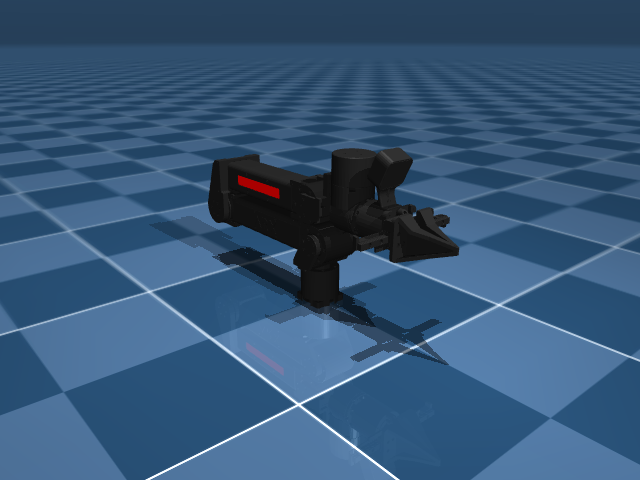
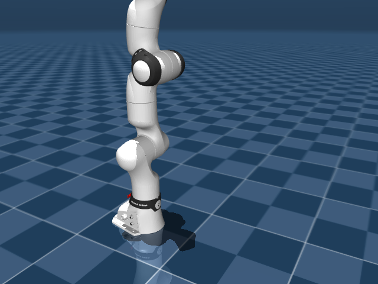
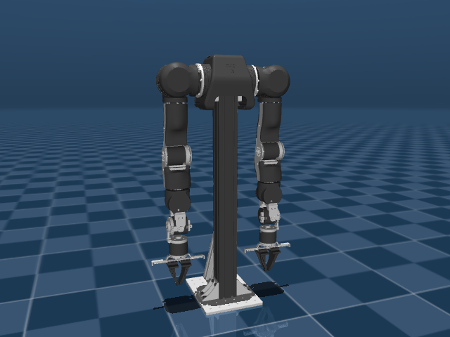
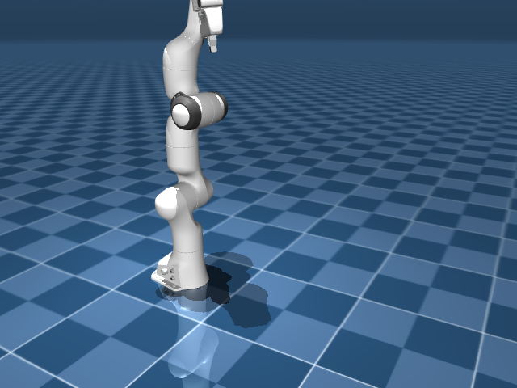
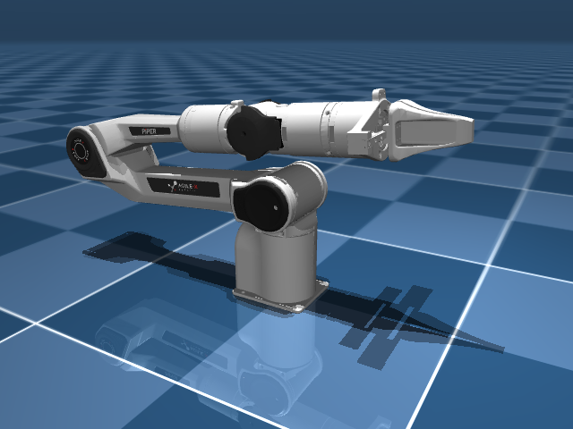
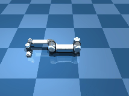

# Arms

Single-arm manipulators: industrial robots, research arms, educational kits.
**23 robots in this category.**

```python
from strands_robots import Robot
sim = Robot("panda")            # Franka Emika Panda
sim = Robot("ur5e")             # Universal Robots UR5e
sim = Robot("so100")            # SO-ARM100 (low-cost Feetech)
```

## Catalog

| Name | Description | Joints | Aliases |
|------|-------------|-------:|---------|
| `arx_l5` | ARX L5 (6-DOF lightweight arm) | 11 | - |
| `dynamixel_2r` | Dynamixel 2R Educational Arm (2-DOF) | 2 | - |
| `fr3` | Franka Research 3 (7-DOF + gripper) | 8 | `franka_fr3` |
| `fr3_v2` | Franka Research 3 v2 (7-DOF + gripper, updated) | 7 | `franka_fr3_v2` |
| `hope_jr` | Hope Junior arm _(hardware-only, no sim asset)_ | ? | - |
| `kinova_gen3` | Kinova Gen3 (7-DOF lightweight) | 7 | - |
| `koch` | Koch v1.1 Low Cost Robot Arm (6-DOF, Dynamixel) | 7 | `koch_follower`, `koch_v1.1`, `low_cost_robot_arm` |
| `kuka_iiwa` | KUKA LBR iiwa 14 (7-DOF collaborative) | 11 | `kuka_iiwa_14` |
| `omx` | OMX Robot Arm (ROBOTIS, CAN bus motors) _(hardware-only, no sim asset)_ | ? | `omx_follower`, `omx_robot`, `robotis_omx` |
| `openarm` | Enactic OpenArm (7-DOF, DAMIAO motors, CAN bus) | 9 | `enactic_openarm`, `open_arm`, `openarm_v10` |
| `panda` | Franka Emika Panda (7-DOF + gripper) | 7 | `bimanual_panda_gripper`, `bimanual_panda_hand`, `franka`, `franka_emika_panda`, `franka_panda`, `libero_panda`, `oxe_droid`, `oxe_droid_rel`, `oxe_droid_relative_eef_relative_joint`, `single_panda_gripper` |
| `piper` | AgileX Piper (6-DOF + gripper) | 11 | `agilex_piper` |
| `rebot_b601` | Seeed Studio reBot B601-DM (6-DOF + gripper, Damiao CAN motors) _(hardware-only, no sim asset)_ | 7 | `rebot_b601_follower`, `seeed_rebot_b601`, `b601_dm` |
| `sawyer` | Rethink Robotics Sawyer (7-DOF) | 7 | `rethink_sawyer` |
| `so100` | TrossenRobotics SO-ARM100 (6-DOF, Feetech servos) | 6 | `so100_4cam`, `so100_dualcam`, `so100_follower`, `so_arm100`, `trs_so_arm100` |
| `so101` | RobotStudio SO-101 (6-DOF, upgraded SO-100) | 6 | `robotstudio_so101`, `so101_dualcam`, `so101_follower`, `so101_tricam` |
| `ur10e` | Universal Robots UR10e (6-DOF industrial) | 6 | - |
| `ur5e` | Universal Robots UR5e (6-DOF industrial) | 6 | - |
| `vx300s` | Trossen ViperX 300s (6-DOF + gripper) | 19 | `oxe_widowx`, `trossen_vx300s`, `viper_x300s` |
| `wx250s` | Trossen WidowX 250s (6-DOF + gripper) | 16 | `widowx_250s`, `trossen_wx250s` |
| `xarm7` | UFactory xArm 7 (7-DOF + gripper) | 13 | `ufactory_xarm7` |
| `yam` | i2rt YAM Arm (8-DOF) | 8 | `i2rt_yam` |
| `z1` | Unitree Z1 (6-DOF + gripper) | 8 | `unitree_z1` |


## Featured renders

A handful of the arms with their default sim render:

### `arx_l5`

{ width=400 }

_ARX L5 (6-DOF lightweight arm)_

### `fr3`

{ width=400 }

_Franka Research 3 (7-DOF + gripper)_

### `kinova_gen3`

{ width=400 }

_Kinova Gen3 (7-DOF lightweight)_

### `koch`

{ width=400 }

_Koch v1.1 Low Cost Robot Arm (6-DOF, Dynamixel)_

### `kuka_iiwa`

{ width=400 }

_KUKA LBR iiwa 14 (7-DOF collaborative)_

### `openarm`

{ width=400 }

_Enactic OpenArm (7-DOF, DAMIAO motors, CAN bus)_

### `panda`

{ width=400 }

_Franka Emika Panda (7-DOF + gripper)_

### `piper`

{ width=400 }

_AgileX Piper (6-DOF + gripper)_


## Universal Robots over RTDE

`ur5e` and `ur10e` have a native driver, so an e-Series arm is driven directly by its
controller's Real-Time Data Exchange interface rather than through lerobot (which
registers no UR robot type):

```python
from strands_robots import Robot

arm = Robot("ur5e", mode="real", driver="strands", port="192.168.1.10")
arm.connect_eagerly()                      # refuses a controller that cannot move
arm.state()                                # joints, TCP pose, TCP wrench
arm.send_action({"elbow_joint": 1.40})     # one servoJ setpoint, radians
arm.run_policy(policy, n_steps=500)        # streamed rollout at control_frequency
```

Needs the SDK: `pip install ur_rtde`. `port=` is the controller's address; the RTDE
port is fixed at 30004 by the protocol, so a different suffix is refused rather than
dialled.

Two gates stand in front of every write, because a UR controller does not reject a bad
command the way a servo bus does - it accepts the register and performs nothing:

- **Controller mode.** A robot mode other than `RUNNING`, or a safety mode outside
  `NORMAL`/`REDUCED`, is refused in the controller's own vocabulary (`PROTECTIVE_STOP`,
  `SAFEGUARD_STOP`). The mode is re-read per write, so a stop landing mid-rollout ends
  the rollout with that reason.
- **Commanded speed.** A joint asked to move further than the model's datasheet ceiling
  allows in one control period is refused, naming the joint and both figures. The
  ceilings differ per model - every UR5e joint reaches 180 deg/s where the UR10e's three
  proximal joints are held to 120 deg/s - so the same policy cadence can be admitted on
  one arm and refused on the other.

Joint keys are the arm's own names, in RTDE wire order, and the MuJoCo assets declare
them identically - so an action dict recorded in simulation streams to the controller
with no remap:

{ width=420 }

_540 servoJ setpoints from `URDriver.send_action` driving the `ur5e` MuJoCo model at
50 Hz, headless._

{ width=640 }

_Top: the setpoints the controller received (solid) and the arm's response (dotted).
Bottom: every commanded step against the model ceiling._

## Compatibility notes

- Most arms are loadable in MuJoCo via the registry's asset block and pull from
  [robot_descriptions.py](https://github.com/robot-descriptions/robot_descriptions.py)
  on first use. Exceptions: `hope_jr`, `omx` and `rebot_b601` declare no sim asset
  and require physical hardware.
- Real hardware through LeRobot, where the registry entry names a `lerobot_type`:
  `hope_jr`, `koch`, `omx`, `openarm`, `rebot_b601`, `so100`, `so101`.
- Real hardware through a native Strands driver, selected with `driver="strands"`:
  `dynamixel_2r`, `fr3`, `fr3_v2`, `hope_jr`, `koch`, `panda`, `so100`, `so101`,
  `ur10e`, `ur5e`, `vx300s`, `wx250s`.
- Every other arm is simulation-only: `Robot(name, mode="real")` refuses it and names
  the robots that do have a path, rather than falling back to sim.
- The Franka arms (`panda`, `fr3`, `fr3_v2`) are driven over the Franka Control
  Interface, which needs the control box's address and the `panda-py` binding over
  libfranka (`pip install panda-py`):

    ```python
    arm = Robot("panda", mode="real", driver="strands", port="172.16.0.2")
    arm.connect_eagerly()                     # returns None, or a reason
    arm.send_action({**dict(zip(arm.joint_names, targets)), "gripper_width": 0.04})
    ```

    Read `arm.joint_names` rather than assuming them: each Franka's joints are named
    the way *its own* MuJoCo model names them, so a Panda's are `joint1..joint7`
    while an FR3's are `fr3_joint1..fr3_joint7`. That is what lets one action dict
    drive the simulated arm and the real one:

    { width=400 }

    _The same dict, keyed by `arm.joint_names` and passed through the driver's own
    `action_to_targets` gate, stepping the simulated `panda`._

    A `send_action` that reports success means the arm reached the configuration
    it was given. `panda-py` runs the trajectory on its own realtime thread and
    reports the outcome as a return value rather than by raising, so a reflex
    stop, an out-of-limit target, or a motion that simply ended short of the goal
    all come back as an error envelope carrying libfranka's own message - not as
    a success naming joints the arm is not holding.

    `arm.stop()` preempts a motion in flight. It goes through libfranka's own
    `Robot::stop()`, which is designed to abort a running control loop from
    another thread, so it does not wait for the motion it was asked to interrupt;
    the Franka Hand is halted with the arm. Telemetry keeps answering throughout,
    so `read_state()` on another thread is not blanked for the duration of a
    motion.
- Joint counts include any free joints / gripper actuators - the *control* DOF is
  usually `joints - 1` for arms with grippers.

## See also

- [Robot factory](../getting-started/robot-factory.md) - how `Robot("name")` resolves
  these names.
- [Bimanual](bimanual.md) - two-arm setups (Aloha, Trossen WX-AI).
- [Hands](hands.md) - pair an arm with a dexterous end-effector.
- [Quickstart](../getting-started/quickstart.md) - spawn one of these arms in 3 lines.
