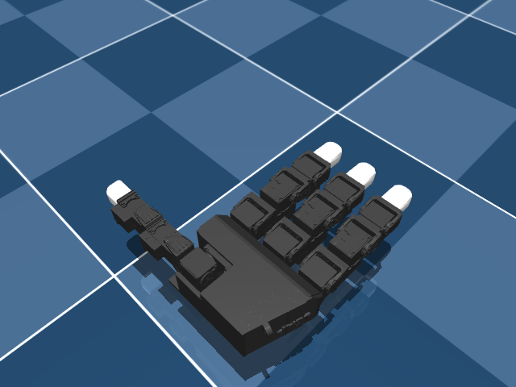
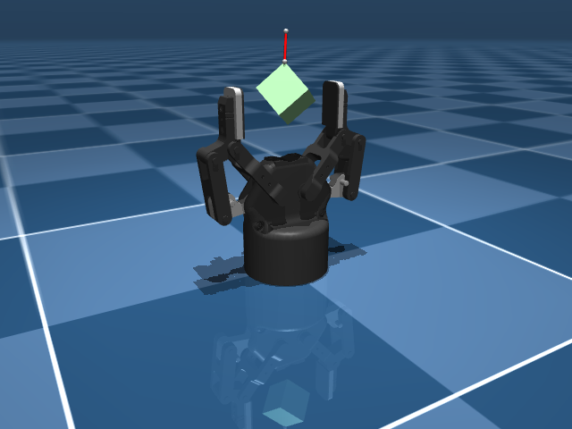
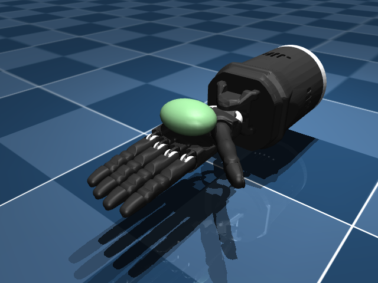

# Hands

Dexterous end-effectors - Allegro, Shadow, LEAP, Robotiq, etc.

```python
from strands_robots import Robot
sim = Robot("shadow_hand")      # Shadow Hand
sim = Robot("leap_hand")        # LEAP Hand
sim = Robot("robotiq_2f85")     # Robotiq 2F-85 gripper
```

## Catalog

| Name | Description | Joints | Aliases |
|------|-------------|-------:|---------|
| `ability_hand` | PSYONIC Ability Hand (5-finger prosthetic, 11-DOF) | 11 | `psyonic_ability_hand` |
| `aero_hand` | Tetheria Aero Hand Open (16-DOF dexterous) | 16 | `tetheria_aero_hand`, `aero_hand_open` |
| `allegro_hand` | Wonik Allegro Hand (16-DOF dexterous) | 16 | `wonik_allegro` |
| `hope_jr_hand` | HopeJR Hand (dexterous anthropomorphic hand, Feetech) _(hardware-only, no sim asset)_ | ? | `hopejr_hand`, `hope_junior_hand` |
| `leap_hand` | LEAP Hand (16-DOF dexterous) | 41 | - |
| `robotiq_2f85` | Robotiq 2F-85 Gripper (2-finger adaptive) | 16 | `robotiq` |
| `robotiq_2f85_v4` | Robotiq 2F-85 v4 Gripper (updated model) | 6 | - |
| `shadow_dexee` | Shadow DexEE Dexterous End-Effector (12-DOF) | 12 | - |
| `shadow_hand` | Shadow Dexterous Hand (24-DOF) | 45 | - |

## Featured renders

### `leap_hand`

{ width=400 }

_LEAP Hand (16-DOF dexterous)_

### `robotiq_2f85`

{ width=400 }

_Robotiq 2F-85 Gripper (2-finger adaptive)_

### `shadow_hand`

{ width=400 }

_Shadow Dexterous Hand (24-DOF)_

## Hardware control

Every entry above builds in simulation. One of them also drives real hardware:
the Robotiq 2F-85 has a native Modbus TCP driver, so `mode="real"` reaches the
gripper itself.

```python
from strands_robots import Robot

gripper = Robot("robotiq_2f85", mode="real", port="192.168.1.11")
gripper.connect_eagerly()          # opens the socket AND activates the gripper

gripper.send_action({"gripper": 1.0})        # 0.0 fully open, 1.0 fully closed
gripper.send_action({"aperture_mm": 40.0})   # or millimetres between the fingertips
gripper.read_status()                        # aperture, grasp detection, faults
```

`driver="strands"` is the default for this robot (its registry entry declares
it), because lerobot has no robot type for a gripper.

Two things worth knowing about the hardware:

- **Activation is not optional.** A 2F-85 powers up unactivated and *ignores*
  every position command until it has run a calibration stroke - it reports no
  error, it simply does not move. `connect_eagerly()` performs the activation
  sequence and waits for it to finish, so a successful connect means a gripper
  that will actually move.
- **A grasp is not the same as a stop.** `read_status()` reports `holding`,
  derived from the gripper's `gOBJ` field: the fingers stopping because they
  reached the commanded position is a different outcome from stopping because
  something is between them. Reading only "stopped" reports every empty close
  as a successful pick.

The 2F-140 and Hand-E answer the same register map with a different stroke; pass
`stroke_mm=` to drive one.

## See also

- [Arms](arms.md) - pair a hand with an arm via `add_robot`.
- [Custom policies](../policies/custom-policies.md) - high-DOF hand control needs careful action-space design.
- [Bimanual](bimanual.md) - two arms each with a hand.
