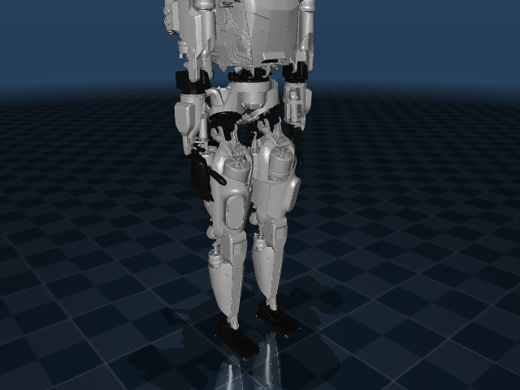
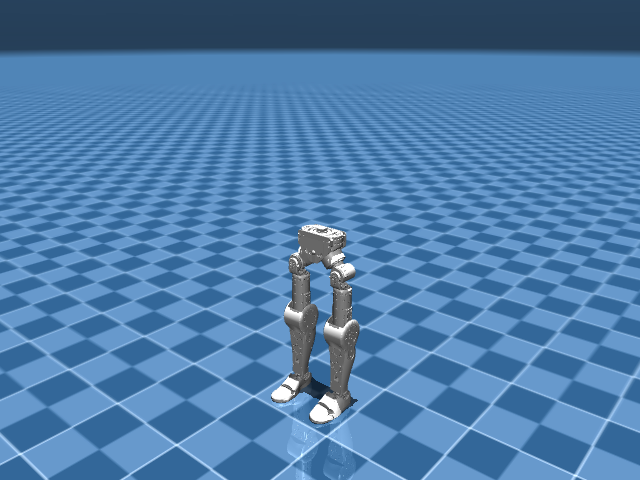
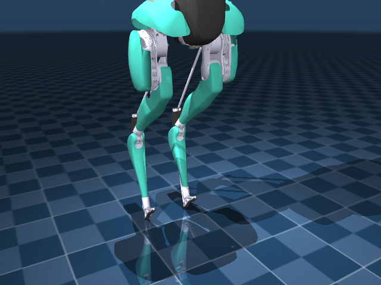
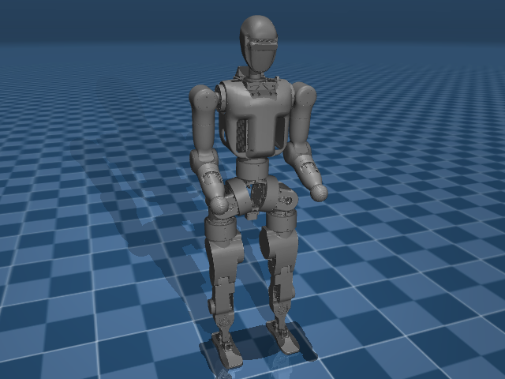
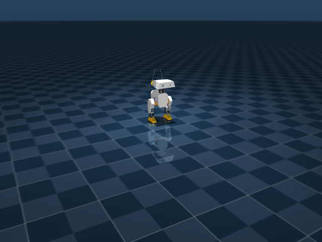
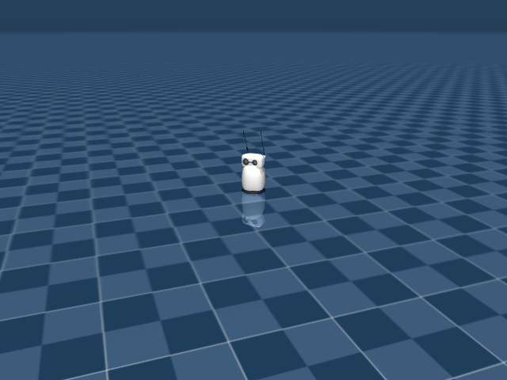

# Humanoids

Full-body humanoids and expressive desktop robots.

```python
from strands_robots import Robot
sim = Robot("unitree_g1")       # Unitree G1
sim = Robot("unitree_h1")       # Unitree H1
sim = Robot("apollo")           # Apptronik Apollo
sim = Robot("reachy_mini")      # Pollen Reachy Mini (expressive)
```

## Catalog

| Name | Description | Joints | Aliases |
|------|-------------|-------:|---------|
| `adam_lite` | PNDbotics Adam Lite Humanoid (26-DOF) | 26 | `pndbotics_adam_lite` |
| `apollo` | Apptronik Apollo Humanoid (34-DOF) | 34 | `apptronik_apollo` |
| `asimov_v0` | Asimov V0 Bipedal Legs (12-DOF + 2 passive toes) | 15 | `asimov` |
| `booster_t1` | Booster T1 Humanoid (24-DOF) | 24 | - |
| `cassie` | Agility Cassie Bipedal Robot | 28 | `agility_cassie` |
| `elf2` | BXI Elf2 Humanoid (25-DOF) | 26 | `bxi_elf2` |
| `fourier_n1` | Fourier N1 / GR-1 Humanoid (26-DOF) | 26 | `fourier_gr1`, `fourier_gr1_arms_only`, `fourier_gr1_arms_waist`, `fourier_gr1_full_upper_body`, `gr1` |
| `jvrc` | JVRC-1 Humanoid (HRP-based, 45-DOF) | 45 | `jvrc1` |
| `microduck` | Pollen Microduck (14-DOF open-source biped, Dynamixel XL330) | 15 | `micro_duck`, `pollen_microduck` |
| `op3` | ROBOTIS OP3 Humanoid (20-DOF) | 21 | `robotis_op3` |
| `open_duck_mini` | Open Duck Mini V2 (16-DOF expressive biped, Feetech servos) | 16 | `bdx`, `mini_bdx`, `open_duck`, `open_duck_mini_v2`, `open_duck_v2` |
| `rby1` | Rainbow Robotics RB-Y1A Mobile Manipulator (31-DOF) | 31 | `rby1a`, `rainbow_rby1` |
| `reachy2` | Pollen Reachy 2 _(hardware-only, no sim asset)_ | ? | - |
| `reachy_mini` | Pollen Reachy Mini (6-DOF Stewart head + antennas, 9 actuators) | 21 | `pollen_reachy_mini`, `reachy`, `reachy-mini`, `reachymini` |
| `talos` | PAL Robotics TALOS Humanoid (32-DOF) | 45 | `pal_talos` |
| `toddlerbot_2xc` | Toddlerbot 2xC Humanoid (45-DOF) | 45 | - |
| `toddlerbot_2xm` | Toddlerbot 2xM Humanoid (45-DOF) | 45 | - |
| `unitree_g1` | Unitree G1 Humanoid (29-DOF + dexterous hands) | 46 | `g1`, `g1_wbc`, `real_g1_relative_eef_relative_joints`, `unitree_g1_full_body`, `unitree_g1_locomanip`, `unitree_g1_real`, `unitree_g1_sonic`, `unitree_g1_wbc` |
| `unitree_h1` | Unitree H1 Humanoid (19-DOF) | 20 | `h1` |
| `unitree_h1_2` | Unitree H1-2 Humanoid (52-DOF, with hands) | 52 | `h1_2` |

## Featured renders

### `apollo`

{ width=400 }

_Apptronik Apollo Humanoid (34-DOF)_

### `asimov_v0`

{ width=400 }

_Asimov V0 Bipedal Legs (12-DOF + 2 passive toes)_

### `booster_t1`

_Booster T1 Humanoid (24-DOF)_

**Real hardware.** The T1 is driven natively through its own SDK
(`booster_robotics_sdk_python`, a pybind11 wrapper over the robot's DDS
transport) — lerobot has no robot type for it, so `driver="strands"` is the only
way to reach it and the registry declares it as the default:

```python
from strands_robots import Robot

t1 = Robot("booster_t1", mode="real", port="192.168.10.102")  # driver="strands"
t1.connect_eagerly()          # ChannelFactory + loco client + LowState/LowCmd channels

t1.move(vx=0.2)               # walk: a twist to the onboard controller
t1.rotate_head(pitch=0.1, yaw=-0.3)

t1.enable_upper_body(True)    # claim the arms (UpperBodyCustomControl)
t1.send_action({"left_shoulder_pitch": -0.4, "right_elbow_pitch": 0.7})
t1.stop_task()                # halt locomotion + hand the arms back
```

Control of the T1 is **split**, and the driver enforces the split rather than
documenting it. An onboard whole-body controller owns the legs, waist and head;
the eight upper-body joints can be handed to a host, and only then:

| Slots | Joints | Who commands them |
|-------|--------|-------------------|
| 2–9 | `left`/`right` `shoulder_pitch`, `shoulder_roll`, `elbow_pitch`, `elbow_yaw` | the host, via `send_action`, after `enable_upper_body(True)` |
| 0–1 | `head_yaw`, `head_pitch` | the robot, via `rotate_head()` |
| 10–22 | waist, hips, knees, ankle cranks | the robot, via `move()` |

Every frame the driver publishes puts `kp=kd=0` on every slot outside 2–9, which
is what leaves the onboard controller in charge of balance; an uncommanded arm
joint holds its last *observed* position, so commanding one arm does not drop the
other. `send_action` refuses before the gate is open, before the first `LowState`
has arrived (the frame width and the hold positions both come from the robot's
own report), and for any joint outside the upper body — naming `move()` or
`rotate_head()` instead.

The driver also subscribes the T1's battery and fall-down topics. A fall state
other than `IS_READY` refuses a write — a held arm posture is noise while the
robot is on its way to, on, or getting off the floor, and can obstruct its
getting-up routine — and the gate reads *evidence of a fall* rather than the
absence of a reading, so a T1 whose fall topic is silent keeps writing. The
charge read reaches `get_status()` as the shared `battery_pct` field and gates
nothing: the SDK names it `soc` and documents no scale, and a floor compared
against an unverified scale refuses every frame or none while looking like a
working check.

`run_policy`/`start_task` refuse: this driver publishes one frame per call and
owns no control loop. A caller who wants a trajectory calls `send_action` on
their own timer (the vendor's reference client runs 100 Hz).

The SDK is a vendor wheel rather than a declared dependency of this project
(`pip install booster_robotics_sdk_python`, linux wheels only) — the same footing
as the G1's `unitree-sdk2`. Without it the driver still imports, builds and
answers `get_status`; `connect_eagerly()` returns a reason naming the module and
the install line.

### `cassie`

{ width=400 }

_Agility Cassie Bipedal Robot_

### `fourier_n1`

{ width=400 }

_Fourier N1 / GR-1 Humanoid (26-DOF)_

### `microduck`

{ width=400 }

_Pollen Microduck (14-DOF open-source biped, Dynamixel XL330)_

{ width=400 }

_`alpha_walking.onnx` in a MuJoCo rollout — see [Microduck policies](../policies/microduck.md#walking-in-mujoco)._

**Real hardware.** The Microduck is driven natively through its on-robot
`robotd` daemon (Pollen's `duck-ipc-proto` JSON-RPC over a Unix socket) — the
same policy code that runs in sim drives the physical robot:

```python
from strands_robots import Robot

# On the robot (robotd's default socket), or a socket forwarded over SSH.
duck = Robot("microduck", mode="real")                       # /run/robotd.sock
duck = Robot("microduck", mode="real", port="/tmp/robotd.sock")

duck.connect_eagerly()                 # Hello handshake + subscribe to state
duck.send_action({"vx": 0.15})         # walk forward (robot.move intent)
duck.send_action({"skill": "kick_left"})  # a named skill (robot.do)
duck.emergency_stop()                  # robot.stop
```

`robotd` owns the walking/skill ONNX on-device, so `run_policy`/`start_task`
refuse and point back at the intent path; use `mode="sim"` for a host-driven
`MicroduckPolicy` rollout. For a remote robot, forward its socket to a local
path (`ssh -L`/`socat`) and pass that path as `port=`.

### `open_duck_mini`

{ width=400 }

_Open Duck Mini V2 (16-DOF expressive biped, Feetech servos)_

### `reachy_mini`

{ width=400 }

_Pollen Reachy Mini (6-DOF Stewart head + antennas, 9 actuators)_

## Mounting a camera on a humanoid

`add_camera(parent_body=...)` mounts a camera ON a body so it rides with the
robot, and `position`/`target` are then in that body's LOCAL frame. The general
recipe in [World building](../simulation/world-building.md) reads the mount from
`list_bodies(robot_name=...)["gripper_body"]`, which is the right mount for an
arm. A humanoid here reports `gripper_body: None`: that hint set (`gripper`,
`hand`, `jaw`, `ee`, `tool`) is arm-shaped, and matching it on word boundaries is
what keeps a leg out of the answer - a `knee` link is not an end-effector because
`ee` occurs in its name. Pick the mount from the full `bodies` list instead.

For a head camera there is no head link to pick. The Unitree G1 asset's body tree
ends at the wrists - `pelvis` to hips/knees/ankles, and `waist_yaw_link` to
`waist_roll_link` to `torso_link` to shoulders/elbows/wrists - with no
`head_link`, `neck_link` or `eye_link`; its only sites are two IMUs and the two
feet. Mount on the torso with a local offset instead:

```python
sim.add_camera(name="head", parent_body="g1/torso_link",
               position=[0.08, 0.0, 0.35], target=[1.0, 0.0, 0.2])
```

That puts the camera 0.35 m above the torso frame, roughly head height, and it
rides with the torso through waist yaw and roll. An arm camera mounts the same
way on a wrist link (`g1/left_wrist_yaw_link`).

## See also

- [Mobile](mobile.md) - quadrupeds and wheeled bases.
- [Bimanual](bimanual.md) - two-arm rigs without the legs.
- [GR00T](../policies/groot.md) - many GR00T data_configs target humanoids.
