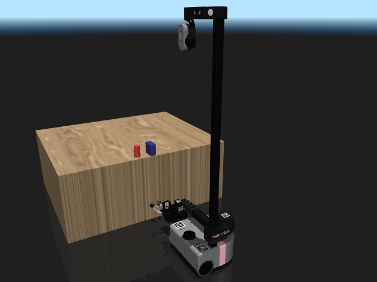
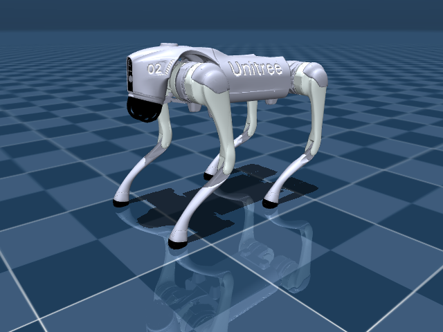

# Mobile, mobile manip, and aerial

Quadrupeds, wheeled bases, mobile manipulators, and quadcopters.

```python
from strands_robots import Robot
sim = Robot("unitree_go2")      # Unitree Go2 quadruped
sim = Robot("spot")             # Boston Dynamics Spot
sim = Robot("stretch3")         # Hello Robot Stretch 3 (mobile manip)
sim = Robot("crazyflie")        # Bitcraze Crazyflie 2 quadcopter
```

## Catalog

| Name | Description | Joints | Aliases |
|------|-------------|-------:|---------|
| `aliengo` | Unitree Aliengo Quadruped (12-DOF) | 13 | `unitree_aliengo` |
| `anymal_b` | ANYbotics ANYmal B Quadruped (12-DOF) | 13 | `anybotics_anymal_b` |
| `anymal_c` | ANYbotics ANYmal C Quadruped (12-DOF) | 13 | `anybotics_anymal_c` |
| `crazyflie` | Bitcraze Crazyflie 2 Nano-Quadcopter | 1 | `cf2`, `bitcraze_crazyflie` |
| `earthrover` | EarthRover Mini Plus (mobile outdoor navigation) _(hardware-only, no sim asset)_ | ? | `earth_rover`, `earthrover_mini_plus`, `frodobots` |
| `go1` | Unitree Go1 Quadruped (12-DOF) | 13 | `unitree_go1` |
| `google_robot` | Google Robot (mobile base + arm, RT-X) | 10 | `oxe_google` |
| `lekiwi` | LeKiwi mobile manipulator (6-DOF arm on 3-omniwheel base, 9 actuators) | 9 | - |
| `lekiwi_client` | LeKiwi networked client (drives a remote LeKiwi host over ZMQ) _(hardware-only, no sim asset)_ | ? | `lekiwi_remote`, `lekiwi_net` |
| `robot_soccer_kit` | Robot Soccer Kit (multi-robot soccer, 65-DOF total) | 65 | `rsk` |
| `skydio_x2` | Skydio X2 Autonomous Drone | 1 | - |
| `spot` | Boston Dynamics Spot (with arm) | 20 | `boston_dynamics_spot` |
| `stretch` | Hello Robot Stretch (original, mobile manipulator) | 18 | `hello_robot_stretch_original` |
| `stretch3` | Hello Robot Stretch 3 (mobile manipulator) | 41 | `hello_robot_stretch`, `hello_robot_stretch_3` |
| `tiago_dual` | PAL Robotics TIAGo++ Dual-Arm Mobile (26-DOF) | 26 | `tiago++`, `pal_tiago_dual` |
| `unitree_a1` | Unitree A1 Quadruped | 13 | `a1` |
| `unitree_go2` | Unitree Go2 Quadruped | 40 | `go2` |

## Featured renders

### `spot`

{ width=400 }

_Boston Dynamics Spot (with arm)_

### `stretch3`

{ width=400 }

_Hello Robot Stretch 3 (mobile manipulator)_

### `unitree_go2`

{ width=400 }

_Unitree Go2 Quadruped_

## Real hardware: the Go2 native driver

The Go2 has no lerobot robot type, so `mode="real"` builds the native CycloneDDS
driver in `strands_robots.drivers.go2`. Its registry entry declares
`hardware.driver = "strands"`, so no `driver=` keyword is needed:

```python
from strands_robots import Robot

go2 = Robot("go2", mode="real", port="192.168.123.161", network_interface="eth0")
go2.connect_eagerly()          # subscribes rt/lowstate and rt/sportmodestate
go2.release_sport_mode()       # hands the legs over - see below
go2.send_action({"FL_calf_joint": -1.5})
```

Two Go2 specifics are worth knowing before writing a controller.

**Sport mode must be released first.** The Go2 ships with an onboard sport-mode
service driving the legs. Until it is released, a `rt/lowcmd` frame puts that
controller and your commands on the same twelve motors, so every write path
(`send_action`, `run_policy`, `start_task`) refuses until `release_sport_mode()`
confirms the robot reports no active mode. Releasing is deliberately *not* a side
effect of `connect_eagerly()`, which only subscribes to read.

**Actions are keyed by joint name, never by index.** `rt/lowcmd`'s `motor_cmd`
array follows Unitree's `LegID` order - front-right, front-left, rear-right,
rear-left - while the Go2's own URDF/MJCF description declares its joints
front-left, front-right, rear-left, rear-right. The two orders hold the same
twelve joints, so zipping a description-ordered vector onto `motor_cmd` produces
twelve valid commands aimed at the mirror-image legs, with a correct CRC and
nothing in any log to say so. `GO2_JOINT_INDEX` is the one place the two
conventions are reconciled:


_The same command, run in MuJoCo on the official Go2 description. Left: keyed by
name through `GO2_JOINT_INDEX`, the front-left leg lifts. Right: the identical
twelve-value vector written to `motor_cmd` in description order - the front-right
leg lifts instead._

| Description order (URDF/MJCF) | Wire slot (`motor_cmd` index) |
|-------------------------------|------------------------------:|
| `FL_hip_joint` / `_thigh_` / `_calf_` | 3, 4, 5 |
| `FR_hip_joint` / `_thigh_` / `_calf_` | 0, 1, 2 |
| `RL_hip_joint` / `_thigh_` / `_calf_` | 9, 10, 11 |
| `RR_hip_joint` / `_thigh_` / `_calf_` | 6, 7, 8 |

Telemetry read back through `go2.state` is keyed by the same names, so the read
path cannot be transposed either.

`run_policy(policy_object=...)` rolls a callable or a `Policy` on a 500 Hz thread,
re-checks both gates every step, and publishes a zero-gain (but still enabled)
soft-stop frame on the way out rather than cutting the motors dead. Poll
`get_task_status()`; `stop_task()` reports honestly whether the loop actually
joined.

## See also

- [Humanoids](humanoids.md) - bipedal alternatives.
- [Multi-robot mesh](../mesh.md) - coordinate a fleet via the mesh.
- [Domain randomization](../simulation/domain-randomization.md) - terrain randomisation for legged robots.
