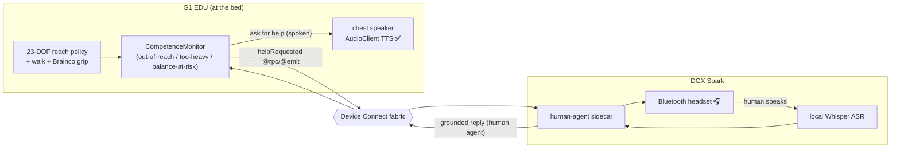
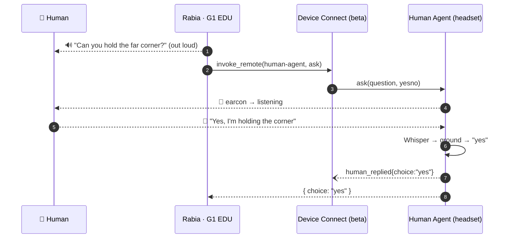
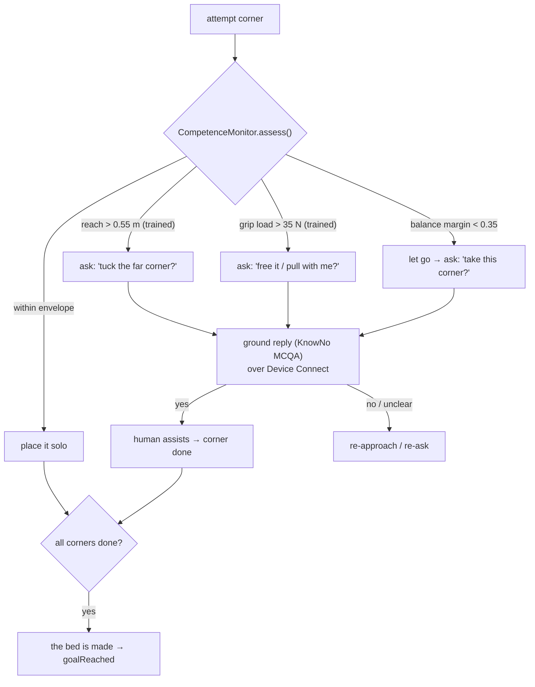
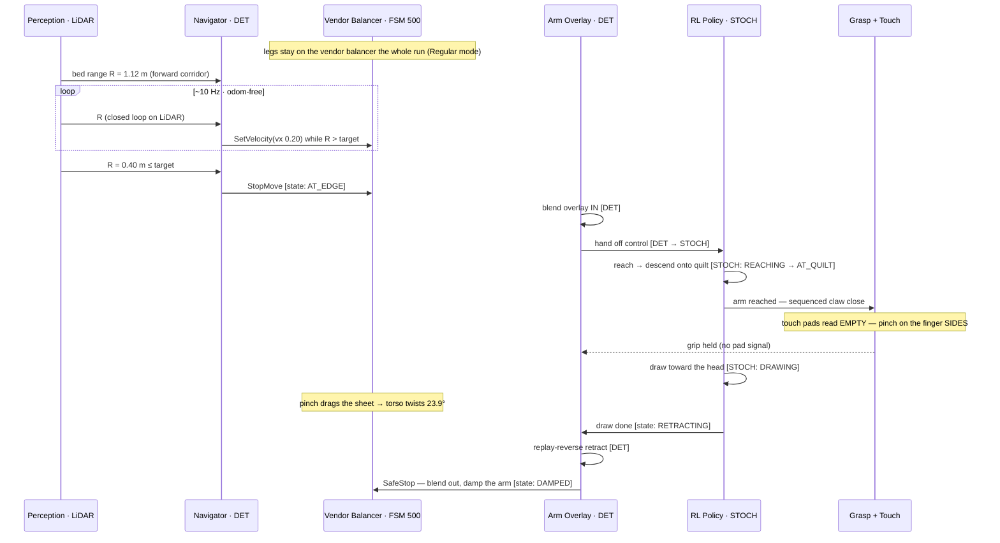

# Bed-Making, In Real Life — Unitree G1 EDU (23-DOF) + a Human Partner

> The sibling of [`RL_WHOLE_BODY_REACH.md`](RL_WHOLE_BODY_REACH.md) (the **simulation**). That
> document teaches two free-base G1s to balance-while-reaching in Isaac Sim. **This one takes the
> demo to the *physical* robot** ([armwaheed/robots#3](https://github.com/armwaheed/robots/issues/3)):
> a real **23-DOF Unitree G1 EDU with Brainco hands**, making a bed **with a human partner it asks
> for help** when it gets stuck — orchestrated by **Device Connect**, perceived with the robot's own
> **LiDAR + RGB + depth**.
>
> *Methodology rule, unchanged from the sim work: **verify by what the human sees** (rendered frames,
> live sensor reads, the robot actually speaking) — never by telemetry alone. Every claim below was
> checked on the hardware or by eye.*

---

## 1. The robot, in the room

The 23-DOF G1 EDU (Brainco hands), working a real bed. The goal: **reach over the edge, grip the
cover, and draw it** — arms only, on the `rt/arm_sdk` overlay while the **factory balancer holds the
legs** (no whole-body release). The whole IRL effort is grounded in *this* robot and *this* space —
its sensors, its closed audio system, its real DOF.

| The task: reach → grip → draw the cover | The limit that reshaped the approach |
|---|---|
|  |  |

*Left: the EDU reaches to grip and draw the cover, balance carried entirely by the vendor controller
— live, the torso barely twisted and the factory balancer didn't even compensate. Right: the
open-loop limit that drove today's architecture — the vision-less RL reach comes in too low and the
**forearm drags the mattress**. Today's fix, validated on hardware: a **deterministic shoulder-wide
lift** that clears the surface → an **RL come-in from shoulder height** → grip → draw → an
**exact-reverse retraction**, with every transition (including the release) smoothly blended.*

---

## 2. What carried over from the sim, and what is new

| Axis | Sim (issue #2) | IRL (issue #3) |
|---|---|---|
| Robot | 2 × **29-DOF**, Inspire hands | **1 × 23-DOF EDU**, Brainco hands |
| Partner | a second robot | a **human**, asked for help only when stuck |
| Channel | robot ↔ robot over Device Connect | robot **speaks**; human replies as a **Device Connect agent** |
| Perception | sim RayCaster + camera | the **real** LiDAR + RGB + depth (this doc) |
| Goal | sheet drawn in sim | a **real** bed |

The hard sim results (balance-while-reach, ambidexterity, the grip experiments) are documented in the
sim writeup. Here we focus on the three things that only exist on hardware: a **transfer-valid
policy**, **real perception**, and the **human voice loop** (and the deep rabbit-hole the robot's
microphone turned out to be).

---

## 3. A transfer-valid 23-DOF policy

The sim policy used all **29** body DOF — including the **waist pitch** it leans on. The real EDU
**does not have** that joint (nor waist roll, nor wrist pitch/yaw — 6 joints absent), so the sim
policy is a valid sim result but **not transfer-valid**. We retrained for the robot's actual body:

- **Action = the 23 real EDU joints** (12 legs + waist-yaw + 10 arms incl. wrist-roll); the 6 absent
  joints are **locked rigid** and excluded from the action set.
- **Observation restricted to those 23 joints** → the obs vector is **85-D** (vs 151-D), i.e. exactly
  what the hardware can report. *(Keeping the obs/action contract explicit is the documented #1
  sim-to-real lever for the G1 — the public deployment failures are obs-layout / joint-order
  mismatches, e.g. IsaacLab #4037, not the DOF-locking itself.)*
- **EE = `wrist_roll_link`** (the distal actuated link on the 23-DOF arm).

Trained from scratch (2048 envs × 1500 iters on the DGX Spark GB10) and **eye-verified**: the EDU
balances on its own two feet at the bedside and reaches onto the bed, no topple, no kinematic cheats.

| reach over the bedside | lateral reach (the drag direction) |
|---|---|
|  |  |

*`reach_coarse` climbs 0.32 → 0.65 while mean episode length holds at ~393/400 — nearly no early
terminations, i.e. it stays upright. (Mean reward is regularizer-dominated and misleading; the real
signals are `reach_coarse` + ep-len + the rendered eval.)* Full clip:
[`media/rl/g1edu/bed_reach_g1edu.mp4`](https://github.com/user-attachments/assets/c66bd224-0670-4815-8ea2-afadb14d40ab). Deployable policy at
[`rl/policy_g1edu/`](rl/policy_g1edu/); env in [`rl/robot_cfg_g1edu.py`](rl/robot_cfg_g1edu.py) +
[`rl/bed_reach_env_cfg_g1edu.py`](rl/bed_reach_env_cfg_g1edu.py).

---

## 4. Real perception — LiDAR-first, on the actual sensors

We pulled live readings from the robot (`robotics-connect` `lidar_sight` + `depth_camera_sight`):

| Crown LiDAR (Livox MID-360), top-down | Head depth (RealSense D435i) |
|---|---|
|  |  |

- The **LiDAR is mounted upside-down** in the crown; `lidar_sight` applies the **180° roll
  correction** so the cloud comes out in a clean body frame (+x fwd, +y left, +z up). The raw scan
  also sees straight through the office's **open doorway** (points out to ~10 m); the view above is
  **cropped to the room** (radial + box, 11,361 of 12,423 points kept) — the truncation the bed task
  needs so the detector reasons about *this* room, not the hallway.
- **Hand placement is LiDAR-first.** The near-field LiDAR is accurate to ~±4 cm; the head depth
  camera's IR stereo produces artifacts on textureless bedding (visible as the holes/speckle in the
  depth map), so depth is used only for the **coarse** coverage check, never the fine hand target —
  the user's hardware observation, corroborated by the cloth-manipulation literature (Seita et al.
  2019: pick on depth, not RGB). Code: [`perception.py`](perception.py) (`grasp_point_from_lidar`,
  `BedPerception`) — the *same* numpy runs on the sim RayCaster cloud and this real `lidar_sight`
  cloud (the real-to-sim loop).

### 4.1 In the master bedroom — perceiving the actual bed

The robot is now standing in the **master bedroom**, at its fixed start pose: in front of the closed
double doors (to the master bathroom), **facing the bed** ~1.5–2.5 m away across clear carpet. Here is
what each sensor reports from that spot — each checked against ground-truth photos of the room.

| Crown LiDAR (annotated, near-field) | Head RGB (down-tilt 51.29°) | Head depth (RealSense D435i) |
|---|---|---|
|  |  |  |

- **LiDAR (left).** `find_tables()` locks onto the **bed as a 0.68 m² flat plane at (1.44 m forward,
  0.44 m left)** at mattress height, with the floor at z ≈ −0.78 m and the far window-wall at ~5 m —
  exactly the room geometry (bed ahead and slightly left, headboard against the window).
- **RGB (centre).** The down-tilted head camera frames the **bed's near edge** — dark frame, grey
  fitted sheet, white mattress, the cream comforter draped over the side, brass feet on carpet — the
  same bed seen in the room photos.
- **Depth (right).** The bed edge and receding floor read from ~1.0 m out, **but the white speckle is
  invalid depth — the stereo artifacts the IR projector leaves on textureless bedding and carpet.**
  This is exactly why **hand placement is LiDAR-first**: the near-field LiDAR has none of those holes.

So from its start pose the robot already sees the bed it has to make — a clean ~1.4 m approach on a
clear path — which is what the walk-to-bed step (§9) drives toward.

---

## 5. Voice OUT — the robot speaks (verified on hardware)

The robot asks for help through its **own chest speaker**, via Unitree's `AudioClient` over the DDS
`"voice"` service — built as `robotics-connect/unitree/g1/voice`
and **verified live**: the G1 physically spoke "Hello. I am the bed-making robot…".

Two findings worth recording for the next session:
- `TtsMaker(text, speaker_id)` — on this EDU firmware **`speaker_id=0` is Chinese (female)**; **1–4
  are English** (faint accent). We default to **4**.
- `PlayStream` accepts raw **16 kHz / mono / 16-bit PCM** (bring-your-own TTS); `SetVolume` and
  `LedControl` (used as an "I'm listening" cue) round it out.

---

## 6. Voice IN — the microphone is a closed system (the honest record)

The "listen" half was a genuine rabbit hole, and the result is a clear, useful negative finding. The
goal: read the G1's 4-mic array so the robot could hear the human's reply. **Every native path was
exhausted:**

| Attempt | Result |
|---|---|
| `unitree_sdk2` `AudioClient` mic/ASR | **not exposed** — ASR api id `1002` is *registered but never called*; calling it returns error `3104` |
| Serial / UART / I2C | **no path** — the mic is an on-board Tegra-APE ALSA codec, not a serial device |
| Read the factory binary's config | `master_service` is **stripped** (no ALSA params); it only supervises `ota_pipe` + `video_hub_pc4` |
| Direct ALSA capture (`hw:APE,0`) | the only capture node `pcmC1D0c` is **held exclusively** by the factory |
| Play silence → full-duplex (the AEC trick) | **opens a capture** (`pcm0c` RUNNING, S16/2ch/44100) — but it's the AEC *reference*, not the live mic |
| Wake word ("Hello Unitree") → real listen | the mic **does** open — but the route is **not on the XBAR mux** (`ADMAIF1 Mux = None`) so it can't be fanned to a parallel ADMAIF |
| Parallel XBAR tap (DMIC1-4 / I2S1-6 → ADMAIF2) | **all at/below noise floor** (chart below) |
| DDS republish (`rt/audiosender` / `rt/audio_msg`) | **idle** — no traffic |
| `journalctl -u unitree_voice` / service logs | **no ASR process and no voice log exist** on this unit |

**Root cause:** the G1 EDU has **no on-board ASR**. With "Wake-up Conversation Mode" enabled in the
Unitree app, a *closed firmware wake-detector* briefly opens the mic and **streams it off-robot** to
Unitree's app/cloud for recognition — there is no local userspace hook (no XBAR-visible route, no DDS
republish, no log, no ASR result to read). Extracting it would require root-tracing an ephemeral
closed process or intercepting the encrypted cloud stream — not something to do on a balancing robot.

| The app mode that opens the mic | |
|---|---|
|  | The toggle that lets the closed firmware open `pcm0c` on the wake word — confirmed by watching the capture substream go `RUNNING` while a person spoke. |

We filed the full reproduction (above) and took it to **Unitree engineering support** for the
supported way to read the array from userspace. The mic findings are also documented in the voice
module's `README.md`.

### 6.1 Unitree engineering support's verdict — the question is now closed

Unitree's engineering support confirmed the result outright (support work order, June 2026): **the
G1's microphone is not exposed as a developer interface.** The only supported speech route is the
robot's built-in automatic speech recognition, together with the other voice-UI features documented
under [VuiClient_Service](https://support.unitree.com/home/en/G1_developer/VuiClient_Service). To run
your own speech recognition — or anything that needs the raw array — their guidance is to **connect an
external microphone/speaker array through the USB-C ports** instead of tapping the built-in one.

So the closed-system result above is *by design*, not a bug to root around — which settles why the
human loop is built the way §7 describes. Rather than crack the onboard mic, we route the human into
**Device Connect** as their own agent (a Bluetooth headset + a sidecar that runs the ASR); the robot
asks over its speaker (§5, verified) and hears over the fabric. (An external USB-C mic array would
also satisfy Unitree's supported path, and the same coordination layer would accept it as a drop-in
audio source — see §7.)

---

## 7. The resolution — the human as a Device Connect *agent*

The robot doesn't need to crack its own mic to work with a human, because **Device Connect already
is the human↔robot bus.** The human talks through a **Bluetooth headset on the DGX Spark**; a small
**Device Connect sidecar** on the Spark captures that headset, runs ASR (local Whisper), and
registers the human as a **"human agent"** in the Device Connect fabric. The robot **asks** through
its own speaker (§5, verified) and **hears** through Device Connect.

This keeps the issue's intent — *Device Connect orchestrates the human interaction* — while sidestepping
the closed on-board mic. And per Unitree engineering support (§6.1) the built-in array will *stay*
closed by design, so this isn't a stopgap: if a fully on-robot listen path is ever wanted, Unitree's
supported route is an **external USB-C mic/speaker array**, and the same coordination layer swaps the
sidecar's headset source for it with no logic change.

### 7.1 Built and verified live — both devices on the dashboard

This is no longer just a design. The real G1 EDU (**"Rabia"**) and a **Bluetooth Headset Human Agent**
both register on the hosted Device Connect fabric (`beta` tenant) and run the full loop end-to-end:
Rabia asks for help **out loud through her chest speaker**, invokes the human agent's `ask()` over
Device Connect, and the human's spoken answer — captured on the headset, transcribed by Whisper, and
grounded — comes back over the fabric with a `human_replied` event.

Both devices are live on the dashboard, each with its callable functions and event stream — the Human
Agent (`ask`/`notify`/`presence` + `human_replied`) and Rabia (`say`/`request_help`/`get_status` +
`help_requested`/`help_answered`):

**Audio, validated on the real hardware.** A real answer captured over the Jabra Talk 25 SE (HFP mSBC,
16 kHz) — the energy VAD cleanly separates the speech from the robot's own (loud) cooling fan, and
faster-whisper transcribes it → grounded to `yes`:

The end-to-end help loop is ~10.8 s (out-loud speak → listen + VAD → Whisper → ground + return), and
the robot's speaker master gain — dropped to 60 in a prior session, softening even the factory
announcements — is restored to full:

Because `device-connect-edge` needs Python ≥3.11 while the G1 SDK env is 3.10, the sidecar runs in a
clean 3.11 env and drives the chest speaker (the verified `AudioClient` path, §5) through a subprocess
**two-env bridge** — generalized as the `bootstrap-device-connect-env` skill in robotics-connect.

---

## 8. "Robot solo, asks when stuck" — the coordination

The behaviour layer ([`human_partner.py`](human_partner.py)) lets the robot attempt the whole bed and
**ask only when it leaves its competence envelope** — a competence monitor inspired by execution-time
failure prediction (BCVA, FAIL-Detect), with trip-points tied to *what the policy was actually trained
for*:

The spoken reply is grounded to a decision (KnowNo-style multiple-choice — "yeah go ahead" → `yes`),
and the whole dialogue + goal state are Device Connect events. Verified end-to-end in loopback (robot
does 2 corners solo, asks for the 2 it can't, human helps → "the bed is made").

---

## 9. Status & what's next

**Done + verified on hardware:** the transfer-valid 23-DOF policy (eye-verified), live LiDAR/RGB/depth
perception (LiDAR-first hand placement), the robot **speaking** (English TTS), and the **human-in-the-loop
help exchange running live over Device Connect** — Rabia and the Bluetooth Headset Human Agent both on
the dashboard, the out-loud ask → headset answer → grounded reply verified on the real hardware (§7.1).

**Next:**
1. Walk the robot to the bed (velocity-walk policy) and trigger the ask-when-stuck loop from the
   on-robot competence monitor (the help exchange itself is now verified live; what remains is wiring
   it to the walked-to-bed reach attempt).
2. Deploy the 23-DOF policy to the EDU (map Isaac ↔ SDK joint order for parity) for the bedside reach.
3. Brainco sensor-gated grip on the real sheet; sustained pull-load robustness (the open manipulation
   edge from the sim writeup).
4. The on-board mic is a settled question (§6.1): Unitree engineering support confirmed it is **not** a
   developer interface — built-in ASR only, or an external USB-C mic/speaker array for custom speech.
   The human loop intentionally doesn't depend on it; an external USB-C array stays an option if a
   fully on-robot listen path is ever wanted.

---

## 10. Hardware deploy — the de-risk ladder, an incident, and a transfer-robust retrain

The robot **walked to the bed** under closed-loop measured odometry (`rt/odommodestate`), controller-abort
armed, and made light contact with the wooden footboard while staying balanced (eye- + telemetry-verified:
IMU level, not leaning). Two vendor-interface gotchas surfaced and are now baked into the
robotics-connect locomotion binding: `LocoClient.BalanceStand`
needs a `balance_mode` argument on the current SDK (and only sets the mode — it does not stand the robot up),
and `Move(...)` must use `continous_move=True` or the gait re-ramps every re-issue into a ~0.03 m/s shuffle
that false-trips the stall guard (which is a *speed* check, not an obstacle sensor).

**The whole-body RL deploy was staged as a de-risk ladder** (full rationale in robotics-connect
`SAFETY.md`):

| Rung | Runs | Fall risk | Result |
|---|---|---|---|
| 0 — offline | obs+policy printed, no commands | none | **joint mapping verified on hardware** — predicted crouch offsets (knee +0.20, hip_pitch −0.17) landed on the named joints. The IsaacLab action order is **interleaved** (action idx 9 = `left_shoulder_pitch`, *between* the knees and ankles) — NOT the SDK 0–28 order; map by joint name. |
| 1 — arm-only | policy's arms via `rt/arm_sdk`, legs on vendor balance | none | smooth, bounded, abortable; IMU dead-steady — the policy→arm control path validated, fall-safe |
| 2 — whole-body | all 23 joints via `rt/lowcmd`, vendor balance released | **high** | transfer failed (the policy didn't balance) → **incident** |

**The incident (and the durable safety lesson).** On the gantry, the whole-body transfer failed and the
operator's controller-abort correctly damped it. The deploy process was still alive, so it was `kill -9`'d
"to stop the commands" — which **latched the last high-gain command on the motors** (DDS keeps applying the
last sample; on the G1 at sim gains, `kp` up to 150–200) with nothing left to update or damp it. The robot
**spin-kicked on the floor and broke an office window.** The fix is architectural, now shipped: **never
`kill -9` a low-level control process** — the safe stops are the hardware e-stop, the controller firmware-damp,
or a clean `kp=0` damp; every motor-command process must wrap its loop in
`lib/safe_stop.py` (damps on
return/exception/SIGINT/SIGTERM). See `SAFETY.md` §0.

**Why the transfer failed, and the fix.** The first transfer-robust retrain dropped `base_lin_vel` from the
observation (the real G1 can't observe its base linear velocity reliably) — but dropping it from **both** the
actor and the critic **starved the value function**, and `reach_coarse` peaked at 0.39 then *regressed* to
0.29 (ep-len ~210/400, topples ~30%). The research-backed fix is **asymmetric actor-critic**: keep
`base_lin_vel` (and other privileged terms) in a **critic-only** observation group while the **actor** drops it
and stays deployable (82-D). Retrained ("v2"): `reach_coarse` climbed **monotonically to 0.59**, ep-len
**394/400** (robust, barely topples), eye-verified upright + reaching at mid *and* end of the episode
([`media/rl/g1edu/bed_reach_v2_critic.mp4`](https://github.com/user-attachments/assets/6e4ffb0b-fae3-4e8b-83bd-dabf148b87ff)). The deployable actor is **82-D**
(no `base_lin_vel`); the deploy contract is dumped from the exact env by
[`rl/dump_deploy_contract.py`](rl/dump_deploy_contract.py) → `rl/deploy_contract_v2.json`. Deferred: actuator
**latency / motor-strength DR** (needs an actuator-model change — add only if hardware transfer is still marginal).

**The DGX Spark slowdown was a known GB10 bug, not the config.** A retrain ran 3.2× slower (213 vs 67 min,
same envs) — diagnosed not-thermal (40 °C), not CPU-bound (1/20 cores), not contention: the **GB10 GPU was
trapped in a low-power state**, pinned at **507 MHz / 6 W under 80% load** (vs a 2418 MHz app clock). It is a
[documented Spark firmware bug](https://forums.developer.nvidia.com/t/dgx-spark-grace-blackwell-gb10-performance-drop-gpu-trapped-in-15w-650mhz-loop-with-50-c-artificial-t-limit-temp/370304);
the **only** fix is a **full AC power cycle** (unplug from the wall ≥60 s — a normal reboot does not clear it).
After the power cycle the GPU boosted to **2541 MHz / 97 W** and v2 trained in 67 min. **Lesson: check the GPU
clock-vs-max before blaming a config change.**

### 10.1 Lifting v2 onto the productized deploy harness

The on-hardware ladder above first ran through a bespoke `rl/deploy/g1_bedreach_deploy.py` that hardcoded an
85-D observation concatenation and an inline gains table. Neither survives the v2 change — the actor dropped
`base_lin_vel`, so the obs is now **82-D** — so the deploy is lifted onto the robot-agnostic harness in
robotics-connect (`lib/policy_deploy.py`
+ the G1 `RobotIO` binding).
Everything is now driven by `rl/deploy_contract_v2.json`: the `ObsBuilder` is **term-major** — it concatenates
exactly the terms the contract lists, in order — so the 82-D obs falls out of the contract with **no code change
to robotics-connect**. The productized harness was already correct; the lift was entirely application-side.

One real footgun surfaced and is fixed. The generalized whole-body rung reads its **PD gains from the contract**
(`contract.gains`), but the dump script never emitted them — so a v2 deploy through the productized path would
have commanded **`kp = 0` on every joint → zero torque → collapse** (the bespoke harness had hidden this behind
its inline table). `dump_deploy_contract.py` now emits the per-joint nominal gains, read straight off the
articulation with the startup gain-randomization disabled so they are the *nominal* training values, not a
per-env DR sample. `deploy_contract_v2.json` now carries all 23 (`knee 150/4`, `waist_yaw 200/5`, `arms 40/10`,
… matching the actuator config exactly).

This is verified **off-hardware**: [`rl/deploy/test_v2_deploy_lift.py`](rl/deploy/test_v2_deploy_lift.py) loads the
real exported `policy.pt` and `deploy_contract_v2.json` through `PolicyDeploy` against a mock robot and asserts
(5/5) the 82-D obs is built and is **invariant to `base_lin_vel`**, the policy returns a finite bounded 23-D
action, the contract carries positive PD for every joint, and the whole-body rung commands the trained gains
(damping-first gain ramp → full PD in the policy phase) and `SafeStop` damps on exit. The deploy entrypoint is
[`rl/deploy/g1_bedreach_deploy_v2.py`](rl/deploy/g1_bedreach_deploy_v2.py) (`--stage offline|arms|whole`).

### 10.2 Whole-body aborted (procedure error), and the corrected operator procedure

`--stage offline` was then **validated on the live robot** (read-only, zero motor commands): the 82-D obs built
from the real IMU (`projected_gravity ≈ [0.03, 0.005, −1.0]`, upright), v2 ran in the deploy env (`|a|max ≈ 2.77`,
finite), and command-responsiveness was confirmed (right target → right arm leads). The whole-body attempt was
then **aborted — a procedure/mode error, not the policy**, and is the reason for the rework below.

**What went wrong.** The robot was operated from **Regular (AI-Sport) mode**, and the operator tried to "verify
the abort" by pressing controller buttons — but **in Regular mode the `A/B/X/Y` combos are bound to vendor gesture
routines**, so the "abort test" *commanded arm motions*. On a loose tether that destabilized the robot; it
collapsed and ended up in Develop mode. (The deploy process itself was inert — stuck at a `Type 'whole'` prompt,
never publishing.) No new damage, but a clear lesson: **the handheld any-button latch is only a clean abort in
Develop mode.**

**Corrected G1 mode + abort model** (from the Unitree docs — quadruped.de G1 controls FW1.4; Weston Robot G1 dev
guide; `unitree_sdk2_python#43`):

| Action | Buttons (FW ≥1.4) | Notes |
|---|---|---|
| **Damping / e-stop** | **`L2+B`** (old `L1+A`) | compliant, settles slowly; the operator e-stop; a clean abort **only in Develop mode** |
| Locked standing | `L2+UP` | from damping; support the shoulders |
| Regular / AI-Sport | `R1+X` | **buttons = vendor gestures here, not aborts** |
| **Develop / low-level `rt/lowcmd`** | **`L2+R2`** | **precondition: SUSPENDED + DAMPING first**; pauses AI-Sport; **exit = reboot** |

**Sequence: suspend → `L2+B` (damping) → `L2+R2` (Develop), operator-driven** — *not* software
`MotionSwitcher.ReleaseMode`. Develop mode executes queued `rt/lowcmd`, so it needs DDS hygiene and a damping-first
start. **Never `kill -9`** (latches the last command → runaway).

**The suspension/activation paradox.** A whole-body **balance** policy assumes feet-on-ground dynamics:
- **fully suspended** → off-distribution (no ground reaction) → its corrections diverge → **flailing is the
  guaranteed behavior**; you cannot validate a balance policy while it dangles.
- **feet-on-ground, taut-but-slack gantry as a fall-catch** → in-distribution, with a real (but caught) fall
  possible. This is the correct rig.

The **activation transient** (the dangerous handoff) is the policy seeing a pose far from its **default** and
commanding a large first action to return to it — worse from a non-default squat. The fix, now in code:
1. **move to the EXACT default training pose first**, under a scripted **gain-ramped** position move (damping-first:
   kd nominal throughout, kp ramped up) — the policy is out of the loop;
2. start the policy on a **neutral command** (≈0 first action) and **ramp the command**;
3. **first whole-body test = STAND** (neutral command), add the reach only after a stable stand;
4. **feet-on-ground + slack gantry**, never fully suspended.

**Bigger reframe — prefer `--stage arms`.** The fall-safe arm overlay (`rt/arm_sdk`, legs on the vendor balancer)
delivers the bedside reach with **zero whole-body balance risk** and no gantry. Do the arms reach **first**; take
on whole-body legs only if the reach demonstrably needs CoM shifting the vendor balancer can't provide.

**What the rework shipped** (robotics-connect `lib/policy_deploy.py` + `unitree/g1/deploy/g1_robot_io.py`, and this
repo's `rl/deploy/g1_bedreach_deploy_v2.py`):
- **Dropped the software `ReleaseMode` path.** `verify_whole_body_ready()` now only **verifies** operator-driven
  Develop mode via `MotionSwitcher.CheckMode()` (a vendor mode still active → refuse; unreadable → proceed only on
  an explicit operator Develop-mode assertion, `--in-develop-mode`).
- **`confirm_abort_live()`** — the operator presses+releases the handheld and the code confirms the latch fires
  **in the current mode** before any motion (replaces the old `input("Type 'whole'")` prompt).
- **Explicit VOLATILE / keep-last-1 QoS on the `rt/lowcmd` writer** so a torn-down writer leaves no latched command
  to retransmit (verified against the robot's own `unitree_sdk2_python`, cyclonedds 0.10.2).
- **Move-to-default + damping-first gain-ramp + command-ramp** startup in `run_whole`, plus an **operator
  checkpoint** (hold at the default stance until the operator lowers the tether and signals proceed — fail-safe
  damp if they never do), a **balance-preserving return** (ramp the command back to neutral with the policy still
  balancing), and a **gentle pose→default + kp→0 release** — every transition motion-blended. `--whole-mode
  stand|reach` (default **stand**). This mirrors the Unitree low-level RL-deploy state machine (zero-torque →
  develop → move-to-default → lower hoist → policy → lower rope;
  [unitree_rl_gym deploy_real](https://github.com/unitreerobotics/unitree_rl_gym/blob/main/deploy/deploy_real/README.md)):
  in Develop mode the legs **only bear load once the program commands the default pose at gains** — the bare damped
  Develop state cannot stand, which is why you cannot "launch from Regular mode" and why the tether holds the weight
  until move-to-default.
- Off-hardware tests green: `lib/test_policy_deploy.py` **14/14**, `rl/deploy/test_v2_deploy_lift.py` **5/5**.

**Operator runbook (every whole-body run).** Robot on a gantry. Hardware e-stop / battery in reach. Key fact: in
low-level Develop mode the legs **only bear load once the program commands the default pose at gains** (the
move-to-default); the bare damped Develop state cannot stand, so the **tether bears the weight until then**. Then:
1. **Enter Develop mode by hand:** suspend → `L2+B` (damping) → `L2+R2`. The tether bears the weight here.
2. `--stage offline` first (read-only) — confirm obs/joint-map/action and a small `|a|max` for the STAND command.
3. `--stage whole --whole-mode stand` — the script verifies Develop mode and makes you **prove the abort latches**
   (press+release), then runs **move-to-default** (the legs ramp to a stiff standing stance and begin to bear load).
4. **Tether — stage 1 (at the checkpoint):** the script then HOLDS at the default stance and waits. **Lower the
   tether so the feet take the weight; verify by eye the robot stands on its OWN feet.** Start the policy by creating
   the proceed file — `touch /tmp/whole_proceed` (`run_whole` polls it). Until then it holds and **any button aborts**;
   if you never proceed it damps (fail-safe — the policy is never auto-started).
5. **Tether — stage 2:** once the policy is stably balancing, **slacken the tether further** to a fall-catch only.
   Verify a stable stand **by eye**, not telemetry.
6. **Ending:** the run eases the command back to neutral (policy still balancing), then returns to the exact default
   pose and eases stiffness off — **re-tension the tether** as it releases. Only after a stable STAND should you try
   `--whole-mode reach` (the command ramps STAND→target, then returns the same way).
- **Aborting a run = press ANY button.** In Develop mode the in-loop any-button latch catches it within one
  ~20 ms tick and runs the clean `kp=0` damp (`SafeStop`) — never hunt for a specific combo, just mash any button.
  Backstops if the process itself ever hangs: handheld **`L2+B`** firmware damp → hardware e-stop / battery.
  `SafeStop` also damps on return/exception/SIGINT/`kill -TERM`. **Never `kill -9`** — it latches the last
  high-gain command (this broke a window once). See robotics-connect `SAFETY.md`.

**Status:** code-complete and tested off-hardware + the SDK API verified read-only against the robot's own SDK; the
reworked whole-body rung (Develop-mode verify, abort-live handshake, `rt/lowcmd` QoS, move-to-default startup) still
needs its **on-gantry live re-check**.

### 10.3 Mode detection on the G1 EDU, and why the deployment is arm-overlay + vendor locomotion

Staging the whole-body rung surfaced a hard problem: **how does the software know the robot is actually in low-level
mode (high-level balancer off) before it commands `rt/lowcmd`?** The findings (verified live + against the Unitree
SDK source and the developer forums):

- **`MotionSwitcher.CheckMode()` cannot tell the modes apart.** On this G1 EDU it returns `name='ai'` in BOTH normal
  AI-Sport mode AND a freshly-entered Develop mode (confirmed across a power-cycle) — it reports the *configured*
  mode, not whether the balancer thread is running. **`rt/sportmodestate` is not published on this variant** either,
  so the other obvious liveness signal is silent. No `LowState_` field (`mode_pr`, `mode_machine`, per-motor `mode`)
  reports the active controller (Unitree SDK source; unitree_sdk2_python#43).
- **The reliable signal is high-level *service liveness*.** The loco service is fully gone in Develop mode, so a
  read-only loco GET-FSM RPC (`ROBOT_API_ID_LOCO_GET_FSM_ID` = 7001) **answers (code 0) in AI-Sport and
  errors/times out in Develop** — verified live (Develop → code 3102). The deploy gate now uses this, not
  `CheckMode`: service answers → refuse (a balancer is active); service down → proceed; probe unavailable → proceed
  only on an explicit operator Develop assertion (fail-safe).
- **`rt/lowcmd` against an active high-level controller does not cleanly take over — it jitters/oscillates** (the
  controller keeps issuing its own commands; unitree_sdk2_python#43/#108). Whole-body `rt/lowcmd` is only valid when
  the high-level controller is fully *off* (Develop mode), which is gantry territory.

**Architecture decision — the bed-making deployment is arm-overlay + vendor locomotion, not whole-body `rt/lowcmd`.**
Because the arm overlay (`rt/arm_sdk`) *blends* with the running balancer (`executed = controller·(1−w) + arm_sdk·w`,
weight ramped 0→1; unitree_sdk2_python#108) instead of fighting it, the bedside reach is **fall-safe, gantry-free,
and self-gating** (the overlay is a no-op if the balancer isn't running). So the real-robot path is: keep the robot
balancing in Regular/AI-Sport mode, **walk to the bed with the vendor `LocoClient.Move`** (the
robotics-connect locomotion layer), and **reach with the arm
overlay** — which is the rung we already eye-verified live (reach + smooth blended return). Whole-body `rt/lowcmd`
(the v2 policy's own leg balancing) remains a **gantry-only, stand-only research path** behind the liveness gate; it
is not the path to the task, because the task needs walking and `rt/lowcmd` cannot coexist with the AI walk. The
move-to-default / operator-checkpoint / blended-return machinery stays in the generalized harness for robots/variants
where full low-level takeover *is* the right call.

### 10.4 Match the task to the robot — and do we need a new RL model? (No.)

With the factory balancer holding the legs (the only viable mode on the 23-DOF EDU), the robot **cannot squat** to
reach a low sheet — so the bedside reach is fundamentally an **upper-body** task. The design follows from that
(descriptor-driven, so robotics-connect stays universal across the 23- and 29-DOF variants —
`lib/task_gate.py`):

- **Bed high enough → upper-body reach (no RL, fall-safe).** If the sheet is within the robot's **balance-safe
  upper-body envelope**, reach it with a **deterministic arm trajectory** (IK via `unitree/g1/arm_fk` into safe joint
  ranges) over the `rt/arm_sdk` overlay — exactly the rung we eye-verified. **No reinforcement-learning model is
  needed**, and none needs to be trained: the existing v2 policy's arm outputs also work, but a deterministic reach
  is simpler and sufficient.
- **Bed too low + 23-DOF → decline and SPEAK.** Rather than topple, the robot says so via `unitree/g1/voice`
  ("the bed is too low for me to reach safely without a whole-body motion policy, which I don't have").
- **29-DOF → whole-body allowed.** A 29-DOF G1 with a gantry-validated whole-body policy may squat/CoM-shift (the
  `deploy-policy` whole-body rung, liveness-gated). **We have no 29-DOF unit to test**, so this is a descriptor-gated
  **stub** in robotics-connect — keeping the project universal without blocking the 23-DOF demo.

So the priority is: **ship the 23-DOF demo on the upper-body path** (walk to the bed with `LocoClient`, deterministic
arm reach over the balancer, decline-and-speak if out of envelope), while the whole-body path stays a gated,
gantry-only research artifact. **Open question — is a whole-body motion policy achievable on the 23-DOF G1 EDU at
all?** Pending Unitree engineering (tracked as a separate issue on armwaheed/robots); if yes, the descriptor's
whole-body flag flips and the 23-DOF path can opt in.

### 10.5 Re-litigating the pull-load, and the live whole-body stand test (the honest record)

Two questions were re-opened: *can the 23-DOF EDU survive a bedsheet draw load?* and *can it hold a
whole-body stand under our policy at all?* Both were taken as far as is safe.

**Pull-load (sim).** The reach env already trains against a FALCON-style grip-slip force (`randomize_ee_load`,
≤ 35 N, random direction, on/off every 1–2.5 s). What it had never been tested against is a *sustained
directional draw* — what pulling a sheet actually is. A new stress harness (`rl/pull_stress.py`) applies a
constant horizontal force on the gripping hand, **outward along the reach side** (the worst case for
balance — it drags the CoM toward the stance edge), one magnitude per env, rendered as a labelled montage
(`media/rl/pull_load_stress.mp4`). Eye-verified: **the policy reaches and holds at 0 / 15 / 35 / 55 N
for the full episode; at 75 N it collapses.** A realistic sheet drag is ~2–15 N (≈ 1× cloth weight, not 4×
max-spec — cf. issue #5), so the policy carries a **~4–10× margin**, and headroom even past the 35 N
training max. **Verdict: the draw load is not the topple risk — reach posture / reach-envelope is.** Caveat:
this is the sim *RL policy*, not the real deploy path (arm-overlay + vendor balancer); the vendor-balancer
side is a 5-minute real check (hang a known load on an arm-overlay reach and watch it hold), not a retrain.

**Whole-body stand (live, 23-DOF EDU, on a slack gantry).** Four operator-driven runs of
`g1_bedreach_deploy_v2.py --stage whole --whole-mode stand`:

- ✅ **Move-to-default works** — the legs ramp from the slump to the commanded default stance under the
  damping-first gain ramp, **no leg-shotgun**, and hold the stance at the checkpoint. Repeated cleanly 4×.
- ✅ **Every safety gate held** — Develop-mode liveness check, the abort handshake (window widened
  20 → 120 s, `abort_confirm_s`, since it's relayed over a remote console), and the SafeStop damp on every
  abort. No damage across four runs.
- ⚠️ **The default stance carries a forward CoM bias** — it leans gently forward (feet flat, tether-caught)
  when weight transfers onto the *fixed* hold. Expected for a position-hold (not a balancer), but the
  consistent forward direction points at a sim↔real CoM/mass gap (sim asset is the 29-DOF Inspire-hand
  model; the real robot is 23-DOF + Brainco hands).
- ❓ **Policy balance — inconclusive.** On engagement (its first time ever driving the real legs) the policy
  **balanced for ~300 ms, then diverged into a limit cycle** ("kicking and dancing"). But the feet were
  **under-loaded** (the tether still carried most of the weight), and `run_whole`'s own docstring warns that
  *"a fully suspended balance policy is off-distribution → guaranteed flailing, NOT a useful test."* So this
  is the **documented off-distribution failure, not a proven transfer failure.** The signature
  (brief stability → growing oscillation, at only ~12 % blend) is a **closed-loop instability** — control
  latency and/or PD-gain/action-scale mismatch and/or missing action smoothing — compounded by the
  under-loading. A *fair* test needs the feet bearing (near-)full weight with a trusted fall-arrest that
  catches within a few cm of tip — **which is the real blocker; the current tether cannot do "fully loaded
  AND reliable catch" at once.**

**What this settles.** Whole-body `rt/lowcmd` is confirmed the **wrong path for the 23-DOF EDU** — now not
just on the mode/coexistence grounds of §10.3, but because the policy will not produce a clean stand under
any loading we can *safely* reach. The demo's legs stay on the **vendor balancer** (arm-overlay +
`LocoClient`); the whole-body policy remains a sim result. This is an *academic* question for the build
(whole-body can't coexist with walking regardless), so it is **deprioritised, not chased** — pushing the
tether slacker to "fairly" test a thrashing policy is both unsafe and symptom-chasing. If it is ever
revisited: model + randomise action latency in training, system-ID and soften the deploy PD gains, add an
output low-pass filter, filter the `joint_vel` obs, then retest with a real fall-arrest rig.

**Post-test leads (2026-06-17).** Two findings sharpen the diagnosis — both point at *sim-asset /
safety-layer* gaps rather than the policy itself:

- **The sim used the wrong asset.** Training ran on the 29-DOF Inspire-hand mobile USD (locked DOFs),
  **not** the real 23-DOF EDU URDF (`unitree_ros/robots/g1_description/g1_23dof_mode_10` or
  `g1_23dof_rev_1_0`). That URDF has a **centred torso CoM** (`torso_link` CoM x≈0, mass 6.78 kg of a
  ~32 kg robot) and **different hip gear ratios** ({22.5, 22.5} or {14.3, 22.5} by `mode_machine`) than
  our asset — which plausibly explains **both** the forward-CoM lean **and** part of the limit cycle
  (wrong effective gains). Fix, if whole-body is ever revisited: rebuild the sim asset from the correct
  23-DOF URDF matching our unit's `mode_machine`, matching the gear ratios + inertials. (Ankle pitch
  effort is only 35 N·m vs 139 for knee/hip — limited ankle authority to pull a forward CoM back.)
- **The factory controller clamps motion off-ground; ours did not.** Operator observation: in factory
  Regular mode, when a foot leaves the ground the leg motion becomes markedly gentler (reduced velocity
  + range); our custom policy flailed violently. This is a **ground-contact-gated safety layer** — a
  motion clamp, or a switch to a damped/hold mode (mechanism unconfirmed; asked Unitree). Key
  distinction: replicating it would make our *failure* safer (a gentle flail), **not** make the policy
  balance — a safety clamp is not a balance fix. The deeper point: **the vendor balancer already has
  this protection, which is precisely why delegating balance to it (the arm-overlay path) is correct.**
  (A ground-contact clamp could also make a fair full-load test *safe* on the standard gantry — but that
  only matters if whole-body is ever revisited.)

### 10.6 On the bed (and a cot stand-in) — the arm-overlay reach, grip, and draw (2026-06-17)

The deployment is the arm-overlay path of §10.3: the **factory balancer holds the legs**, the arms run
on the `rt/arm_sdk` weight overlay, and the **same v2 RL policy** drives the reach. On hardware:

- **Reach validated** at the bedside — smooth out, and a clean *blended* return to side. An un-blended
  overlay release jerked the arm (the vendor snaps it across in one tick); fixed with a **mode-aware
  damp that ramps the overlay weight down** (`robotics-connect` `g1_robot_io.damp_once`).
- **The RL reach can't do a high, collision-free top-down approach** — its command box caps the hand
  below shoulder height and a single hand-xyz can't hold a shoulders-wide pose, so it comes in low and
  the forearm drags the surface (§1, right). **Fix = a hybrid** (`rl/deploy/g1_bed_pull_v2.py`): a
  *deterministic* shoulder-wide **lift** (stay wide while extending so the arm clears the edge) → the
  **RL policy comes in from shoulder height** → grip → draw → an **exact-reverse retraction** (retrace
  the recorded path out so the hand can't snag on the way to side).
- **The grip** is a separate effector (`bed_grip_v1.py` over the Brainco TCP bridge), sensor-gated on
  fingertip force; soft fabric reads low, so the threshold is dropped.
- **Load is the vendor's job, not the policy's.** During a draw the torso twist stayed within balance
  limits and the **factory balancer didn't even compensate** — confirming that in overlay mode a
  deterministic arm trajectory is as load-robust as the RL one (RL load-training matters only for the
  ruled-out whole-body rung).
- **Liveness-gate gotcha:** the loco mode probe false-negatives under DDS contention (a `LocoClient`
  created after the 500 Hz `rt/lowstate` subscriber times out even when the balancer is up) — primed +
  polled, with a clean-probe override.

A flimsy fold-out cot (~8" above mattress height) served as a robustness stand-in; the full pipeline
ran end-to-end (lift → come-in → grip → draw → reverse-retract — collision-free, balance untroubled).
**Open for the real-bed run (tomorrow):** the draw must slide **laterally toward the headboard** (not
inward toward the torso, fixed in `DRAW_TARGET`), and the fingers must capture a cover *fold* / hanging
edge rather than press a flat top.

### 10.7 On the real bed — grasp mechanics, a human handoff, and a failure detector (2026-06-18)

The real-bed run closed the loop on the grasp and produced the first **graceful-degradation** path —
the robot that knows when it failed and asks a human, which is the Device Connect value proposition.

- **Palm orientation is ours, not the policy's.** The hybrid put the hand on the hanging edge, but the
  RL come-in left the *palm not facing the edge* — the thumb grazed and the fingers closed on nothing.
  The G1 EDU arm is 5-DOF (wrist **roll** only), and the policy drives that roll to whatever serves the
  hand-xyz target. Fix (`g1_bed_pull_v2.py --grasp-wrist-roll`): **override the wrist roll deterministically**
  during the RL grasp (palm to the edge) while the policy keeps the shoulder+elbow reach — roll barely
  moves the hand centre, so the reach is unaffected.
- **You cannot pinch thin fabric with a flat hand.** The Brainco close is `thumb_aux` (0 = slap, 1 =
  opposed) plus four fingers; closing all six together never forms a claw. Fix (`bed_grip_v1.py`):
  **oppose the thumb into a claw first, let it settle, then close the digits into it** — as one smooth
  continuous flex (the old stepped set-points caused intermittent flexion).
- **Grasp + balance proven, task not yet.** With the claw and the palm right, the hand caught the cover —
  but it caught the **fixed mattress cover** along with the sheet. Pulling the immovable cover twisted
  the torso ~15° and the **factory balancer held it dead steady** (no rocking), correcting on the way
  back. A pass for the *mechanics*; the free-sheet end-to-end pull is still owed.
- **A deterministic human→robot handoff** (`rl/deploy/g1_bed_handoff_v1.py`, **no RL** — so the
  "pull from an intermediate pose" is in-distribution by construction): approach via the collision-clearing
  lift → **present palm-up, open claw** at a comfortable height → the human lays the sheet edge into the
  hand and signals → claw closes → **deterministic draw** toward the head → exact-reverse retract.
  Validated end-to-end on hardware. A bonus of the record-forward / replay-reverse retract: it **frees
  the fabric from the hand without entangling it** (the hand backs off along the path it came in).

  

- **A pull-failure detector** (`rl/deploy/bed_fail_detect.py`) — so the robot *knows* when it grabbed the
  cover instead of the sheet. Calibrated free-vs-anchored on hardware: the two signals that separate ~2×
  are **following error** (commanded−actual, a torque proxy under the PD overlay: ~0.18 free / ~0.35
  anchored rad) and **`tau_est`** (~7 / ~14). Demoted to logged-only after the data disagreed with
  intuition: base-IMU **yaw** (~0.1° either way — the pelvis IMU misses the upper-torso twist you *see*)
  and joint **velocity** (~0 either way — the deterministic ramp saturates, so the arm settles to rest
  whether free or stuck). A sustained over-threshold (past a startup-transient warm-up) writes
  `/tmp/pull_failed`.
- **The orchestrator** (`rl/deploy/g1_bed_orchestrator.py`) ties it together into the demo state machine:
  **autonomous attempt(s) → detect failure (`/tmp/pull_failed`) → ASK THE HUMAN (Device Connect) →
  deterministic handoff fallback → done**. Graceful degradation *is* the value — the robot escalates
  instead of silently believing it succeeded. The state machine is dry-run-validated end-to-end; the
  live bedside run is the next step.

**Open / next:** the live orchestrator run; **vision** (not LiDAR — same height/geometry can't tell sheet
from cover) for autonomous self-positioning; and walking the drawn sheet to the headboard (a separate task).
A code-debt note: the deterministic-overlay scaffolding (blend / rate-limited ramp / reverse-retract /
abort) is now duplicated between `g1_bed_pull_v2.py` and `g1_bed_handoff_v1.py` and should be factored into a
shared arm-overlay helper (with a hardware re-validation) — deliberately deferred rather than refactor
just-validated code blind.

### 10.8 Empty-grab confirmation — closing the detector's blind spot (2026-06-19)

The §10.7 draw-resistance detector catches an *anchored stall* (pulled something that won't move — the
fixed cover) but is **blind to the opposite failure: an empty grab**. If the claw closes on nothing, the
"draw" sweeps air, following-error and `tau` read perfectly *free*, no `/tmp/pull_failed` is written, and
the orchestrator reports **success** while the sheet never moved. A confident false-success is worse for
the Device Connect story than an honest stall — so the grasp now confirms fabric-in-hand *before* the draw.

- **`rl/deploy/bed_grasp_confirm.py` (`GraspConfirmMonitor`)** — baselines the **open** claw, then watches
  the close on two signals already in the `brainco_bridge` telemetry (no harness change): per-finger
  **touch-force rise** over baseline, and per-finger **proximity deviation** from baseline. Verdict =
  *fabric present* if either signal clears its threshold on ≥`fingers_needed` fingers, else *empty grab*.
  Two design choices worth recording: (1) the confirm fires at a **lower** touch rise (~15 u16) than the
  grip's contact gate (40) — §10.7 found real soft-fabric grabs read only ~10–40, so the grip's own gate
  barely fires on a true grab and can't be the empty-vs-fabric discriminator; **proximity** is the signal
  the grip never used. (2) proximity sign is firmware-dependent, so the verdict keys on **|deviation|** from
  baseline (direction-agnostic), and if proximity reads all-zero/garbage it degrades to touch-only — the
  same defensive posture as `read_arm_tau`.
- **Wiring.** `bed_grip_v1.py` runs the confirm during the close and logs a `GRASP VERDICT`. On an empty
  verdict under **`--require-fabric`** it writes `/tmp/grab_empty`, skips `/tmp/sheet_gripped`, and releases;
  `g1_bed_pull_v2.py` / `g1_bed_handoff_v1.py` break their grip-wait on `/tmp/grab_empty` (no draw on air,
  no dead-wait to timeout); the orchestrator treats `/tmp/grab_empty` as an autonomous-attempt failure →
  ask-the-human → handoff, exactly like a stall. The handoff's success check is also tightened (it wrote
  `/tmp/draw_done` in both its drew and no-grip branches).
- **Measure-only by default — calibration gates enforcement** (mirrors `--abort-on-stall`). Thresholds
  (`--confirm-force-rise`, `--confirm-prox-dev`) are first-pass; until calibrated, the grip *logs* the
  verdict but always proceeds. **Calibration is one command:** `rl/deploy/bed_grasp_calibrate.py --air 5
  --sheet 5` runs five empty-claw closes and five real-sheet closes, captures the strongest-finger peak
  touch-rise + proximity-deviation per trial, and **recommends** a `--confirm-force-rise` /
  `--confirm-prox-dev` set midway between max(air) and min(sheet) — biased below min(sheet) so a slightly
  weaker real grab still reads as fabric. It refuses to recommend a signal whose clusters **overlap**, and
  flags proximity as **dead** if it reads zero throughout (→ fall back to touch-only, or to a vision cue).
  Run it, then pass the recommended values with `--require-fabric` (orchestrator: same flag). Validated
  here by unit tests on the verdict
  logic (empty / touch-fabric / proximity-fabric / dead-proximity-degrades / missing-fields) and a full
  orchestrator `--dry --require-fabric --dry-fail-reason empty` pass through escalation → handoff; the
  **hardware threshold calibration is the remaining gate** before `--require-fabric` runs live.

**Hardware reality, checked on-robot 2026-06-19/20:** the `brainco_bridge` TCP JSON exposes
`left_touch_force` / `left_touch` / `left_touch_raw` but **does NOT emit `left_proximity`** (it reads
the proximity registers internally but never publishes them), so `GraspConfirmMonitor` runs **touch-only**
on this G1 as-is and degrades exactly as designed. Encouraging first data: **5 empty closes read a clean
`[0,0,0,0,0]` force every time** (idle normal_force ≈ 0), even with the thumb fully opposed — so the
*empty* side of the cluster is rock-solid zero; only the *sheet* side (does a light fabric press register
≥ ~15 force-rise?) is still unmeasured. Two open options: (a) extend the bridge to publish proximity from
reg 4200 (it already reads it) for a second signal, or (b) if touch on a light sheet proves marginal, a
vision fabric-in-hand cue (folded into the vision work already on the list).

**Open follow-up:** complete the sheet-side measurement using the PROVEN `bed_grip_v1.py` converging
close (the grasp that worked on 2026-06-18), not isolated bench thumb poses; then set `--confirm-force-rise`
from the air-vs-sheet split and enable `--require-fabric`. **[Done 2026-06-19 — see §10.9.]**

### 10.9 Calibrated, validated end-to-end, and a grasp rebuilt (2026-06-19)

A long bedside session took the empty-grab guard from measure-only to **calibrated + enforced**, scored
the **first fully-autonomous end-to-end success on a *free* sheet**, validated the **ask-the-human →
handoff** path live, and — after two hardware root-causes — **rebuilt the claw grasp** so it grips
firmly. Every claim below was checked on the robot or by eye.

**Sheet-side calibration (closes §10.8's follow-up).** Using the proven converging close, the empty
floor held a hard **`[0,0,0,0,0]`** (≤1 over 7 closes) and a single draped layer read **9–39** on the
strongest finger (n=6) — a clean gap, so touch-only *does* separate fabric from air on this G1.
`--confirm-force-rise` was set from that split and `--require-fabric` validated both ways (real grab →
`sheet_gripped`; bare air → `grab_empty`).

*The held-grip verdict (thumb pad excluded, touch-only) cleanly separates an empty/air close (≤1) from a
single draped layer (≥9) — a real gap, so touch alone is a usable fabric-vs-air discriminator on this G1.*

**PEAK ≠ CAPTURE — a real false-success caught and killed.** A taut/tucked sheet exposed a hole: the
claw *brushed* the fabric (a finger's force peaked over threshold) but, with no slack to pinch, the sheet
**slipped off** and force collapsed to ~0 by full close; the empty hand then "drew" freely and the
orchestrator reported success. The draw cannot catch this — a **free sheet loads the arm about as little
as air** (empty and free draws read an indistinguishable `follow ~0.10 / tau ~4`; only an *anchored* load
separates), so this *must* be caught at the hand. The verdict now keys on fabric **still loaded while
HOLDING the closed grip** (median over a short held window), not a transient peak; and a **mid-draw grip
monitor** is the real backstop — the grip watches the fingertip force through the draw and writes
`grab_empty` if it collapses. Validated on hardware: empty → EMPTY, real grab → FABRIC, taut brush-slip →
EMPTY (slipped).

*Why the slip must be caught at the hand, not the arm: an empty/slipped draw and a real free-sheet draw
are nearly indistinguishable on the arm (following-error ~0.10–0.30, torque ~4–7); only an **anchored**
cover crosses the stall thresholds. The fingertip is the only place that sees the sheet leave the hand.*

**First autonomous end-to-end success on a free sheet.** `g1_bed_orchestrator.py --require-fabric
--assume-balancer-up` (after a clean-context `GET_FSM_ID` 0 gate): deterministic lift → RL come-in onto
the quilt → **claw closed on the free sheet** (confirm: FABRIC) → **RL draw moved freely** (`follow 0.24
< 0.28`, `tau 4.4 < 11` — the free-sheet signature) → retract → damp. The §10.7 baseline had only ever
grabbed the *anchored* cover; this is the task — move a free sheet — shown end-to-end **autonomously**,
with the empty-grab guard live in the loop.

**Graceful degradation, live.** With the taut setup the autonomous attempt correctly flags the slip →
`grab_empty` → skip draw → **ask-the-human** → **handoff present** — the whole Device Connect story
executed on hardware (previously only `--dry`).

**Two hardware root-causes (the real value of the day).**
1. **Thumb claw.** The claw came out a curled thumb, not a crab-claw, and palm-up handoff grabs read
   weak (~5). Root cause: a **stale Brainco bridge** running from a *competing dev environment*
   (`/home/unitree/brainco_touch/`, an April copy with the old naive thumb byte-packing) that **swapped
   the two thumb channels**. The deploy code and git were byte-identical to the proven baseline — nothing
   in the repo had regressed. Fix: run the **canonical bridge from the robotics-connect checkout**
   (`/home/unitree/robotics-connect-deploy/unitree/g1/brainco_touch/`, which fixed the packing *and*
   publishes proximity); the stale loose copy was synced to canonical with a `CANONICAL_SOURCE.txt`
   pointer so it can't bite again. *Lesson: on-robot assets must come from the robotics-connect checkout,
   not loose copies — and a "regression" with byte-identical code means a stale/wrong asset, not a bug.*
2. **Weak grip.** Even with the right claw, grabs were weak because the close ramped the thumb flexion
   **together** with the fingers, so the fingers caught on the **base of the opposed thumb** and never
   closed around the fabric. Fix: a **sequenced close** — the four fingers close fully first, then (after
   a settle) the thumb flexes in to clamp — at a full `--grip-max 1.0` in the adducted claw. A one-layer
   grab went from **~5 to 51–108** across the finger pads. The confirm was hardened too: the **thumb pad
   is excluded** from the fabric vote (it self-contacts the closed fingers in the clamp-last close), and
   **proximity is opt-in** (the canonical bridge publishes it, but it spikes ~30 000 on an *empty* close
   from the claw geometry, so it false-fires until baselined closed-empty).

*The day's headline result: fixing the stale-bridge thumb-claw and sequencing the close (fingers close
fully, then the thumb clamps last) took the strongest finger-pad reading from ~5 to **51–108** — the weak,
marginal grabs that dogged the handoff are gone.*

**Handoff, end-to-end with the fixed grasp.** Re-ran the handoff: the robot presented the palm-up
crab-claw, the human laid the sheet, the close fired **all four finger pads** (index 108) → FABRIC →
**drew the sheet to the head** (`follow 0.30, tau 7.25` — a *real* sheet load now, higher than the
empty/weak draws because the firm grab actually moves fabric) → retract → damp.

**Housekeeping.** A code-review pass removed a dead legacy contact-gating subsystem and fixed stale
docstrings/defaults; the robotics-connect assets the deploy loads were verified against canonical and
synced (only `policy_deploy.py` was stale — a docstring-only diff).

**Open items for the next session.** (a) Re-tune the stall threshold (0.28, calibrated on the anchored
cover) before enabling `--abort-on-stall` — a firm free-sheet draw now peaks `follow ~0.30`. (b) Make
`robotics-connect-deploy` a real git checkout so `git pull` keeps it best-of-breed (the stale-copy hazard
above). (c) Proximity as a real second signal needs a closed-empty baseline. (d) Stiffer waist/torso-yaw
to resist the ~5° accordion twist; and the robot still needs to **walk** the drawn sheet to the headboard.

### 10.10 Hail Mary — LiDAR-gated autonomous approach, and a sheet-pull with gloriously messy telemetry (2026-06-21)

*End to end, no human in the loop: the G1 uses its crown LiDAR to find the bed, walks itself to the left edge, reaches with the RL policy, pinches the sheet, and draws it. (GIF: the ~32 s policy-load wait is trimmed to ~5 s and the rest is ~1.7× for file size; the [full-rate 92 s raw capture](https://github.com/armwaheed/robots/releases/download/hailmary-irl-media/hailmary_hero_raw.mp4) keeps the wait.)*

**The pivot — perception-gated, odom-free.** The earlier walk-to-bed used the vendor odometry (`walk_to` an absolute pose). On hardware the odom **drifted** — mid-session it reported a **1.1 m phantom jump** the robot never made, and a closed-loop `walk_to` chasing that stale target drove the robot **into the bed and nearly toppled it**. So the approach was rebuilt to close the loop on the **LiDAR-measured forward distance to the bed**, not on odom. From the side, `lidar_sight` sees the bed as a large flat plane at waist height; `g1_lidar_approach.py` reads the **nearest forward obstacle distance R** in a narrow corridor and creeps forward until R drops by the proven advance (R ≈ 1.12 → 0.40 m), with an **independent hard floor** that stops if anything comes within `hard_min_r`. Standing R is rock-steady — **1.12 m median, 4.3 cm spread over 24 samples** — so the creep is fully odom-independent and ram-safe.

**A non-destructive abort, first.** Before driving a balancing biped autonomously again, we needed an abort that does **not** collapse the robot. The vendor controller's L2+B is a whole-body damp (the robot drops), and in **Regular / AI-Sport mode the handheld buttons fire vendor *gestures*, not a clean SDK abort latch** — confirmed in the deploy's own `confirm_abort_live` note ("that trap destabilized the robot once"). So the only safe non-destructive stop in this mode is a **commanded `StopMove`**. `g1_abort.py` gives the operator a held terminal: **press ENTER → `StopMove` + write `/tmp/ABORT`** → the robot halts to balance-stand (FSM 500), **upright, not damped**. The walk polls the same flag (`set_abort_source`) and self-stops within a tick. **Never a `kill -9`** — a hard kill can't run cleanup, leaving the last velocity latched on the topic (the leg-shotgun/spin-kick failure mode). Verified live: a slow in-place turn aborted after **8.7° of a commanded 90°**, robot still standing FSM 500.

**The run** is continuous, one take: LiDAR-gated approach → the proven `--grasp-wrist-roll -1.33` RL pull (`g1_bed_pull_v2.py`). Legs on the vendor balancer throughout; arms via `rt/arm_sdk`; the RL policy owns the come-in / descend / draw.

**The hero grab — a real success the touch sensors swore was empty.** This is the honest, messy part, and it's the best part. The claw closed and the fabric-in-hand confirm reported **EMPTY — every front finger-pad read 0**:

…yet the robot **had** the sheet. It grabbed with the **sides and outsides of the index and middle fingers and the thumb — a pinch, not a pad press** — which the front-mounted touch pads cannot sense. The corroborating proof is in the **waist torque**: as the pinch dragged the sheet, the torso twisted to **23.9°** — versus **0.2°** on a "clean" earlier take, where the index pad fired 17 → FABRIC. Same task, two successes, wildly different telemetry:

This is exactly the **real-world false-negative** a touch-only grasp confirm produces, and a clean illustration of why the deploy keeps the empty-grab check *measure-only*: the sensor said fail, the robot succeeded, and the **torso-twist signal is the tell** that fabric was loaded.

**Placement is the finicky last mile.** The robot side is dead repeatable; the grab lives in a ~2 cm window. R 0.38 m put the claw *onto* the mattress top (snag); R 0.47 m fell *short* (no contact); **R 0.40 m + a lofted fold under the claw** is the sweet spot. The approach lands R 0.40 ± a couple cm every run — the remaining variance is the sheet itself (frays, loft, exact placement), the same finickiness the early Tier-0 grabs showed.

**Committed this session:** `g1_lidar_approach.py` (odom-free LiDAR-gated approach), `g1_abort.py` (ENTER-to-abort, Regular-mode-safe), `g1_walk_to.py` (abort-wired), `make_hailmary_charts.py` (these figures), and `g1_waist_hold_ref.py` (a clean-room reference for the waist-stiffness fix below). Run telemetry is under `data/irl_hailmary/` — dirty data and all. All tools went through a code-review pass (guarded cleanup paths, the gait-speed floor, an EOF-safe abort).

**Open items / next session.** **(a) TOP PRIORITY — a Device Connect robot↔human comms test** with the human on the Bluetooth headset, to record the dashboard showing the human-robot interaction. **(b)** Calibrate the **`waist_yaw` stiffness hold** (`g1_waist_hold_ref.py`) to absorb the draw twist — incrementally, low kp first, torque clamp ≤ 50 N·m (actuator limit 88). **(c)** Kill the **~32 s policy-load lag** by pre-warming the pull (policy load + DDS + loco prime) during the walk and triggering the lift on arrival. **(d)** Publish a second grasp signal (LiDAR `proximity` or a vision cue) so the confirm isn't touch-only — it would have called this hero grab empty.

## 11. Research, forums & references

**Sim-to-real RL — observation & training:**
- Asymmetric actor-critic / privileged critic (keep `base_lin_vel` in the critic, drop from the actor):
  [Isaac Lab — Sim-to-Real Policy Transfer](https://isaac-sim.github.io/IsaacLab/main/source/experimental-features/newton-physics-integration/sim-to-real.html)
  (teacher/student privileged-obs pattern); rsl-rl `critic` obs group.
- Obs-layout / joint-order parity is the #1 G1 deploy footgun: [IsaacLab #4037](https://github.com/isaac-sim/IsaacLab/issues/4037).
- [Real-world humanoid locomotion with RL — Science Robotics](https://www.science.org/doi/10.1126/scirobotics.adi9579);
  [Learning Sim-to-Real Humanoid Locomotion in 15 Minutes (arXiv 2512.01996)](https://arxiv.org/pdf/2512.01996);
  [Booster Gym (arXiv 2506.15132)](https://arxiv.org/pdf/2506.15132); [Unitree `unitree_rl_lab`](https://github.com/unitreerobotics/unitree_rl_lab).

**Whole-body loco-manipulation & reward design (reach while balancing):**
- [FALCON — Force-Adaptive Humanoid Loco-Manipulation (arXiv 2505.06776)](https://arxiv.org/abs/2505.06776)
  (dual-agent: lower-body balance under force + upper-body EE tracking);
  [SkillBlender (arXiv 2506.09366)](https://arxiv.org/html/2506.09366); HOVER / ExBody2;
  [Kinematics-Aware Multi-Policy (arXiv 2511.21169)](https://arxiv.org/pdf/2511.21169).
- Reward design trend: robust behaviors emerge from **<10 terms** vs heavy 20+-term shaping — judge by
  `reach_coarse` + ep-len + the render, not the regularizer-dominated mean reward.

**Domain randomization (sim-to-real dynamics gap):**
- Motor strength / offset / lag like IsaacGym: [IsaacLab Discussion #2895](https://github.com/isaac-sim/IsaacLab/discussions/2895)
  (`isaaclab.utils.buffers.DelayBuffer`, `DelayedPDActuatorCfg`); [DR tips for legged locomotion #2813](https://github.com/isaac-sim/IsaacLab/discussions/2813).
- Friction + actuator delay are the *critical* terms; [DrEureka — LLM-guided DR (arXiv 2406.01967)](https://arxiv.org/pdf/2406.01967).

**DGX Spark / GB10 (training throughput):**
- [Arm — Isaac Lab RL on DGX Spark](https://learn.arm.com/learning-paths/laptops-and-desktops/dgx_spark_isaac_robotics/4_isaac_rfl/)
  (~1.5 s/iter, 40–60k fps, 2048–4096 envs, `--headless`, `LD_PRELOAD=…libgomp.so.1`).
- GPU stuck-low-power bug + AC-cycle fix: [NVIDIA forum 370304](https://forums.developer.nvidia.com/t/dgx-spark-grace-blackwell-gb10-performance-drop-gpu-trapped-in-15w-650mhz-loop-with-50-c-artificial-t-limit-temp/370304) ·
  [367768](https://forums.developer.nvidia.com/t/gb10-gpu-power-stuck-around-37w-when-running-llms-gemma-4-26b-qwen-3-6-27b/367768) ·
  [step-by-step fix](https://dredyson.com/fix-dgx-spark-performance-degradation-gpu-power-draw-issue-in-under-5-minutes-actually-works-a-complete-step-by-step-beginners-guide-to-resolving-the-14w-power-cap-low-token-rate-and-stuck-pe/) ·
  [spark-doctor diagnostic](https://github.com/joeynyc/spark-doctor). Blackwell `sm_121` slow NVRTC paths → Isaac Sim source build w/ CUDA 13 (general speedup; not the stuck-clock cause).

**Help-seeking, failure-detection & perception (the human-partner loop):**
- [KnowNo — conformal MCQA grounding (arXiv 2307.01928)](https://arxiv.org/abs/2307.01928) (the ask-reply grounding);
  BCVA (arXiv 2302.04334) / [FAIL-Detect (arXiv 2503.08558)](https://arxiv.org/abs/2503.08558) (execution-time "ask-when-stuck" trigger, no failure data needed);
  Ask-to-Act (arXiv 2504.00907).
- Cloth/bed vision: Seita et al. 2019 (depth > RGB on textureless bedding) → LiDAR-first hand placement;
  VIRAL (arXiv 2511.15200) visual DR.
- Drift-free localization for the walk: [Point-LIO (Unitree LiDAR)](https://github.com/unitreerobotics/point_lio_unilidar) /
  [FAST-LIO localization for the G1](https://github.com/deepglint/FAST_LIO_LOCALIZATION_HUMANOID).

*Hardware: Unitree G1 EDU (23-DOF, Brainco hands) · NVIDIA DGX Spark (GB10). Physically valid for
sim-to-real — no base pinning / teleporting / joint freezing. Built with Claude Code (Opus 4.8).*
