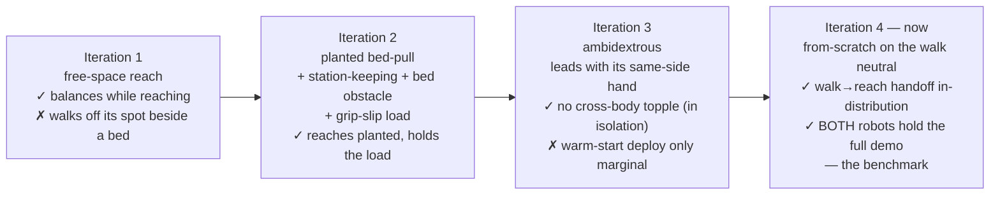
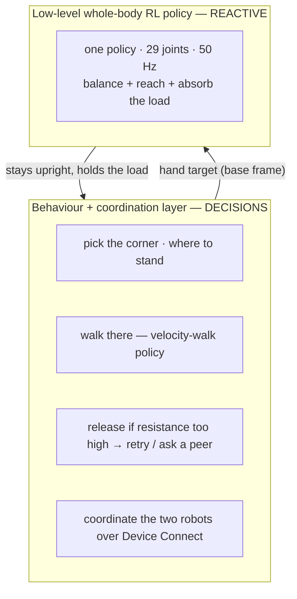

# Whole-Body Loco-Manipulation RL for Bed-Making — Unitree G1 on NVIDIA DGX Spark

> **Setup** — this repo targets **Python 3.12+**; run tooling/tests from a Python 3.12 venv
> (`python3.12 -m venv .venv && source .venv/bin/activate && pip install -e "."`). Isaac Sim 5.1
> bundles Python 3.11, so keep a separate 3.12 venv for anything that imports `strands_robots`
> (full setup + Isaac caveat: [`README.md`](README.md#setup--python-version)).

> Teaching two **free-standing Unitree G1 humanoids (Inspire 5-finger hands)** to **balance on their
> own two feet while bending over a bed and pulling a sheet** — the loco-manipulation skill a walking
> policy cannot hold. Trained end-to-end in **NVIDIA Isaac Lab** on a **DGX Spark (GB10, aarch64)**.
>
> *Loco-manipulation = moving and manipulating at the same time. The hard part isn't the reach or the
> balance alone — it's holding both **together** when the reach pulls the robot off balance.*
>
> Just as important as the robot: **how it was built.** It applies the field's best robot-learning
> research where it exists — and does real engineering on the genuinely open problems where it doesn't
> (a free-base Inspire-hand G1, an out-of-env *ambidextrous* deployment, a real-to-sim sensing method).
> See [§1](#1-how-it-was-built).


*The benchmark: both free-base G1s reach onto the sheet at once — robot 0 (near) drops into a deep
squat, robot 1 (far) leans over the mattress — each balancing entirely on its own two feet (no base
pinning, no teleporting, no joint freezing). "Free base" = the robot is **not** bolted to the world; it
has to keep itself upright, exactly like the real hardware. The postures differ because **the policy
solves the reach within each robot's own actuation envelope — RL does not impose human grace**; that
asymmetry is learned, balanced behaviour, not a loss of balance.*

**🎬 Benchmark video (full two-G1 demo, current):** [`media/isaac_bed_making.mp4`](https://github.com/user-attachments/assets/28eb7850-6f58-427f-bf28-631423ca1fa9)
&nbsp;•&nbsp; **Single-policy isolation eval:** [`media/rl/bed_pull_policy.mp4`](https://github.com/user-attachments/assets/cff9d6b9-fb20-4e7b-9a8c-4ca308ceb283)
&nbsp;•&nbsp; **Deployable policy (committed):** [`rl/policy/policy.onnx`](rl/policy/policy.onnx) · [`rl/policy/policy.pt`](rl/policy/policy.pt)

> **Status — read this first.** **The two-G1 demo now runs end-to-end (iteration 4 — the benchmark).** Both
> robots **walk in arms-at-their-sides, hand off to a whole-body bed-reach policy, lean/squat to reach the
> draped sheet, grip it and draw it headward — each balancing on its own two feet the entire time, no
> topple, no kinematic cheats.** This closes the **walk→reach handoff** that a warm-start could only make
> *marginally* stable (robot 1 toppled): a **from-scratch retrain** on the velocity-walk's own arm neutral
> reconverged to a stable basin ([§3.4](#34-iteration-4--from-scratch-retrain--the-two-g1-benchmark)).
> Eye-verified across the full 195-frame demo. The open work is now **manipulation quality** — drawing the
> sheet up to the pillows ([§9](#9-status--whats-next)). **This is a living document.**

---

## 1. How it was built

The fastest path through a hard robotics problem is to **stand on the field's best work** — most of
applied physical AI is *integration under real-world constraints*, not new theory. So the spine of this
system is reused, deliberately: the balance-while-reach formulation rides **Isaac Lab's locomotion RL
rails** and the **PPO** recipe; the grip-slip robustness is **FALCON**-style force-adaptive whole-body
control; the *learn-to-reach-then-add-force* curriculum is **NVIDIA's Isaac Lab 2.3** pattern; the
ambidexterity is **morphological symmetry** (SYMDEX). *(PPO = the standard RL training algorithm.)*

But "apply, don't reinvent" is the default, not a limit — and three pieces here had no shelf solution,
so we built them:
- **An open NVIDIA problem, solved.** The 5-finger Inspire-hand G1 can't be given a free (mobile) base by
  the documented switch, and NVIDIA's own forum thread on exactly this is **unanswered**. We found a
  reusable fix (a tiny override USD; [§8](#8-the-research--resources-we-reused)).
- **An Isaac Lab policy deployed *outside* its training env** — reverse-engineering the exact 151-D
  observation + action map so it runs in the two-robot demo, and making it **ambidextrous with no
  observation change** (the same-side trick) so two flanking robots both pull naturally.
- **A real-to-sim method.** Isaac Sim doesn't expose a real robot's sensor/effector envelope, so
  on-hardware sensor characterization (**robotics-connect**) calibrates the sim *and* cuts RL training
  cycles ([§6](#6-closing-the-real-to-sim-gap-with-robotics-connect)) — real-to-sim feeding sim-to-real.

That is the honest shape of applied physical AI: assemble the proven pieces, and do real engineering on
the few that nobody has solved yet.

### The real insight: the human/AI division of labour

Working with a partner AI (Claude Code) made one split natural — and it is the split that *scales*
applied physical AI:

| The **human engineer** owns the *abstract* problem-solving | The **partner AI** owns the *implementation* problem-solving |
|---|---|
| What to build; which research applies; the physics/architecture calls (*"keep the feet planted — that's the bug,"* *"a sustained pull-load is the next gap"*) | Writing the env, reverse-engineering the observation, wiring it up, debugging launches and topples, running and babysitting training |
| Judgement: **verify by what the human sees** (rendered video), reject over-claims, decide the next iteration | The candidate fixes, the probe scripts, the convergence plots, this document |

A rough sense of the split for *this* iteration — and the point is the asymmetry:

- **Human decisions fit in a few sentences:** keep it physically valid (no kinematic cheats); use the
  Inspire hands; start the robot *hands-at-its-sides*; the bug is that it won't stay *planted*; train it
  to lean-and-pull without losing balance; here's the research that applies; verify by eye; and push
  *walking / giving-up / avoiding others* down to the behaviour layer.
- **The AI did essentially everything else:** the RL environment and its custom reward + force terms,
  the bed-obstacle scene, the out-of-env deployment, the launch/topple debugging, the training/eval/probe
  runs, the convergence analysis, and this writeup.

The scarce resource in physical AI is **human reasoning about the physical world.** Pushing the
*computational and implementation* burden onto the AI spends that reasoning only where a human is truly
required — which research to apply, what "working" looks like, and where the real gap is — and lets one
engineer move at the pace of a team.

---

## 2. The problem (why it's hard)

Two G1s making a bed must **lean out over the mattress and pull a sheet** — a deep forward-and-down
reach. A locomotion (walking) policy keeps the robot upright *while walking*, but the instant it bends to
reach over the bed, the **centre of mass (CoM) travels past the feet and the robot topples.** We
confirmed this every other way first:

- A stationary **inverse-kinematics stand-and-reach** topples on the sustained lean.
- A **drag-while-walking** strategy snags or launches the robot when the hand grips the cloth.
- The official **velocity-walk policy** balances beautifully while striding but cannot hold the bend.

The fix is a **single whole-body policy** — one controller for the legs, waist *and* arms — that owns
balance *and* reach at once, so the reach never becomes a fall.

> **Methodology rule held throughout:** *verify by what the human sees* (rendered video), never by reward
> telemetry alone. Every claim below is eye-verified.

---

## 3. The policy, in four iterations



### 3.1 Iteration 1 — whole-body *free-space* reach (the intermediate step)

The first policy learned to **balance on a free base while reaching a hand target** sampled in a
forward-and-down cone (no bed in the scene). It worked: the G1 squats and leans to targets from chest
height to near the floor and **never topples** — reach error converged **37 cm → ~12 cm**.

 &nbsp; *(full clip: [`media/rl/bed_reach_policy.mp4`](https://github.com/user-attachments/assets/9254d6b8-fbca-4a45-adf3-21aaf2879928))*

**Why it was only a stepping stone.** It proved balance-while-reach is learnable — but it had **no
incentive to keep its feet planted.** In free space it was free to *step* toward a target to stay
balanced. Beside a real bed (feet outside, reaching *over* the mattress) it does exactly that: reaching
forward shifts the CoM forward, so it **steps backward** to recover, the fixed sheet target then sits
even farther forward in its receded frame, it leans harder — and it **walks itself off its spot and
topples.** The missing ingredient was *staying planted*.

### 3.2 Iteration 2 — *planted bed-pull*

The current policy keeps the same balance-while-reach core and adds exactly what was missing for a
**bedside** reach — each piece an application of reused research:

| Added this iteration | What it does | Reused from |
|---|---|---|
| **Station-keeping** reward | Penalises the base drifting off its spawn spot → it reaches by *leaning/squatting with planted feet*, not by stepping away. The fix for the walk-off. (*Station-keeping = stay on your spot.*) | standard locomotion reward shaping |
| **Bed as a collision obstacle** | The robot must bend *over* the bedside (feet outside, knees against it) — the real constraint a free-space policy never feels. | the deployment scene, brought into training |
| **Grip-slip / sheet-tension load** | A random horizontal force on the hand that **toggles on and off** → the policy learns to absorb a *sudden* load change without toppling ("don't fall when the sheet slips or you let go"). | **FALCON** force-adaptive WBC; unified position/force loco-manip; Isaac Lab 2.3 force-disturbance curriculum |
| **Wider reach + drag workspace** | Targets span forward **and both lateral sides** → the planted policy can reach *and drag headward* in any needed direction. | — |
| **Natural idle-arm** regularizer | Keeps the non-reaching arm from contorting into an uncanny counter-balance (small counter-motions still allowed). | standard posture regularization |

### 3.3 Iteration 3 — *ambidextrous*

Wired into the two-G1 demo, iteration 2 exposed one more gap. The robots flank **opposite** sides of the
bed, so when both pull the sheet *headward* with the **same** (right) hand, one does a natural outward
sweep while its mirror does an awkward **cross-body** sweep — and the cross-body robot topples.

The fix is **ambidexterity**, applied straight from the robot's **bilateral symmetry** (*SYMDEX*,
[arXiv 2505.05287](https://arxiv.org/abs/2505.05287)): the policy reaches with **whichever hand is on the
target's side**. Implemented as *same-side* reward, idle-arm and force terms that read the active hand from
the command's lateral sign — so it needs **no change to the 151-D observation**; the deployed policy stays
a drop-in. Now each robot leads with its natural same-side hand and the headward drag is a clean abduction
for both. **Eye-verified in isolation: it reaches targets on both sides, balanced and leaning over the
bed, no topple.**

| Reach over the bedside | Lateral reach (the drag) |
|---|---|
|  |  |

🎬 **Ambidextrous eval** — both-handed, balanced, no topple:

https://github.com/user-attachments/assets/927fed0f-66d1-4c36-82c2-c323a24b0d7f

In the **full demo** the robots **spawn ~1 m out and walk to the bedside with their arms at their
sides** (the canonical Unitree stance — see [§6](#6-closing-the-real-to-sim-gap-with-robotics-connect)),
and the **full 9-inch-overhang sheet drapes during the walk** so its overhang folds down off the bed edges
instead of dumping on their arms. In isolation iteration 3 was clean — but **deployed via a warm-start it
was only *marginally* stable** (robot 1 toppled on the deep reach-down, robot 0 unreliable run-to-run).
The cause was the **walk→reach handoff**: warm-starting *from* the converged free-neutral policy trapped it
in a marginal basin it never climbed out of. That is what iteration 4 fixes.

### 3.4 Iteration 4 — from-scratch retrain → the two-G1 benchmark

The reach policy's neutral pose has to match the pose the robot is *in* when the walk hands off — otherwise
the first reach observation is out-of-distribution and the policy launches. We had already baked the
**velocity-walk policy's own arm neutral** (shoulder-pitch 0.30, elbow 0.97 — the canonical at-sides
stance) into the reach env's default pose; the remaining problem was purely the *training start*. A
**warm-start** from the old free-neutral policy never reconverged. A **from-scratch retrain** on that
at-sides neutral did — 2048 robots, 1500 PPO iterations on one GB10, fresh random init — climbing cleanly
out of the early exploration dip and **reconverging to a stable basin** (the isolation eval reaches across
the workspace, balanced, no topple).

Wired into the two-G1 demo, this is the **benchmark**: both G1s walk in, hand off, lean/squat to reach the
draped sheet, grip it and draw it headward — **each balancing on its own two feet through all 195 frames,
neither toppling** (the warm-start failure is gone). Telemetry agrees with the eye-check — pelvis held at a
stable squat height (~0.57–0.60 m) with feet planted the whole time, never the ~0.16 m collapse the
warm-start hit.

> **The deep squat is the point, not a flaw.** Robot 0 reaches its near corner by squatting deep while
> robot 1 leans; both are *balanced, planted, physically valid*. **RL does not guarantee human-like grace —
> it produces a policy that resolves the task within the robot's own actuation capabilities.** Two robots in
> mirrored situations converge on the postures *each* can hold, not on a single choreographed pose. That is
> exactly what learned (vs scripted) control looks like, and it is the honest face of sim-to-real.

| Both reach the sheet, balanced | Both draw the cover headward |
|---|---|
|  |  |

🎬 **Full two-G1 demo** — 195 frames, both robots upright throughout:

https://github.com/user-attachments/assets/28eb7850-6f58-427f-bf28-631423ca1fa9

---

## 4. Result (eye-verified)

**The benchmark — full two-G1 demo (iteration 4):** both robots walk in, hand off, reach, grip and draw the
sheet headward, **each balancing on its own two feet, no topple, no kinematic cheats** — eye-verified across
all 195 frames (frames above; full clip [`media/isaac_bed_making.mp4`](https://github.com/user-attachments/assets/28eb7850-6f58-427f-bf28-631423ca1fa9)).

**The policy in isolation** reaches targets on and above the bed surface (forward **and** lateral — the
headward drag direction), balancing and staying planted at the bedside the entire time:

| Lean over the bedside | Lateral reach (drag direction) |
|---|---|
|  |  |

🎬 **Single-policy bed-pull** — 350 frames, no topple:

https://github.com/user-attachments/assets/cff9d6b9-fb20-4e7b-9a8c-4ca308ceb283

**Convergence** (2048 parallel robots, ~30–45 min on one GB10): the iteration-4 from-scratch run climbs out
of the early exploration dip (mean reward −8.6 → −2.6) as the coarse reach lands first and the fine reach
sharpens; base drift stays small and stable (**planted**); falls are rare even with the grip-slip load
toggling. *(The iteration-1 curve below is for reference — same rig, before the bedside additions.)*


> **Honest caveats — and why they're here.** The balance/handoff is solved; **manipulation quality is the
> open work.** In the benchmark the sheet is *drawn* but not yet crisply made — the Device Connect goal
> reports 2/4 corners (`bed_made: False`), because the near corners are tugged a modest amount, not pulled
> up to the headboard/pillows. The next iteration targets exactly that ([§9](#9-status--whats-next)). We
> surface this on purpose: engineers should trust a result more, not less, when its limits are stated
> plainly.

---

## 5. Architecture — who owns what

A clean two-layer split (the consensus across the loco-manipulation literature) keeps the RL job
tractable: the **low-level policy stays reactive**; **all decisions live above it.**



So *walking to different positions*, *deciding to let-go / retry / ask a peer for help*, and *avoiding
another robot* are **behaviour-layer** jobs — not terms in the RL reward. Trying to train those into the
balance policy would make it intractable and brittle.

---

## 6. Closing the real-to-sim gap with robotics-connect

Training in simulation only transfers to hardware if the **simulated robot matches the real one** — and a
simulator, however good, **does not fully expose a real robot's sensor and effector envelope.** Isaac Sim
hands you idealized cameras and ray-casts; the *actual* G1's sensors are tilted, range-limited, and
**occluded by the robot's own body** in ways the sim will never tell you. Bridging that is **real-to-sim**:
measure the hardware, then build the sim to match — the loop that *feeds* sim-to-real.

We close it with **robotics-connect** — Arm's Unitree G1
EDU control stack, where each sensor and effector is **characterized on the physical robot.** That
on-hardware characterization is **calibration data an AI agent can build the simulator from**, and it pays
off twice.

**1. It calibrates the simulated sensors to the real ones.** Two measurements that a sim would otherwise
make you guess:

- **RGB camera angle + viewing distance.** `depth_camera_sight` calibrates the head Intel RealSense's
  downward tilt **on the dev robot to 51.29°** (a floor-plane fit), and documents the hard constraint that
  at that pitch it sees the floor and the near bed but **not** the broader room — while a mattress edge is
  still resolvable **2–3 m out** in the upper frame. Our simulated head camera is set to **exactly 51.29°**
  *because of that measurement*, not a guess.
- **LiDAR near-field fidelity + self-occlusion.** `lidar_sight` characterizes the crown **Livox MID-360**:
  a table surface reads cleanly at **0.4 m forward / −0.05 m down (≈ −7° elevation)** — near-field
  detection works, a 0.66 m bed is seen up close — while the robot's **own face-frame blanks ±40–45° of
  azimuth** and its **chin blanks everything below −10° elevation**. Our simulated LiDAR (an Isaac
  `RayCaster`) reproduces **those exact blind spots**, so a bed-detector that works in sim works on the
  robot. *(Full-fidelity RTX-Livox replay is neither affordable nor the point — the real device is already
  characterized on hardware; the sim only needs to share its blind spots.)*

Without this an agent guesses the camera angle and assumes an unobstructed LiDAR — and sim-trained
perception silently fails on the real robot. The measurement comes from the **hardware**; the **sim is
built to match it** (the bed perception lives in [`perception.py`](perception.py)).

**2. It cuts RL training cycles by getting the rewards and constraints right up front.** Knowing what the
*real* hardware and task demand lets the agent encode the correct rewards and constraints on the first
pass, instead of discovering them by burning training runs:

- the **at-sides arm neutral** is taken straight from the **real Unitree walking policy's own default
  pose** — so the trained reach policy's neutral matches the deploy stance and the walk→reach handoff lands
  in-distribution (no training cycles wasted on a mismatched pose);
- the **grip-slip / sheet-tension force** model and the **bed-as-obstacle** constraint reflect what the
  real bedside reach actually involves;
- the **sensor placement** (head-cam down-tilt, crown LiDAR) is fixed before training, not retrofitted.

Each is a constraint the agent would otherwise have to *find* the hard way. robotics-connect turns
"characterize it on the robot once" into **fewer, better-aimed training runs** — real-to-sim feeding
sim-to-real.

---

## 7. The grip — an honest intermediate experiment

Balancing *while* reaching is solved ([§3](#3-the-policy-in-four-iterations)–[§4](#4-result-eye-verified)). The **grip** — holding the cover and drawing it to the head — is the harder half, and it ran into a simulator wall the wider field has not cleanly solved either. This is the honest record of that experiment, through to a **working, eye-verified grip** (with one open edge — the draw without toppling); the dead ends are as informative as the result.

**The wall: there is no off-the-shelf sim-to-real grasp of PhysX particle cloth.**

1. **Friction grasp** — rubberized fingers close on the sheet. PhysX particle-cloth friction *slips*; a documented-unsolved limit (NVIDIA forum 332704: grippers penetrate + slip on particle cloth). It never holds through a drag.
2. **Attach the cloth to the wrist** — a PhysX cloth attachment. Cloth ↔ **articulation-link** attachment is **unsupported** in Isaac Sim 5.1 / Lab 2.3 (IsaacLab #4291): it fires but never holds; the cover slides out of the hand.
3. **Grab tabs + finger friction** — sew light rigid **tabs** into the cover via the one attachment that *is* supported (cloth ↔ **free rigid body**), and grip a tab by closing the fingers. It holds at contact, but the reaching hand **plows into the cluster of rigid tabs** and topples the free-base balancer before it even grabs.
4. **The custom spring peel-off grip** (the current approach). Filter the tabs from the robot entirely (nothing to plow), and hold via a **compliant D6 spring joint** from the wrist to the nearest tab, with a **break-force** that peels the grip off above a load threshold. This keeps the physics honest: PhysX applies the spring as a real bilateral force, so the robot **feels the cover's load and must balance against it**, and an over-hard draw **mechanically releases** instead of yanking the robot over (requirement E) — no pin, no teleport, no kinematic freeze.

**An experiment inside the experiment — the particle explosion.** Wiring the grip surfaced a solver detonation during the cover's drape — the cover wads up and the rigid tabs scatter across the bed:


It was a *pre-existing* instability (the committed baseline exploded too), root-caused in isolation with a **no-robot probe that swept tab configurations in a single boot**: packing many **featherlight (3 × 10⁻⁴ kg) tabs is numerically unstable** — a tab is flung and the solver blows up — while the eye-verified-stable earlier density (21 tabs) holds (heavier tab mass fixes it independently). Restoring that density fixed it. A second, related trap: excluding the tab↔robot contact by adding the robot to *the tab's own particle collision-filter* silently broke that filter and re-detonated the solver — so that exclusion moved to a **separate PhysX collision group**, leaving the proven filter untouched. Both were found by *watching the render*, not the telemetry (which read a uniform, uninformative NaN): **verify by what the camera shows.**

**The grip, verified.** With the cover stable, the grasp finally ran end-to-end (eye-verified). The robots walk in, balance, and **reach the cover** — a *hand-lock-free* reach to the live cover nearest each hand (committing a hand up front drove it outboard off the bed; a **5 cm lower bed** brought the grab edge into reach) — the **short-range hand sensor fires the grasp on contact** (gap ≈ 5–6 cm), and **the spring joint holds: the cover follows the hands as the robots move.** That is the first proof the mid-sim D6 joint is picked up by PhysX and transmits real load, with the **balance-loss release firing** (requirement E) when the draw turns dangerous. What remains is the **draw without toppling**: the sustained drag still pulls the balancing bipeds over before the cover reaches the head — the loco-manipulation *balance-under-sustained-load* problem (FALCON / force curriculum, [§8](#8-the-research--resources-we-reused)), a different problem from the grip and the open edge of this work.


**Tightening the draw — and isolating what actually topples the robots.** Pushing on the draw peeled back two layers before the real problem stood alone. First, the cover had to be made to *settle*: the soft-spring particle lattice was trading the deep accordion-fold energy back and forth in a limit cycle — a visible, never-settling jiggle — and the rigid grab tabs read on camera as little cubes studding the sheet. Strong spring damping bleeds the fold energy so the cover drapes and comes to rest (a no-robot settle probe shows the max particle frame-to-frame motion decay to ~3 mm and hold), and the tabs are now **hidden from the renderer** — visibility is a pure render attribute, so the rigid body, the cloth attachment and the spring grip are all physically unchanged; the grip mechanism simply does its job unseen. Second, the draw's *first* failure was not sustained load at all but a **transition yank**: the seek grabs the cover where it actually settled (footward of the authored head edge), but the draw was ramping from the *authored* grab point — a ~0.65 m jump that snapped the compliant grip to ≈76 N on the first step and peeled it instantly. Ramping the draw from the **actual grab pose** removes the yank, and on the now-stable cover **both robots grab reliably**. What is left is the genuine article: even with a smooth grip and a gentle ramp, the **sustained headward drag still tips the balancing free-base bipeds over** — the loco-manipulation *balance-under-sustained-load* problem, which the behaviour layer can only survive by *letting go*. The concrete next step is a retrain with a force curriculum that **opposes the drag direction** (FALCON / Kinematics-Aware multi-policy, [§8](#8-the-research--resources-we-reused)). (Both lessons were found *by watching the render* — the jiggle and the cubes are invisible in the telemetry: **verify by what the camera shows.**) Hiding the tabs has its own cost, still open: once the draw lifts a corner off the mattress, the cover is held up by the *invisible* tab on the wrist's spring, so it reads on camera as cloth **pinned to thin air** — a real physical grip, but one that *looks* like a kinematic cheat. The fix is to anchor the visible grip at the hand (or move to the enclosing cloth grasp of [issue #5](https://github.com/armwaheed/robots/issues/5)) so what holds the cover is what the eye sees holding it.

**What is and isn't sim-to-real here — stated plainly.** The spring grip's *holding, load and peel-off physics* are valid. Two parts are **not** transferable: the grab **tabs** are a stand-in for a simulator limitation, not a real effector; and selecting the **nearest tab from privileged cloth state** is knowledge a real hand does not have. (The grasp already only *fires* on a short-range hand proximity sensor, so the *decision* to grip transfers even though the *targeting* does not yet — replacing the privileged targeting with sensor-grounded targeting is the immediate next step.) So the spring grip is best read as a **legitimate "grip-lock" abstraction** — the same category as the kinematic *weld* the MuJoCo phase used — with honest dynamics layered on top, not a finished sim-to-real grasp.

**The real fix is a different cloth model, and it has its own issue.** A thin PBD membrane has no volume to *enclose*, and a real hand grips a sheet by friction **+ enclosure** of a bunched wad. So the path to a genuinely transferable grasp is a **different cloth representation** — Newton/FEM or a volumetric/layered cloth — tracked in **[issue #5](https://github.com/armwaheed/robots/issues/5)** and run as a separate investigation. We will **replace the spring grip if and only if that representation beats it on transfer realism**; if it proves infeasible on this stack, the spring grip (with sensor-grounded targeting) stays as the honest abstraction.

### 7.1 The divergent path — Newton FEM cloth (issue #5), parked as last-resort

[Issue #5](https://github.com/armwaheed/robots/issues/5) spun out of the grip wall above to answer one question: **is there any cloth representation on this stack that supports a real, sim-to-real friction + enclosure grasp** — the thing PhysX particle cloth cannot do? The answer is **yes, in a different engine** — and that "different engine" is exactly why it is a *divergent* path, parked behind cheaper fixes rather than adopted now.


*A force-limited, **sensor-gated** pinch grips the hanging hem and hauls the whole cover headward across the bed — **grip held, 5.3 cm slip over a 45 cm stroke** — with no attachment, no tabs, no spring, no pinning. (Source mp4 `examples/isaac_cloth_grasp/spikes/out/newton_harness_v21_held_drag.mp4` on branch [`issue-5-cloth-grasp`](https://github.com/armwaheed/robots/tree/issue-5-cloth-grasp); the [#5 discovery comment](https://github.com/armwaheed/robots/issues/5#issuecomment-4677127342) embeds it.)*

| grip (LIFT) | drag headward |
| --- | --- |
|  |  |

**What was established (apples-to-apples, same pinch-and-drag protocol):**

| representation | engine | frictional grasp through a drag |
|---|---|---|
| PBD particle cloth (the grip-wall baseline above) | PhysX 5.1 | ❌ penetrate + slip — reproduced, incl. the DexGarmentLab adhesion recipe; NVIDIA-documented-unsolved (forum 332704) |
| **VBD FEM triangle cloth** | **Newton** | ✅ **holds the 45 cm drag** (force-limited, sensor-gated, no privileged state) |
| FEM surface deformable (deformable-beta) | PhysX 5.1 | ❌ slips the full stroke — **NVIDIA staff corroborate**: rigid↔surface-deformable collision "not fully supported" (forum 359023) |

Newton installs on the DGX Spark (GB10 / aarch64) from **stock pip wheels** — no source build. Library + harness + the four comparison spikes live under [`examples/isaac_cloth_grasp/`](https://github.com/armwaheed/robots/tree/issue-5-cloth-grasp/examples/isaac_cloth_grasp) on the `issue-5-cloth-grasp` branch.

**Why it is divergent — and parked as the last resort, not the next step:**

1. **It is a different simulator, not a swap.** This whole demo runs in Isaac Sim / PhysX (G1 + walk policy + Pink-IK); the Newton grasp runs in Newton (Warp / VBD) with a *free-pad force-servoed* gripper, **not the G1**. Bringing it under the robot means a cross-simulator integration — Isaac Lab 3.0-beta's two-way Newton-VBD coupling ([isaac-sim/IsaacLab#5443](https://github.com/isaac-sim/IsaacLab/pull/5443), `Isaac-Lift-Cloth-Franka`), or porting the G1 + policy into Newton — **days of work plus a sim-to-sim policy-gap risk**, the most expensive option on the table.
2. **It does not address the demo's *current* blocker.** Tracing the newest two-G1 run (`cloth_v1`) shows the robots **topple during the deep low squat to reach a cover that settled too low, at load ≈ 0 N — they fall before any drag begins** (eye-verified; the grip itself fires and holds, `gripped=True`, gap 0.07, released only on "losing balance"). The Newton grip improves *grip quality*; the blocker is reach **posture**, which is upstream of grip quality. A better grasp does not stop a robot from falling over while squatting to reach.
3. **So the cheaper fixes go first** ([#2 plan](https://github.com/armwaheed/robots/issues/2)): a **scene fix** (let the cover settle with grippable material in a reachable zone; grab the *lowest-resistance* location — the hanging hem or a top-of-mattress bunch), then, if a stable reach exists but the *drag* topples, a rescoped **retrain** in the validated Isaac pipeline (~30–45 min). The Newton path is the **eventual transfer-realism upgrade** — it also retires the spring grip's "floating-corner" artifact, since a real enclosing grasp holds a real bunched wad with nothing to float — pursued only if those fail, or once the bed-making works and we want the honest grasp for sim-to-real.

In short: **issue #5 answered its research question** (a grippable cloth representation exists — Newton VBD), and is **parked, not abandoned**. It is the standing transfer-realism testbed and the engine-level grasp upgrade for when this stack migrates to Isaac Lab / Newton — not the lever that makes the current bipeds make the bed.

---

## 8. The research & resources we reused

The spine of this system is reused — found and applied. (The genuinely open problems we *did* have to
build are in [§1](#1-how-it-was-built).)

**Research papers (the force-adaptive / whole-body-control ideas we applied)**
- **SYMDEX: Morphologically Symmetric RL for Ambidextrous Bimanual Manipulation** — exploiting the G1's
  bilateral symmetry so the policy reaches with whichever hand is on the target's side. *The basis for the
  ambidextrous same-side reach (iteration 3).* [arXiv 2505.05287](https://arxiv.org/abs/2505.05287)
- **FALCON: Learning Force-Adaptive Humanoid Loco-Manipulation** — adapting a whole-body policy to
  hand-force loads. *This is the basis for the grip-slip / sheet-tension training.*
  [arXiv 2505.06776](https://arxiv.org/abs/2505.06776)
- **Learning a Unified Policy for Position and Force Control in Legged Loco-Manipulation** —
  [arXiv 2505.20829](https://arxiv.org/abs/2505.20829)
- **AdaptManip: Adaptive Whole-Body Object Lifting with Online State Estimation** —
  [arXiv 2602.14363](https://arxiv.org/abs/2602.14363)
- **SoFTA / "Hold My Beer": Slow-Fast Two-Agent gentle locomotion + end-effector stabilization** — names the
  exact tension a single whole-body policy fights (locomotion wants slow, robust control; the end-effector
  wants fast, precise correction) and decouples them into two agents at different rates. *The reference for
  splitting upper/lower body if the monolithic policy plateaus on reach precision.*
  [arXiv 2505.24198](https://arxiv.org/abs/2505.24198)
- **Kinematics-Aware Multi-Policy RL for Force-Capable Humanoid Loco-Manipulation (Unitree G1)** —
  three-stage decoupled control (upper-body manip + lower-body loco + a delta-command coordinator) with a
  force curriculum; a G1 pulls a heavily-loaded cart while balancing. *The route for the sustained
  sheet-pull load ([§9](#9-status--whats-next)).* [arXiv 2511.21169](https://arxiv.org/abs/2511.21169)
- **NVIDIA Isaac Lab 2.3 — Whole-Body Control & teleoperation** (the *learn-to-reach-then-add-force*
  curriculum, and the low-level-WBC / high-level-task split we followed):
  [NVIDIA blog](https://developer.nvidia.com/blog/streamline-robot-learning-with-whole-body-control-and-enhanced-teleoperation-in-nvidia-isaac-lab-2-3/)
- **NVIDIA Isaac GR00T N1.6 sim-to-real** (WBC as the low-level loco-manipulation layer):
  [NVIDIA blog](https://developer.nvidia.com/blog/building-generalist-humanoid-capabilities-with-nvidia-isaac-gr00t-n1-6-using-a-sim-to-real-workflow/)

**Cloth manipulation — the task references (the grip, [§7](#7-the-grip--an-honest-intermediate-experiment))**
- **Seita et al. — Robot Bed-Making: Deep Transfer Learning of Pick Points on Fabric** — the classic
  *grasp-corner → pull-to-frame-corner* bed-making formulation we follow.
  [arXiv 1809.09810](https://arxiv.org/abs/1809.09810)
- **Bodies Uncovered: Learning to Manipulate Real Blankets Around People via Physics Simulations** —
  blanket manipulation learned in sim and transferred to a real mobile manipulator.
  [arXiv 2109.04930](https://arxiv.org/abs/2109.04930)
- **FlingBot: The Unreasonable Effectiveness of Dynamic Manipulation for Cloth Unfolding** (Ha & Song,
  CoRL'21) — dual-arm pick-stretch-fling cloth context. [arXiv 2105.03655](https://arxiv.org/abs/2105.03655)
- **SoftGym: Benchmarking Deep RL for Deformable Object Manipulation** (Lin et al., CoRL'20) — the
  deformable-manipulation RL benchmark backdrop. [arXiv 2011.07215](https://arxiv.org/abs/2011.07215)
- **Figure Helix-02 — "Bedroom Tidy"** — the one-learned-bimanual-system, no-scripted-handoffs bed-making
  template our two-G1 benchmark is measured against.
  [figure.ai](https://www.figure.ai/news/helix-02-bedroom-tidy)

**Cloth representation & frictional grasp — the grip wall ([§7](#7-the-grip--an-honest-intermediate-experiment) / [§7.1](#71-the-divergent-path--newton-fem-cloth-issue-5-parked-as-last-resort), [issue #5](https://github.com/armwaheed/robots/issues/5))**
- **Newton — open-source GPU physics engine** (NVIDIA / Google DeepMind / Disney, built on NVIDIA Warp,
  integrating MuJoCo-Warp). Its **VBD FEM cloth** is the representation that holds a real frictional grasp
  through a drag (issue #5), and it installs on the DGX Spark (GB10 / aarch64) from stock pip wheels.
  [github.com/newton-physics/newton](https://github.com/newton-physics/newton) ·
  [NVIDIA announce](https://developer.nvidia.com/blog/announcing-newton-an-open-source-physics-engine-for-robotics-simulation/) ·
  [Isaac Lab Newton integration](https://isaac-sim.github.io/IsaacLab/main/source/experimental-features/newton-physics-integration/index.html)
- **NVIDIA Warp** — the GPU-kernel substrate Newton and our cloth-grasp harness run on.
  [github.com/NVIDIA/warp](https://github.com/NVIDIA/warp)
- **Isaac Lab — two-way Newton-VBD cloth coupling** (`Isaac-Lift-Cloth-Franka`, `CoupledMJWarpVBDSolverCfg`)
  — the upstream path to put Newton cloth under the robot when #2 migrates.
  [isaac-sim/IsaacLab#5443](https://github.com/isaac-sim/IsaacLab/pull/5443)
- **PhysX particle-cloth friction *slips*** — grippers penetrate + slip on particle cloth; the documented-
  unsolved limit that forced the spring-grip workaround.
  [NVIDIA forum 332704](https://forums.developer.nvidia.com/t/some-critical-issues-in-isaac-4-5-particle-cloth-that-prevent-realistic-cloth-simulation/332704)
- **Rigid ↔ surface-deformable collision "not fully supported" + dynamic-friction-only** — why the PhysX
  FEM surface-deformable grasp also slips (NVIDIA staff). [NVIDIA forum 359023](https://forums.developer.nvidia.com/t/359023)
- **Grasping a PhysX deformable with an articulation gripper** — solves *contact*, not holding-through-
  motion. [NVIDIA forum 366720](https://forums.developer.nvidia.com/t/unable-to-grasp-a-physx-deformable-body-using-an-articulation-based-gripper/366720)
- **Cloth ↔ articulation-link attachment unsupported (Isaac Sim 5.1 / Lab 2.3)** — root cause of the
  slipping wrist grip; the supported path is cloth ↔ free rigid body.
  [IsaacLab #4291](https://github.com/isaac-sim/IsaacLab/issues/4291) ·
  [discussion #4628](https://github.com/isaac-sim/IsaacLab/discussions/4628)
- **DexGarmentLab — Dexterous Garment Manipulation** — the PBD particle-rigid adhesion + friction grasp
  recipe we reproduced as the apples-to-apples PhysX baseline.
  [arXiv 2505.11032](https://arxiv.org/abs/2505.11032)

**NVIDIA forum threads / GitHub issues that directly unblocked us**
- **Free-base Inspire-hand G1** — the stock `g1_29dof_inspire_hand.usd` ships fixed-base + gravity-off and
  bakes the articulation root onto a `/Robot/root_joint` world pin; `fix_root_link=False` only *disables*
  that joint and then `Failed to create articulation`. **NVIDIA's own forum thread on exactly this is
  unanswered**, and their floating loco-manip env sidesteps it with the 3-finger Dex3 hand. *Fix
  (reusable): a 955-byte override USD* ([`assets/g1_inspire_mobile.usd`](assets/g1_inspire_mobile.usd),
  built by [`rl/make_inspire_mobile_usd.py`](rl/make_inspire_mobile_usd.py)) that deactivates `root_joint`
  and moves `ArticulationRootAPI` onto `pelvis` → a true free base *with* the Inspire hands.
  → [NVIDIA forum 370590](https://forums.developer.nvidia.com/t/locomanipulation-with-inspire-5-finger-hand-mobile-base-usd-compatibility-issue/370590) *(unanswered; solved here)* ·
  [IsaacLab PR #3440 (Inspire arm-damping stability)](https://github.com/isaac-sim/IsaacLab/pull/3440)
- **rsl_rl `KeyError: 'class_name'`** — Isaac Lab 2.3.2 ships rsl-rl-lib 5.x with a new `actor`/`critic`
  config schema; the official Unitree trainer skips Isaac Lab's deprecation shim. *Fix: call
  `handle_deprecated_rsl_rl_cfg(...)` (2 lines). Not a version/Docker problem.*
  → [unitree_rl_lab #115](https://github.com/unitreerobotics/unitree_rl_lab/issues/115)
- **Applying external forces in a manager-based env** (how the grip-slip load is injected) →
  [IsaacLab discussion #1360](https://github.com/isaac-sim/IsaacLab/discussions/1360) ·
  [Isaac Lab events module](https://isaac-sim.github.io/IsaacLab/main/source/api/lab/isaaclab.envs.mdp.html)
- **Headless eval video** — `gymnasium.RecordVideo` doesn't capture Isaac Lab vec envs headless; we read
  an in-scene `Camera` sensor and `ffmpeg`-encode. →
  [IsaacLab #875](https://github.com/isaac-sim/IsaacLab/issues/875) ·
  [discussion #2744](https://github.com/isaac-sim/IsaacLab/discussions/2744)

**Platform & official code**
- [Arm Learning Path — Isaac Sim + Isaac Lab RL on DGX Spark](https://learn.arm.com/learning-paths/laptops-and-desktops/dgx_spark_isaac_robotics/)
- [NVIDIA Isaac Lab](https://github.com/isaac-sim/IsaacLab) · [Isaac Lab docs](https://isaac-sim.github.io/IsaacLab/) · [rsl_rl](https://github.com/leggedrobotics/rsl_rl)
- [Unitree `unitree_rl_lab`](https://github.com/unitreerobotics/unitree_rl_lab) · [`unitree_ros` (G1 URDF)](https://github.com/unitreerobotics/unitree_ros) · [`unitree_sim_isaaclab`](https://github.com/unitreerobotics/unitree_sim_isaaclab)
- [Unitree **G1 WBT Brainco "Make The Bed"** teleop dataset](https://huggingface.co/datasets/unitreerobotics/G1_WBT_Brainco_Make_The_Bed) — the real-robot bed-making reference motion
- Isaac Lab **Pink IK** reference (the differential-IK arm controller our manipulation layer follows): [`pink_controller_cfg.py`](https://github.com/isaac-sim/IsaacLab/blob/main/source/isaaclab_tasks/isaaclab_tasks/manager_based/locomanipulation/pick_place/configs/pink_controller_cfg.py) · [`fixed_base_upper_body_ik_g1_env_cfg.py`](https://github.com/isaac-sim/IsaacLab/blob/main/source/isaaclab_tasks/isaaclab_tasks/manager_based/locomanipulation/pick_place/fixed_base_upper_body_ik_g1_env_cfg.py)

---

## 9. Status & what's next

**Done:** balance-while-reach (it.1) → planted bedside reach + grip-slip robustness (it.2) →
ambidextrous same-side reach (it.3) → **from-scratch retrain on the walk neutral (it.4) — the two-G1
benchmark.** Both robots walk in, hand off, reach, grip and draw the sheet **balancing on their own
two feet, no topple** (eye-verified, full 195-frame demo). The **walk→reach handoff is solved.** Policy
committed at [`rl/policy/`](rl/policy/). **The grip ([§7](#7-the-grip--an-honest-intermediate-experiment))
now works end-to-end (eye-verified): the spring peel-off grip engages on a sensor-gated contact and the
cover follows the hands** — the particle-explosion and reach-contact blockers are fixed.

**Next — manipulation quality (the open work):**
1. **Draw without toppling (the open edge).** Two sub-problems are now cleared. The cover **settles** —
   strong cloth spring damping kills the accordion-fold slosh, and the grab tabs are hidden from the
   render (they are a sim-only grip mechanism that read as cubes on the sheet). And the draw's
   **transition yank** is gone — it ramps from the *actual grab pose* rather than the authored grab
   point, so the compliant grip no longer snaps taut and peels on step one. On the stable cover **both
   robots grab reliably.** What remains is the genuine *balance-under-sustained-load*: the headward drag
   still tips the free-base bipeds over. The behaviour-layer levers (softer ramp, earlier balance-loss
   release, lower break-force, a deterministic software peel) keep the robots upright only by **letting
   go**, so the concrete fix is a **retrain with a force curriculum that opposes the drag direction**
   (FALCON / Kinematics-Aware multi-policy, [§8](#8-the-research--resources-we-reused)). Once it holds, a
   longer draw to take the cover **up to the pillows** (over them if tractable for the particle cloth).
2. **Relax the "made" goal to a pillow-anchored corner test.** Extend each headboard "corner" to its
   **pillow**: a sheet corner counts as a **successful corner placement** when it is pulled within a
   **wider radius of the headboard-end mattress corner (out to the pillow)** — so a corner drawn up to a
   pillow registers as done. This makes the tolerant good-enough goal reflect a realistically made bed
   ([`coverage.py`](coverage.py) / the Device Connect goal state).
3. **Sustained pull-load.** The real sheet is a *sustained, motion-opposing* load, harder than training's
   *random* toggling force. A **behaviour-layer "release if resistance is too high → retry / ask a peer"**
   (the decision belongs above the balance policy), and/or retrain the load to **oppose the drag
   direction** via a smooth escalating force curriculum (FALCON / Kinematics-Aware multi-policy, [§8](#8-the-research--resources-we-reused)).
4. **Wire the perception layer** — the robotics-connect-calibrated LiDAR/RGB
   ([§6](#6-closing-the-real-to-sim-gap-with-robotics-connect)) into the demo's *detect → approach →
   switch* behaviour layer.

**This is a living document** — updated as the policy evolves toward a fully working bed-making system.

---

## Appendix A — Platform & setup (DGX Spark, aarch64)

Getting Isaac Sim + Isaac Lab running well on the Spark is itself load-bearing.

| Component | Detail |
|---|---|
| Machine | **NVIDIA DGX Spark** — GB10 (Grace-Blackwell), **aarch64**, sm_121, 128 GB unified memory, CUDA 13 |
| Isaac Sim | **5.1.0, built from source** — no prebuilt aarch64 binary/container exists, so a native source build is the working path |
| Isaac Lab | **2.3.2** (`./isaaclab.sh --install`), symlinked to the source Sim build |
| RL library | **rsl-rl-lib 5.0.1** (bundled with Isaac Lab 2.3.2) |
| PyTorch | cu13 build; GB10 is sm_121 (newer than torch's max advertised arch) → warns but runs |
| **aarch64 must-do** | `export LD_PRELOAD="$LD_PRELOAD:/lib/aarch64-linux-gnu/libgomp.so.1"` before every Isaac run |

**Tips that saved hours:** build Isaac Sim **natively from source** (prebuilt containers target x86_64);
always `LD_PRELOAD` libgomp; run scripts **from the `IsaacLab` directory** (`./isaaclab.sh` is a relative
launcher — `cd`-ing away first gives a silent `exit 127`); the 128 GB unified memory runs 2048 parallel
humanoids on only ~4 GB.

---

## Appendix B — The exact training configuration

A **manager-based RL environment on Isaac Lab's native rails**. Free-base G1, 29 body DOF + Inspire
5-finger hands, gravity on, **no kinematic cheats.**

### Environment / simulation
| Parameter | Value |
|---|---|
| Parallel envs | **2048** |
| PPO iterations | **1500** from scratch for the committed benchmark policy (~30–45 min on one GB10); fresh random init — *not* a warm-start, which trapped the policy in a marginal basin |
| Control rate | **50 Hz** (`sim.dt = 0.005`, `decimation = 4`) |
| Episode length | **8 s** |
| Action | 29 body-joint position targets (`scale 0.5`, default-offset); Inspire fingers excluded |
| Observation | **151-D**: `base_lin_vel(3) + base_ang_vel(3) + proj_gravity(3) + hand_target(7) + joint_pos(53) + joint_vel(53) + last_action(29)` |
| Scene | flat plane **+ a bed collision box in front** (robot faces it; ±15° yaw) |

### Reward terms (current)
| Term | Weight | Role |
|---|---:|---|
| `reach_coarse` / `reach_fine` (tanh, std 0.20 / 0.06) | +2.0 / +1.5 | shape then sharpen the hand→target reach |
| `reach_l2` | −0.3 | mild distance penalty |
| **`base_anchor` (xy drift from spawn)** | **−2.0** | **station-keeping — reach by leaning, stay planted** |
| `termination_penalty` (fall) | **−200** | the dominant signal: *do not fall* |
| `upright` / `base_height` (0.70 m) / `feet_slide` | −1.0 / −0.5 / −0.2 | stay vertical, don't collapse, plant the feet |
| **`joint_deviation_left_arm`** | **−0.2** | **keep the idle arm natural (no uncanny pose)** |
| `joint_deviation` hips / waist | −0.15 / −0.05 | natural lower-body posture |
| `action_rate` / `dof_acc` / `dof_torques` / `dof_pos_limits` | small | smooth, hardware-able motion |

### Hand-target workspace (base frame) · domain randomization
*Domain randomization = deliberately varying sim parameters during training so the policy is robust on
real hardware, not tuned to one perfect sim.*

| Axis | Range (m) | | DR term | Value |
|---|---|---|---|---|
| x forward | 0.18 → 0.55 | | friction (static/dyn) | 0.7–1.1 / 0.5–0.9 |
| y lateral | −0.40 → 0.40 (**both sides — the drag**) | | reset yaw / vel | ±15° / small |
| z (rel. pelvis) | −0.16 → 0.10 (on/above the surface) | | base push | ±0.3 m/s every 4–7 s |
| resample | every 3–5 s | | **grip-slip force** | **0–35 N on the hand, toggling on/off every 1–2.5 s** |

### PD gains (deploy-matched — the stock Inspire config collapses the policy)
Hips kp 100 / Knees 150 / Ankles 40 / Waist 200 / Arms 40 (kd 2 / 4 / 2 / 5 / 10). The stock
`G1_INSPIRE_FTP_CFG` uses waist kp 5000 / arms kp 3000 (stiff tabletop manipulation); fed those, a
whole-body balance policy **collapses** — a documented gain-mismatch failure.

### PPO (rsl-rl-lib 5.x)
Actor/critic MLP `[512, 256, 128]` ELU · LR 1e-3 adaptive (target KL 0.01) · γ/λ 0.99/0.95 · clip/entropy
0.2/0.008 · 24 steps-per-env, 5 epochs, 4 minibatches.

---

## Appendix C — Reproduce it

```bash
# Always from the IsaacLab dir; LD_PRELOAD is mandatory on aarch64.
cd ~/workspaces/git/IsaacLab
export LD_PRELOAD="$LD_PRELOAD:/lib/aarch64-linux-gnu/libgomp.so.1"

# (one-time) build the mobile-base Inspire USD
./isaaclab.sh -p ~/workspaces/git/robots/examples/isaac_bed_making/rl/make_inspire_mobile_usd.py

# train the benchmark policy — FROM SCRATCH (no --resume_from), ~30–45 min on one GB10
./isaaclab.sh -p ~/workspaces/git/robots/examples/isaac_bed_making/rl/train.py \
    --headless --num_envs 2048 --max_iterations 1500 --run_name atsides_scratch

# render an isolation eval mp4 (verify by eye)
./isaaclab.sh -p ~/workspaces/git/robots/examples/isaac_bed_making/rl/play.py \
    --headless --enable_cameras --video --num_envs 4 --video_length 350 \
    --checkpoint ~/workspaces/git/robots/examples/isaac_bed_making/rl/logs/bed_reach_g1/<run>/model_1499.pt

# install the export and render the full two-G1 benchmark demo
cp ~/workspaces/git/robots/examples/isaac_bed_making/rl/logs/bed_reach_g1/<run>/exported/policy.* \
   ~/workspaces/git/robots/examples/isaac_bed_making/rl/policy/
./isaaclab.sh -p ~/workspaces/git/robots/examples/isaac_bed_making/demo.py --loopback --render
```

Code (all under [`rl/`](rl/)): `robot_cfg.py` (mobile Inspire cfg + PD gains), `bed_reach_env_cfg.py`
(scene / bed / command / reward / termination), `mdp.py` (station-keeping reward + grip-slip force),
`agents.py` (PPO cfg), `train.py`, `play.py`, `make_inspire_mobile_usd.py`.

---

*Hardware: NVIDIA DGX Spark (GB10). Stack: Isaac Sim 5.1 (source build, aarch64) · Isaac Lab 2.3.2 ·
rsl-rl-lib 5.0.1 · PyTorch cu13. Physically valid for sim-to-real — no kinematic cheats. Apply the
proven research, build the open pieces, verify by eye, iterate.*
