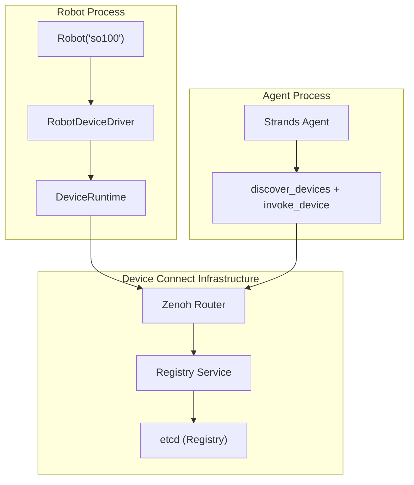
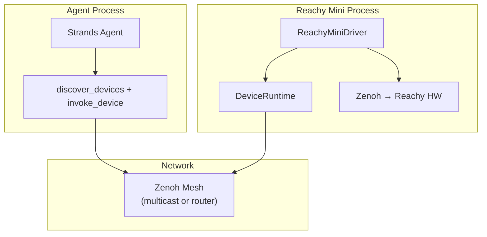

# Device Connect Integration

Strands Robots can use [Device Connect](https://github.com/arm/device-connect), a **device-aware runtime** by Arm — to handle discovery, presence, structured RPC, event routing, and safety — so you can focus on building cross-device experiences instead of re-implementing infrastructure.

> **Fallback behavior:** If `device-connect-sdk` is not installed, Strands Robots automatically falls back to a built-in Zenoh P2P mesh (`zenoh_mesh.py`) for basic peer discovery and coordination. Device Connect is the recommended and primary networking layer.

### Quick Start

```python
from strands_robots import Robot

robot = Robot("so100")
```

That's it. If `device-connect-sdk` is installed, the robot automatically initialises Device Connect with D2D defaults (Zenoh multicast scouting, no broker, no env vars) and becomes discoverable on the LAN. You can optionally pass `peer_id="so100-lab-1"` for a stable address; otherwise one is auto-generated (e.g. `so100_sim-a3f1b2`).

From another process, discover and invoke:

```python
from strands_robots.tools.robot_mesh import robot_mesh

robot_mesh(action="peers")                           # discover devices
robot_mesh(action="tell", target="so100-lab-1",      # invoke
           instruction="pick up the cube")
robot_mesh(action="emergency_stop")                   # e-stop all
```

### Architecture



### E2E Demo

No Docker needed. No env vars. Devices discover each other directly on the LAN via Zenoh multicast scouting. `Robot()` and `robot_mesh()` auto-configure D2D mode when no broker URL is set.

#### Setup

Create a virtual environment and install dependencies:

```bash
python3 -m venv .venv
source .venv/bin/activate

pip install strands-robots              # includes Device Connect SDK + agent tools

export PYTHONPATH="$PWD:$PYTHONPATH"   # makes `import strands_robots` work
```

**Start a mock robot as a Device Connect device (keep running in a separate terminal):**

```python
python -c "from strands_robots import Robot; Robot('so100')"
```

Expected output:

```
Simulation 'so100_sim' running — discoverable as 'so100_sim-a3f1b2' via Device Connect. Ctrl+C to stop.
device_connect_sdk.device.so100_sim-a3f1b2 - INFO - Using ZENOH messaging backend
device_connect_sdk.device.so100_sim-a3f1b2 - INFO - Connected to ZENOH broker: []
device_connect_sdk.device.so100_sim-a3f1b2 - INFO - Driver connected: strands_sim
device_connect_sdk.device.so100_sim-a3f1b2 - INFO - Subscribed to commands on device-connect.default.so100_sim-a3f1b2.cmd
```

#### Option A: Using the `robot_mesh` Strands tool

The `robot_mesh` tool auto-detects Device Connect and uses it when available, falling back to the plain Zenoh mesh otherwise.

**Discover peers:**

```python
python -c "
from strands_robots.tools.robot_mesh import robot_mesh
print(robot_mesh(action='peers'))
"
```

Expected output:

```
Discovered 1 device(s):
  [robot] so100-lab-1 — idle
    Functions: execute, getFeatures, getState, getStatus, stop
```

**Tell a robot to execute an instruction:**

```python
python -c "
from strands_robots.tools.robot_mesh import robot_mesh
print(robot_mesh(action='tell', target='so100-lab-1',
    instruction='pick up the cube', policy_provider='mock'))
"
```

Expected output:

```
-> so100-lab-1: pick up the cube
  {"status": "accepted"}
```

**Emergency stop all devices:**

```python
python -c "
from strands_robots.tools.robot_mesh import robot_mesh
print(robot_mesh(action='emergency_stop'))
"
```

Expected output:

```
E-STOP: 1/1 devices stopped
```

#### Option B: Discover and invoke with `device-connect-agent-tools` directly

```python
python -c "
from device_connect_agent_tools import connect, discover_devices, invoke_device

connect()

devices = discover_devices(device_type='strands_robot')
print(f'Found {len(devices)} robot(s):')
for d in devices:
    print(f'  {d[\"device_id\"]} — {d.get(\"status\", {}).get(\"availability\", \"?\")}')

if devices:
    result = invoke_device(
        devices[0]['device_id'], 'execute',
        {'instruction': 'pick up the cube', 'policy_provider': 'mock'},
    )
    print(f'Execute result: {result}')

    status = invoke_device(devices[0]['device_id'], 'getStatus')
    print(f'Status: {status}')
"
```

Expected output:

```
Found 1 robot(s):
  so100-lab-1 — idle
Execute result: {'success': True, 'result': {'status': 'accepted'}}
Status: {'success': True, 'result': {'status': 'idle'}}
```

#### Option C: Real Robot (hardware or MuJoCo sim)

> Requires `pip install strands-robots[sim]` (MuJoCo) or physical robot hardware.

```python
python -c "
import asyncio
from strands_robots import Robot
from strands_robots.device_connect import init_device_connect

robot = Robot('so100', mesh=False)

async def run():
    runtime = await init_device_connect(robot, peer_id='so100-lab-1')
    print('Robot registered on Device Connect — Ctrl+C to stop')
    await asyncio.Event().wait()

asyncio.run(run())
"
```

Expected output:

```
Robot registered on Device Connect — Ctrl+C to stop
```

#### Full Infrastructure (Optional)

For production deployments, you can add Docker infrastructure for persistent registry, distributed state, cross-network routing, and authentication.

Start the Device Connect infrastructure (Zenoh router + etcd + device registry):

```bash
git clone --depth 1 https://github.com/arm/device-connect.git
cd device-connect/packages/device-connect-server
docker compose -f infra/docker-compose-dev.yml up -d
cd ../../..
```

This starts:

| Service | Port | Purpose |
|---|---|---|
| Zenoh router | `:7447` | Messaging (RPC, events, heartbeats) |
| etcd | `:2379` | Device registry storage |
| Device registry | `:8080` | REST API for device metadata |

Set environment variables (all terminals):

```bash
export MESSAGING_BACKEND=zenoh
export ZENOH_CONNECT=tcp/localhost:7447
export DEVICE_CONNECT_ALLOW_INSECURE=true
```

All the options above (A-C) work identically with full infrastructure — the only difference is that devices register in etcd and discovery goes through the registry service instead of multicast scouting.

> **What infrastructure adds over D2D:**
> - **Persistent device registry** — devices register with TTL-based leases; stale devices are auto-cleaned. Agents can discover devices by type, location, or capability via `discover_devices()`.
> - **Distributed state & locks** — etcd-backed key-value store with atomic distributed locks for coordinating shared resources (e.g., preventing two agents from using the same robotic arm simultaneously).
> - **Cross-network routing** — the Zenoh router (or NATS broker) enables communication across subnets and sites, not just the local LAN.
> - **Authentication & authorization** — mTLS ensures only devices with certificates signed by the trusted CA can exchange data. Full authorization (per-device permissions, topic-level ACLs, certificate revocation) requires the router/registry infrastructure.

#### Running the Tests

```bash
# Unit tests (no Docker needed)
python3 -m pytest tests/test_device_connect_drivers.py -v

# Integration tests (requires Docker infrastructure)
MESSAGING_BACKEND=zenoh ZENOH_CONNECT=tcp/localhost:7447 \
  DEVICE_CONNECT_ALLOW_INSECURE=true \
  python3 -m pytest tests/test_device_connect_integration.py -v
```

#### Control Loop Smoke Test

A self-contained script runs a 200-step mock-policy control loop while a Zenoh listener captures Device Connect events (stateUpdate, observationUpdate, presence, heartbeat) and asserts minimum thresholds:

```bash
bash strands_robots/device_connect/test_control_loop_dc.sh
```

It installs dependencies, starts a Zenoh event listener, runs `Robot("so100")` with a mock policy for 200 steps, then validates that the expected events were published over Device Connect.

---

## Reachy Mini (Zenoh-Native Devices)

Reachy Mini has built-in Zenoh support — it publishes joint positions, head pose, and IMU data natively over Zenoh topics. This makes it a special case: it can be bridged directly via `subscribe()` or wrapped as a Device Connect device for structured RPC.

### Bridging via Subscribe

Use the mesh's `subscribe()` to read Reachy's native Zenoh topics directly:

```python
sim = Robot("so100")

# Subscribe to Reachy's head pose
sim.mesh.subscribe("reachy_mini/head_pose",
    lambda topic, data: print(f"Reachy looking at: {data}"))

# Subscribe to Reachy's joint positions
sim.mesh.subscribe("reachy_mini/joint_positions", name="reachy_joints")

# Mirror Reachy's movements in simulation
def mirror_reachy(topic, data):
    joints = data.get("head_joint_positions", [])
    if joints:
        # Map Reachy joints to sim joints...
        pass

sim.mesh.subscribe("reachy_mini/joint_positions", mirror_reachy)
```

### Architecture



### As a Device Connect Device

Wrap Reachy Mini with `ReachyMiniDriver` to expose it as a structured Device Connect device with RPC commands (`look`, `nod`, etc.):

```python
from strands_robots.device_connect import ReachyMiniDriver
from device_connect_sdk import DeviceRuntime

driver = ReachyMiniDriver(host="reachy-mini.local")
runtime = DeviceRuntime(
    driver=driver,
    device_id="reachy-mini-1",
    messaging_urls=["tcp/localhost:7447"],
    allow_insecure=True,
)
await runtime.run()

# Now any agent can discover and control it:
invoke_device("reachy-mini-1", "look", {"pitch": -15, "yaw": 30})
invoke_device("reachy-mini-1", "nod")
```

### E2E Demo

> Requires a Reachy Mini robot on the network.

**Start the Reachy Mini driver:**

```python
python -c "
import asyncio
from strands_robots.device_connect import ReachyMiniDriver
from device_connect_sdk import DeviceRuntime

driver = ReachyMiniDriver(host='reachy-mini.local')
runtime = DeviceRuntime(
    driver=driver,
    device_id='reachy-mini-1',
    messaging_urls=['tcp/localhost:7447'],
    allow_insecure=True,
)

asyncio.run(runtime.run())
"
```

Expected output:

```
Reachy Mini driver connected: reachy-mini.local
device_connect_sdk.device.reachy-mini-1 - INFO - Device registered
device_connect_sdk.device.reachy-mini-1 - INFO - Subscribed to commands on fabric.default.reachy-mini-1.cmd
```

**In another terminal, invoke RPCs:**

```python
python -c "
from device_connect_agent_tools import connect, invoke_device
connect()
print(invoke_device('reachy-mini-1', 'look', {'pitch': -15, 'yaw': 30}))
print(invoke_device('reachy-mini-1', 'nod'))
"
```
